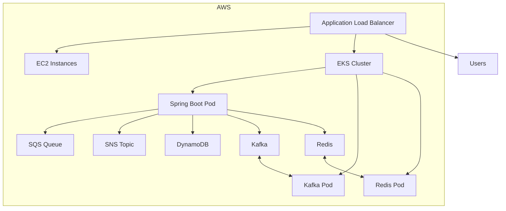
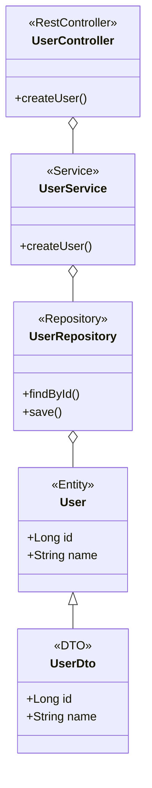

# Spring & Spring Boot: Absolute Beginner to Enterprise Architect (Interview Playbook)

## 0) Spring & Spring Boot: Absolute Basics (For True Beginners)
---

## Advanced: Enterprise Architecture, Distributed Systems, and Cloud Integrations

### Where to Use `@Transactional`
- **Service Layer:** Place `@Transactional` on service methods that modify data across multiple repository calls.
- **Class Level:** All public methods become transactional.
- **Method Level:** Only the annotated method is transactional.
- **Read-Only Transactions:** Use `@Transactional(readOnly = true)` for queries to optimize performance.
- **Pitfalls:**
  - Never use on private methods (Spring AOP proxies only public/protected).
  - Self-invocation (calling another method in same class) does not trigger transaction.
  - Use for atomicity, rollback, and consistency.

Example:
```java
@Service
public class PaymentService {
  @Transactional
  public void processPayment(Order order) {
    // update order, save payment, publish event
  }
}
```

---

### Enterprise Project Organization
  - `api/` (DTOs, API contracts)
  - `service/` (business logic)
  - `repository/` (data access)
  - `integration/` (external systems: Kafka, Redis, AWS, etc.)
  - `config/` (Spring configs, security, beans)
  - `web/` (controllers, exception handlers)
  - Layered architecture (Controller → Service → Repository)
  - Domain-driven design (DDD) for complex domains

For a dedicated novice-to-architect walkthrough of Spring Boot project setup, table/schema design, DTO/entity/DAO/service layering, generic multi-database DAO design, and HLD/LLD diagrams, see [42_JAVA_SPRING_BOOT_DAO_ARCHITECT_GUIDE.md](42_JAVA_SPRING_BOOT_DAO_ARCHITECT_GUIDE.md).

For the agentic AI microservices version of this story, covering Spring Boot orchestration, Python FastAPI agent services, retrieval grounding, model routing, guardrails, and SSE streaming, see [43_JAVA_AGENTIC_AI_MICROSERVICES_ARCHITECT_GUIDE.md](43_JAVA_AGENTIC_AI_MICROSERVICES_ARCHITECT_GUIDE.md).

---

### Cloud & Distributed Systems Integrations

#### AWS Integrations
- **SNS (Simple Notification Service):**
  - For pub/sub messaging, event notifications.
  - Use AWS SDK or Spring Cloud AWS to publish/subscribe.
- **SQS (Simple Queue Service):**
  - For decoupled, reliable message queues.
  - Integrate with Spring Cloud AWS for async processing.
- **ALB (Application Load Balancer):**
  - Distributes HTTP(S) traffic to EC2/EKS targets.
  - Use for blue/green, canary, path-based routing.
- **EC2:**
  - VM-based compute, often for legacy or custom workloads.
- **EKS (Elastic Kubernetes Service):**
  - Managed Kubernetes for container orchestration.
  - Deploy Spring Boot containers, scale with HPA.
- **DynamoDB:**
  - NoSQL, serverless, low-latency DB.
  - Use AWS SDK or Spring Data DynamoDB.

#### Other Integrations
- **Redis:**
  - Caching, session storage, pub/sub, rate limiting.
  - Use Spring Data Redis.
- **Kafka:**
  - Event streaming, decoupled microservices, audit logs.
  - Use Spring for Apache Kafka.
- **Docker:**
  - Containerize Spring Boot apps for portability and CI/CD.
- **Kubernetes:**
  - Orchestrate containers, manage scaling, rolling updates, secrets, config.
- **Service Mesh (Istio, Linkerd):**
  - Traffic management, security, observability, retries, circuit breaking at network layer.

---

### Scaling, Circuit Breakers, and Distributed Systems Patterns
- **Scaling:**
  - Horizontal Pod Autoscaler (K8s HPA) for stateless services.
  - Use ALB/NLB for traffic distribution.
  - Partition workloads (sharding, CQRS, event sourcing).
- **Circuit Breakers:**
  - Use Resilience4j or Hystrix for service-to-service call protection.
  - Combine with retries, timeouts, and bulkheads.
- **Distributed Transactions:**
  - Prefer eventual consistency, outbox/inbox patterns, idempotency keys.
  - Avoid 2PC (two-phase commit) across microservices.
- **Observability:**
  - Centralized logging (ELK, OpenSearch, CloudWatch).
  - Distributed tracing (OpenTelemetry, Jaeger, X-Ray).
  - Metrics (Prometheus, Grafana, CloudWatch).
- **Security:**
  - Use OAuth2/JWT for API auth.
  - mTLS for service-to-service encryption.
  - Secrets management (AWS Secrets Manager, K8s Secrets).
- **Deployment:**
  - CI/CD pipelines (GitHub Actions, Jenkins, ArgoCD).
  - Canary, blue/green, progressive delivery.
  - Rollback on SLO violation.

---

#### Example: Spring Boot + AWS + Kafka + Redis + K8s (Enterprise Reference)



---

**Best Practices:**
- Design for failure: retries, timeouts, circuit breakers, bulkheads.
- Prefer stateless services for scaling.
- Use managed services for DB, cache, messaging when possible.
- Automate everything: infra as code, CI/CD, monitoring, alerting.
- Document runbooks and incident response.

---

### What is Spring?
- **Spring** is a popular Java framework for building enterprise applications. It provides infrastructure support for developing Java apps, focusing on dependency injection (DI), inversion of control (IoC), and modularity.
- **Spring Core**: The foundation, providing IoC and DI.
- **Spring MVC**: For building web applications (controllers, REST APIs).
- **Spring Data**: For database access (JPA, JDBC, Mongo, etc).
- **Spring Security**: For authentication/authorization.
- **Spring Boot**: An extension that makes Spring easy to use with auto-configuration, embedded servers, and production-ready features.

### Why Spring Boot?
- Removes boilerplate setup.
- Provides embedded Tomcat/Jetty/Undertow (no need to deploy WARs).
- Auto-configures based on dependencies.
- Production features: health checks, metrics, external config.

### How a Spring Boot App Works (Hello World)
```java
@SpringBootApplication
public class DemoApp {
  public static void main(String[] args) {
    SpringApplication.run(DemoApp.class, args);
  }
}
```

### Key Concepts
- **IoC (Inversion of Control):** Framework manages object creation/lifecycle.
- **DI (Dependency Injection):** Objects get dependencies from the framework, not by creating them directly.
- **Bean:** An object managed by the Spring container.
- **Component Scan:** Spring automatically finds classes annotated with `@Component`, `@Service`, `@Repository`, `@Controller`.

### Typical Project Structure
```
src/main/java/com/example/demo
├── DemoApp.java
├── controller/
├── service/
├── repository/
├── model/
└── config/
src/main/resources/
  └── application.properties
```

### Learning Roadmap (Spring Boot)
1. **Understand Java basics** (OOP, interfaces, exceptions)
2. **Spring Core**: IoC, DI, beans, configuration
3. **Spring Boot**: starters, auto-configuration, properties
4. **REST APIs**: `@RestController`, request mapping, validation
5. **Data Access**: JPA, repositories, transactions
6. **Testing**: JUnit, Mockito, Spring Boot Test
7. **Security**: Spring Security basics
8. **Messaging**: Kafka/RabbitMQ integration
9. **Observability**: Actuator, logs, metrics
10. **Cloud/Deployment**: Docker, K8s, CI/CD

---

### Foundational Concepts: Table, Entity, Schema, DAO, DTO, DDL, DML

**Table:** A collection of related data in a database, organized in rows and columns.

**Entity:** A Java class mapped to a database table using JPA/Hibernate. Each instance represents a row.
```java
@Entity
@Table(name = "users")
public class User {
  @Id
  private Long id;
  private String name;
}
```

**Schema:** A logical container for database objects (tables, views, etc.), used for organization and access control.

**DAO Pattern (Data Access Object):** Abstracts and encapsulates all access to the data source. In Spring, this is typically a `@Repository` interface/class.
```java
@Repository
public interface UserRepository extends JpaRepository<User, Long> {}
```

**DTO (Data Transfer Object):** A simple object for transferring data between layers, often without business logic.
```java
public record UserDto(Long id, String name) {}
```

**DDL (Data Definition Language):** Statements that define or modify database structure: `CREATE`, `ALTER`, `DROP`.
```sql
CREATE TABLE users (id BIGINT PRIMARY KEY, name VARCHAR(255));
```

**DML (Data Manipulation Language):** Statements that manipulate data: `SELECT`, `INSERT`, `UPDATE`, `DELETE`.
```sql
INSERT INTO users (id, name) VALUES (1, 'Alice');
```

---

### JPA/Spring Annotations: Detailed Chart

| Annotation            | Target         | Purpose/Usage                                                                 |
|-----------------------|---------------|-------------------------------------------------------------------------------|
| `@Entity`             | Class         | Marks a class as a JPA entity (table mapping)                                 |
| `@Table`              | Class         | Specifies the table name/schema for the entity                                |
| `@Id`                 | Field         | Marks the primary key                                                         |
| `@GeneratedValue`     | Field         | Auto-generates primary key values                                             |
| `@Column`             | Field         | Customizes column mapping                                                     |
| `@Repository`         | Class/Interface| Marks DAO/Repository layer for persistence                                    |
| `@Service`            | Class         | Marks service layer (business logic)                                          |
| `@RestController`     | Class         | Marks REST API controller (combines `@Controller` + `@ResponseBody`)          |
| `@RequestMapping`     | Class/Method  | Maps HTTP requests to handler methods                                         |
| `@Autowired`          | Field/Constructor| Injects dependencies                                                        |
| `@Transactional`      | Class/Method  | Declares transaction boundaries                                               |
| `@Component`          | Class         | Generic Spring-managed bean                                                   |
| `@Configuration`      | Class         | Declares configuration class                                                  |
| `@EnableAutoConfiguration` | Class    | Enables Spring Boot auto-configuration                                        |
| `@ComponentScan`      | Class         | Enables component scanning                                                    |
| `@Value`              | Field         | Injects property value                                                        |
| `@RequestBody`        | Method Param  | Maps HTTP request body to method parameter                                    |
| `@Valid`              | Method Param  | Triggers validation on method parameter                                       |
| `@NotBlank`, `@Positive`, etc. | Field| Bean validation constraints                                                   |

---

#### Mermaid Class Diagram Example


---

This guide is designed for senior full-stack/backend interviews where interviewers test:
- framework depth,
- distributed systems judgment,
- cloud and Kubernetes operations,
- resilience architecture,
- and modern AI integration with Spring AI.

It is written as a practical playbook, not only theory.

## 1) How to Use This Playbook Tonight

- Pass 1: Read section 2, 5, 8, 10, 12, 13.
- Pass 2: Rehearse 6 architecture answers from section 14.
- Pass 3: Solve rapid-fire questions in section 16.
- Pass 4: Rehearse 3 incident stories with metrics from section 17.

## 2) Spring Boot from Scratch to Senior Depth

### 2.1 Why Spring Boot

Spring Boot adds opinionated defaults over Spring to reduce setup burden:
- auto-configuration,
- starter dependencies,
- embedded server,
- externalized configuration,
- production features (health, metrics, tracing via ecosystem).

Interview framing:
- Spring is framework foundation.
- Spring Boot is productivity/operability layer over Spring.

### 2.2 Minimal Boot App

```java
@SpringBootApplication
public class App {
    public static void main(String[] args) {
        SpringApplication.run(App.class, args);
    }
}
```

What interviewer expects you to explain:
- `@SpringBootApplication` combines `@Configuration`, `@EnableAutoConfiguration`, `@ComponentScan`.
- Boot starts context, wires beans, starts embedded server.

### 2.3 Core Container Concepts

- IoC container owns object lifecycle.
- DI wires dependencies by type/name/qualifier.
- Bean scopes: singleton, prototype, request, etc.

Common senior pitfall:
- hidden state in singleton beans causing concurrency bugs.

### 2.4 Configuration Management

`application.yml`:

```yaml
server:
  port: 8080
spring:
  application:
    name: order-service
  datasource:
    url: jdbc:postgresql://localhost:5432/orders
    username: app
    password: app
```

Interview explanation:
- use profile-specific config (`application-prod.yml`),
- avoid secrets in source,
- inject secrets via environment/secret manager.

## 3) API Layer and Validation Patterns

### 3.1 REST Controller

```java
@RestController
@RequestMapping("/api/orders")
@RequiredArgsConstructor
public class OrderController {

    private final OrderService service;

    @PostMapping
    public ResponseEntity<OrderDto> create(@Valid @RequestBody CreateOrderRequest req) {
        return ResponseEntity.status(HttpStatus.CREATED).body(service.create(req));
    }
}
```

### 3.2 DTO Validation

```java
public record CreateOrderRequest(
    @NotBlank String userId,
    @Positive long amountCents
) {}
```

### 3.3 Global Exception Mapping

```java
@RestControllerAdvice
public class GlobalErrors {

    @ExceptionHandler(NotFoundException.class)
    public ResponseEntity<Map<String, Object>> handleNotFound(NotFoundException e) {
        return ResponseEntity.status(HttpStatus.NOT_FOUND)
            .body(Map.of("code", "NOT_FOUND", "message", e.getMessage()));
    }
}
```

Interview explanation:
- central error mapping avoids inconsistent API behavior.

## 4) Data Layer: JPA/JDBC/Transaction Design

### 4.1 JPA Entity + Repository

```java
@Entity
@Table(name = "orders")
@Getter @Setter
public class Order {
    @Id
    private UUID id;
    private String userId;
    private long amountCents;
    private Instant createdAt;
}

public interface OrderRepository extends JpaRepository<Order, UUID> {
    List<Order> findByUserIdOrderByCreatedAtDesc(String userId);
}
```

### 4.2 Transaction Boundary

```java
@Service
@RequiredArgsConstructor
public class OrderService {

    private final OrderRepository orderRepo;
    private final OutboxRepository outboxRepo;

    @Transactional
    public OrderDto create(CreateOrderRequest req) {
        Order o = new Order();
        o.setId(UUID.randomUUID());
        o.setUserId(req.userId());
        o.setAmountCents(req.amountCents());
        o.setCreatedAt(Instant.now());
        orderRepo.save(o);

        outboxRepo.save(OutboxEvent.orderCreated(o.getId(), o.getUserId()));
        return OrderDto.from(o);
    }
}
```

Interview explanation:
- outbox row in same transaction prevents dual-write inconsistency.

### 4.3 N+1 Query Awareness

Senior expectation:
- detect N+1 quickly,
- use fetch join/entity graph/projection,
- show SQL and execution plan literacy.

## 5) Enterprise PostgreSQL on AWS for Spring Boot

### 5.1 Common Enterprise Stack

Most enterprises use one of these:
- Spring Boot + HikariCP + Flyway/Liquibase + RDS PostgreSQL.
- Spring Boot + HikariCP + Flyway/Liquibase + Aurora PostgreSQL.
- RDS Proxy in front of RDS/Aurora for connection surge control.

### 5.2 Production Datasource Example

```yaml
spring:
  datasource:
    url: jdbc:postgresql://orders.cluster-xxxx.rds.amazonaws.com:5432/orders
    username: ${DB_USER}
    password: ${DB_PASS}
    hikari:
      maximumPoolSize: 30
      minimumIdle: 5
      connectionTimeout: 2000
      idleTimeout: 600000
      maxLifetime: 1700000
  jpa:
    open-in-view: false
    properties:
      hibernate:
        jdbc:
          time_zone: UTC
```

Interview explanation:
- `open-in-view=false` to prevent lazy-loading leaks across web layer.
- pool limits must match DB capacity, not app wish.

### 5.3 Schema Migration with Flyway

```yaml
spring:
  flyway:
    enabled: true
    locations: classpath:db/migration
```

Migration example:

```sql
CREATE TABLE IF NOT EXISTS idempotency_keys (
    idempotency_key text PRIMARY KEY,
    response_json jsonb NOT NULL,
    created_at timestamptz NOT NULL DEFAULT now()
);
```

### 5.4 AWS Postgres Hardening Checklist

- Multi-AZ enabled.
- automated backups + PITR validated.
- read replicas where read-heavy.
- SSL/TLS enforced.
- parameter groups tuned.
- alarms: CPU, connections, storage, replica lag, slow queries.
- runbook for failover + connection reset behavior.

## 6) Messaging + Async Integration (Kafka/RabbitMQ)

### 6.1 Kafka Consumer in Spring Boot

```java
@KafkaListener(topics = "orders.created", groupId = "billing")
public void onOrderCreated(String payload) {
    // parse, process, idempotency check, commit
}
```

Interview explanation:
- at-least-once is normal, idempotent consumer required.

### 6.2 RabbitMQ Listener

```java
@RabbitListener(queues = "orders.queue")
public void handleOrder(String body) {
    // business processing with DLQ policy configured
}
```

## 7) Logging and Observability in Big Enterprises

### 7.1 Logging Standards

Typical enterprise pattern:
- SLF4J API + Logback implementation.
- JSON structured logs.
- correlation ID and trace ID in every log line.
- centralized aggregation (ELK/OpenSearch/Splunk/Cloud logging).

`logback-spring.xml` pattern snippet:

```xml
<encoder class="net.logstash.logback.encoder.LoggingEventCompositeJsonEncoder">
    <providers>
        <timestamp/>
        <pattern>
            <pattern>{"level":"%level","logger":"%logger","traceId":"%X{traceId}","spanId":"%X{spanId}","msg":"%message"}</pattern>
        </pattern>
    </providers>
</encoder>
```

### 7.2 Metrics + Tracing

Common stack:
- Spring Boot Actuator.
- Micrometer.
- Prometheus + Grafana.
- OpenTelemetry for traces.

Actuator configuration:

```yaml
management:
  endpoints:
    web:
      exposure:
        include: health,info,metrics,prometheus
  endpoint:
    health:
      probes:
        enabled: true
```

Interview explanation:
- liveness and readiness are not same signal.

## 8) Resilience and "Never Break Infra" Patterns

### 8.1 Circuit Breaker + Retry + TimeLimiter (Resilience4j)

`application.yml` example:

```yaml
resilience4j:
  circuitbreaker:
    instances:
      inventoryClient:
        slidingWindowType: COUNT_BASED
        slidingWindowSize: 20
        failureRateThreshold: 50
        waitDurationInOpenState: 30s
        permittedNumberOfCallsInHalfOpenState: 5
  retry:
    instances:
      inventoryClient:
        maxAttempts: 3
        waitDuration: 200ms
  timelimiter:
    instances:
      inventoryClient:
        timeoutDuration: 1s
```

Service method:

```java
@CircuitBreaker(name = "inventoryClient", fallbackMethod = "fallback")
@Retry(name = "inventoryClient")
@TimeLimiter(name = "inventoryClient")
public CompletableFuture<InventoryResponse> checkInventory(String sku) {
    return CompletableFuture.supplyAsync(() -> client.fetch(sku));
}

private CompletableFuture<InventoryResponse> fallback(String sku, Throwable t) {
    return CompletableFuture.completedFuture(InventoryResponse.degraded(sku));
}
```

Interview explanation:
- retry only transient failures.
- breaker stops cascading failure.
- time limiter protects thread pools and latency SLO.

### 8.2 Bulkhead and Load Shedding

- isolate critical paths with separate thread pools.
- reject early when overloaded.
- protect database from traffic spikes.

### 8.3 Idempotency for Safe Retries

- idempotency key table,
- unique constraints,
- deterministic replay response.

## 9) Kubernetes Deployment for Spring Boot at Scale

### 9.1 Deployment + Probes + Resources

```yaml
apiVersion: apps/v1
kind: Deployment
metadata:
  name: order-service
spec:
  replicas: 3
  selector:
    matchLabels:
      app: order-service
  template:
    metadata:
      labels:
        app: order-service
    spec:
      containers:
      - name: app
        image: ghcr.io/example/order-service:1.0.0
        ports:
        - containerPort: 8080
        resources:
          requests:
            cpu: "500m"
            memory: "512Mi"
          limits:
            cpu: "2"
            memory: "2Gi"
        readinessProbe:
          httpGet:
            path: /actuator/health/readiness
            port: 8080
          initialDelaySeconds: 20
          periodSeconds: 5
        livenessProbe:
          httpGet:
            path: /actuator/health/liveness
            port: 8080
          initialDelaySeconds: 30
          periodSeconds: 10
```

### 9.2 HPA with Behavior Controls

```yaml
apiVersion: autoscaling/v2
kind: HorizontalPodAutoscaler
metadata:
  name: order-service
spec:
  scaleTargetRef:
    apiVersion: apps/v1
    kind: Deployment
    name: order-service
  minReplicas: 3
  maxReplicas: 60
  metrics:
  - type: Resource
    resource:
      name: cpu
      target:
        type: Utilization
        averageUtilization: 65
  behavior:
    scaleUp:
      stabilizationWindowSeconds: 0
      policies:
      - type: Percent
        value: 100
        periodSeconds: 30
    scaleDown:
      stabilizationWindowSeconds: 300
      policies:
      - type: Percent
        value: 20
        periodSeconds: 60
```

Interview explanation:
- aggressive scale-up, conservative scale-down avoids thrashing.
- Spring/Java warmup can skew CPU, probe/startup tuning matters.

### 9.3 K8s Production Add-ons (common in big companies)

- cluster autoscaler/Karpenter.
- HPA + custom metrics for queue lag or RPS.
- PodDisruptionBudget.
- canary rollout via Argo Rollouts/service mesh.
- centralized logs + metrics + traces.

## 10) Spring AI: LLM Integration, RAG, Vector DB

### 10.1 Spring AI Core Value

Spring AI gives portable abstractions for:
- chat models,
- embeddings,
- tool/function calling,
- structured output,
- vector stores,
- observability and evaluation utilities.

### 10.2 Basic ChatClient Integration

```java
@Bean
CommandLineRunner demo(ChatClient.Builder builder) {
    return args -> {
        ChatClient client = builder.build();
        String answer = client.prompt("Summarize the order SLA policy").call().content();
        System.out.println(answer);
    };
}
```

### 10.3 Structured Output to POJO

```java
public record PolicySummary(String sla, List<String> exclusions) {}
```

Pattern:
- Ask model for schema-compliant output.
- Map to POJO.
- Reject/retry if schema invalid.

### 10.4 RAG Architecture in Spring Apps

RAG flow:
1. ingest documents,
2. chunk,
3. embed,
4. store vectors,
5. retrieve relevant chunks,
6. augment prompt,
7. answer with citations.

Pseudo service outline:

```java
public String answer(String question) {
    List<DocumentChunk> chunks = retriever.retrieve(question, 5);
    String context = chunks.stream().map(DocumentChunk::text).collect(Collectors.joining("\n\n"));
    return chatClient.prompt("QUESTION:\n" + question + "\nCONTEXT:\n" + context + "\nUse only context.")
        .call()
        .content();
}
```

### 10.5 Vector DB Choices with Spring AI

Common enterprise choices:
- PostgreSQL + pgvector (simple stack alignment).
- OpenSearch/Elasticsearch vector + hybrid search.
- Pinecone/Qdrant/Weaviate for managed vector scale.
- Redis vector for low-latency memory-heavy use cases.

### 10.6 Spring AI + PostgreSQL pgvector Pattern

Enterprise pattern:
- business relational data in Postgres,
- embeddings in pgvector tables,
- metadata filter on tenant/security boundaries,
- periodic reindex pipeline.

## 11) Security, Compliance, and Governance

- OAuth2/OIDC, JWT validation.
- mTLS in service-to-service traffic where required.
- secrets from AWS Secrets Manager or Vault.
- least privilege IAM/service account permissions.
- audit logs for admin and AI tool actions.
- PII redaction in logs and prompts.

For AI use cases:
- prompt injection defenses,
- tool allowlists,
- human approval for destructive actions.

## 12) Enterprise Architecture Patterns by Use Case

### 12.1 Live Streaming (Hotstar-like traffic spikes)

Architecture priorities:
- extreme read fanout,
- burst elasticity,
- cache-first,
- graceful degradation.

Spring Boot role:
- control-plane APIs (catalog, entitlement, session).
- asynchronous event processing for analytics and personalization.

Patterns:
- CDN first, edge caching.
- Redis and read replicas.
- queue buffering for spikes.
- HPA on RPS + CPU + queue lag.

### 12.2 Real-Time Trading Apps

Architecture priorities:
- strict correctness,
- low latency,
- deterministic behavior,
- auditability.

Patterns:
- idempotent order APIs.
- strict timeout budgets.
- minimal retries on non-idempotent paths.
- circuit breakers with clear fallback semantics.
- immutable audit event store.

### 12.3 Booking Apps

Architecture priorities:
- prevent double booking,
- high concurrency,
- consistency under retries.

Patterns:
- optimistic locking/version checks.
- short-lived reservation hold.
- saga for payment/inventory/confirmation.
- idempotency keys for create/confirm operations.

### 12.4 Gaming Backends

Architecture priorities:
- high write volume,
- session state,
- anti-cheat signals,
- low-latency leaderboards.

Patterns:
- Redis for hot state.
- Kafka for event pipelines.
- async materialized views for leaderboards.
- per-region routing for latency.

## 13) System Design and Distributed Systems Thinking (Architect Lens)

### 13.1 Design Checklist

- requirements and SLOs.
- traffic profile and peak multipliers.
- data consistency requirements.
- failure modes and blast radius.
- deployment and rollback strategy.
- observability and runbooks.

### 13.2 Consistency Trade-offs

- strong consistency for balance, inventory, payments.
- eventual consistency for analytics, recommendations, feeds.

### 13.3 Failure Management

- timeout budget per hop.
- retries + backoff + jitter.
- circuit breaker.
- bulkhead isolation.
- dead-letter queue.
- compensating transactions.

## 14) Complete Reference Architecture (Spring Boot + AI)

Reference stack:
- API Gateway -> Spring Boot services.
- RDS/Aurora PostgreSQL (+ read replicas, Proxy).
- Redis cache.
- Kafka event backbone.
- Spring AI service with RAG against pgvector/Pinecone.
- Kubernetes + HPA + cluster autoscaler.
- Prometheus/Grafana + OpenTelemetry + centralized logs.

Release strategy:
- CI with tests + static analysis.
- canary rollout.
- SLO guardrails for automatic rollback.

## 15) Deployment Pipeline Blueprint

- Build: Maven/Gradle, unit tests.
- Scan: dependency and container scanning.
- Package: container image.
- Deploy: staged (dev -> staging -> prod).
- Verify: smoke + synthetic + SLO checks.
- Promote or rollback.

## 16) Senior Interview Questions (Spring Boot Architect)

1. Spring vs Spring Boot vs Spring Cloud: where does each fit?
2. Explain auto-configuration internals and when to override defaults.
3. How do you design resilient outbound calls in Spring?
4. How do you avoid DB connection storms in autoscaling environments?
5. How would you design idempotency for payment APIs?
6. How do you tune HikariCP for RDS/Aurora?
7. How do you handle schema migration in zero-downtime deployments?
8. How do you structure logging for distributed tracing and audits?
9. How do you prevent HPA thrashing for JVM services?
10. How do you design RAG in Spring AI for multi-tenant enterprise data?
11. Why choose pgvector vs managed vector DB?
12. How do you secure tool-calling agents in enterprise systems?
13. How do you design a rollback-safe canary strategy?
14. How do you handle partial failure in booking/trading workflows?
15. How do you measure AI feature quality in production?

## 17) Story Bank Prompts (Use Numbers)

Prepare these stories with measurable outcomes:
- Reduced p95 API latency by X% and DB CPU by Y% through query/index/pool tuning.
- Prevented cascading outage using circuit breaker + bulkhead rollout.
- Migrated monolith to Spring Boot microservices with zero-downtime strategy.
- Scaled event consumers from X to Y messages/s while preserving correctness.
- Deployed Spring AI RAG assistant that improved support resolution time by X%.
- Reduced cloud cost by X% via autoscaling and storage lifecycle policies.

## 18) 2-Hour Sprint Before Interview

0-30 min:
- sections 2, 5, 8.

30-60 min:
- sections 9, 12 (use-case architecture).

60-90 min:
- sections 10 and 11 (Spring AI + security).

90-120 min:
- section 16 and 17 (Q&A + story rehearsal).

## 19) Source Guidance Basis Used for This Playbook

This playbook is aligned with patterns and concepts from:
- Spring Boot official project and reference docs.
- Spring AI official project and reference docs.
- Kubernetes HPA official docs.
- AWS RDS for PostgreSQL official docs.
- Resilience4j documentation.
- Community-oriented Spring Boot topic coverage patterns (including Baeldung/GeeksforGeeks style interview topics), rewritten as original architecture guidance.

### 19.1 One-Stop Summary Distilled from Official + Community References (0 to 7 YOE)

This section synthesizes common interview patterns from Spring official docs, AWS/Kubernetes docs, Baeldung deep dives, and GeeksforGeeks Q&A style prompts into one practical preparation path.

#### A) 0-2 YOE: Foundation Expectations

What interviewers test:
- whether you understand core Spring lifecycle and not only annotations,
- whether you can build and debug a simple REST API end-to-end,
- whether you can explain request flow clearly.

Must-know concepts:
- IoC and DI: container creates objects and wires dependencies.
- Bean scopes: singleton by default, request/session scope in web contexts.
- Bootstrapping: `@SpringBootApplication` as entry point.
- Layering: Controller -> Service -> Repository -> Database.
- Validation: `@Valid`, constraint annotations, consistent error response.
- Config basics: `application.yml`, profiles, environment overrides.

Must-build mini projects:
- CRUD API with DTO validation and global exception handling.
- one module using JPA repository and one using JdbcTemplate.

High-frequency interview traps:
- confusion between `@Controller` and `@RestController`.
- field injection overuse instead of constructor injection.
- no clarity on where business logic should live.

#### B) 2-4 YOE: Professional Backend Expectations

What interviewers test:
- data access correctness under load,
- transactional boundaries,
- observability and test quality.

Persistence and transaction depth:
- entity modeling: keys, indexes, unique constraints, audit columns.
- JPA pitfalls: N+1, lazy-loading leaks, over-fetching.
- transaction placement: service methods, not controller methods.
- read paths: `@Transactional(readOnly = true)` for query flows.
- write paths: keep transaction short; avoid remote calls inside transaction.

`@Transactional` interview framing:
- use when multiple DB operations must succeed/fail atomically.
- rollback default is runtime exceptions; checked exception behavior should be explicit.
- propagation basics to explain:
  - REQUIRED: join existing or create new.
  - REQUIRES_NEW: isolate sub-operation (audit/outbox special cases).
  - MANDATORY: fail if no parent transaction.
- isolation basics to explain:
  - READ_COMMITTED common default,
  - REPEATABLE_READ/Serializable for stricter consistency trade-offs.

Production readiness baseline:
- actuator endpoints, health probes, metrics, log correlation IDs.
- test pyramid: unit, slice, integration (including repository and controller tests).
- cache use cases with Redis: read-heavy endpoints, TTL strategy, cache invalidation plan.

#### C) 4-7 YOE: Senior/Architect Expectations

What interviewers test:
- distributed systems judgment,
- failure handling,
- cloud-native deployment and operations,
- architecture trade-offs with business impact.

Distributed systems core patterns:
- avoid cross-service 2PC in most real systems.
- use outbox for reliable event publication from relational commits.
- consumer idempotency: dedupe key or business key enforcement.
- saga orchestration/choreography for long-running multi-service workflows.
- compensation strategy for partial failure.

Messaging depth (Kafka/SQS/SNS):
- Kafka: partitioning, ordering scope, consumer groups, retry and DLQ policy.
- SQS: visibility timeout, redrive policy, idempotent handlers.
- SNS: fan-out for decoupled subscribers.
- interview focus: exactly-once is expensive and context-specific; most systems are at-least-once + idempotency.

Resilience and traffic management:
- timeout budgets per downstream call.
- retries only for transient failures with backoff + jitter.
- circuit breaker for cascading failure prevention.
- bulkhead isolation for thread pool/resource protection.
- rate limiting and load shedding under saturation.

Cloud and platform architecture expectations:
- ALB as L7 ingress, path/host-based routing, TLS termination.
- EC2 for VM-hosted workloads; EKS for container orchestration.
- Kubernetes probes, HPA behavior tuning, PDB, rollout policies.
- Redis as cache/session/hot-state store.
- DynamoDB for high-scale key-value or document access patterns.
- service mesh role: mTLS, retries, traffic shaping, observability at network layer.

Operational excellence and deployment:
- Docker image hygiene: minimal base image, non-root user, reproducible builds.
- progressive delivery: canary/blue-green with rollback guardrails.
- SLO-driven operations: p95/p99 latency, error budget, alert routing.
- incident response: detection, containment, recovery, follow-up prevention.

AI + RAG in enterprise Spring systems:
- retrieval pipeline: ingest -> chunk -> embed -> retrieve -> grounded answer.
- tenant-aware filtering and access control in retrieval layer.
- prompt/tool safety checks for injection-resistant workflows.
- output contracts with schema validation and observability.

#### D) Interview Question Bank by Experience Band

0-2 YOE:
1. Explain IoC and DI using one concrete class example.
2. What does `@SpringBootApplication` include internally?
3. Why use DTOs instead of exposing entities directly?
4. Difference between entity, table, and schema.
5. Where should validation and exception mapping happen?

2-4 YOE:
1. Where do you place `@Transactional` and why?
2. How do you debug and fix an N+1 query issue?
3. How do you structure tests for controller/service/repository layers?
4. When would you use Redis cache and how do you invalidate?
5. What metrics would you monitor first in production?

4-7 YOE:
1. Design an order workflow using outbox + Kafka + idempotent consumers.
2. How do you prevent retry storms in a multi-hop architecture?
3. Mesh retry vs app retry: where do you draw boundaries?
4. How do you tune HPA for JVM warmup and traffic bursts?
5. What is your rollback decision framework during canary regressions?
6. How do you secure AI tool-calling in regulated domains?

#### E) 30-Minute Revision Strategy (One-Stop Use)

1. 10 min: rehearse foundation definitions (IoC, DI, entity/table/schema, DTO/DAO, DDL/DML).
2. 10 min: rehearse transaction + persistence + observability answers.
3. 10 min: rehearse one distributed architecture story with failure mode + mitigation + metrics.

#### F) What Good Answers Look Like in Senior Interviews

- State decision and trade-off, not only definition.
- Mention one real failure mode and mitigation.
- Include one measurable outcome (latency, error rate, cost, throughput).
- Clarify boundaries: consistency, ownership, rollback, and blast radius.

## 20) L4/L5 Spring Architect Deep Drill Addendum

### 20.1 Distributed Transaction Strategy

- Avoid 2PC in most microservice boundaries.
- Prefer local transaction + outbox + eventual consistency.
- Implement idempotent consumers for replay safety.

### 20.2 API and Resilience Guardrails

- Explicit timeout budgets per downstream.
- Retry only transient classes with jitter and cap.
- Circuit breaker + bulkhead + fallback for graceful degradation.
- Correlation IDs across sync and async paths.

### 20.3 Spring AI Production Integration Notes

- Validate tool inputs with strict schema before execution.
- Keep model provider abstraction for portable routing/fallback.
- Add policy checks before returning generated output.
- Persist prompt/model/version metadata for auditability.

### 20.4 Platform and Delivery Expectations

- Progressive delivery (canary/blue-green) with rollback triggers.
- SLO-driven alerting tied to user impact, not raw infra noise.
- Capacity planning for both control plane and data plane.

### 20.5 Senior Grilling Questions

1. How do you design multi-tenant isolation in Spring + AI systems?
2. How do you prevent retry storms across service mesh + app retries?
3. How do you prove your architecture meets compliance and audit requirements?
4. Which failures are you willing to degrade on vs fail closed?

---

## 21) L5 Spring Platform Governance and Operating Model

### 21.1 Platform Standards for Large Organizations

- service template baseline (security, observability, resilience defaults),
- dependency BOM governance,
- policy-as-code checks in CI/CD,
- release readiness gates tied to SLO health.

### 21.2 Runtime Safety Contracts

- mandatory timeout budgets per hop,
- retry policy scoped by idempotency class,
- circuit breaker and bulkhead defaults,
- startup/liveness/readiness contract quality.

### 21.3 Data and Event Consistency Strategy

- outbox/inbox patterns for async reliability,
- contract versioning discipline,
- replay and auditability expectations.

## 22) Spring Architect Failure Mode Drills

### 22.1 Retry Storm Across Service Mesh + App Retries

Triage:
- identify layered retry multiplication,
- disable duplicate retry layers,
- enforce retry budget and jitter.

### 22.2 Thread Pool Exhaustion in API Tier

Triage:
- blocked calls on slow dependencies,
- missing timeout/circuit boundaries,
- queue growth and rejected execution signals.

### 22.3 Deployment Regression with Healthy Infra Metrics

Triage:
- business-metric degradation despite infra health,
- query plan changes and contract drift,
- rollback decision framework with canary evidence.

## 23) L5 Grilling Questions (Spring Architect)

1. How do you keep 100+ services consistent without blocking team autonomy?
2. Why do many resilience patterns fail in practice despite being implemented?
3. How do you verify outbox/event consistency under partial failures?
4. What is your incident command model during high-severity outages?
5. How do you decide between immediate rollback and progressive mitigation?

## 24) 60-Minute Spring Architect Revision Sprint

0-20 min:
- platform standards, runtime guardrails, dependency governance.

20-40 min:
- resilience and consistency patterns with concrete failure modes.

40-60 min:
- one deep architecture story + one production incident story with metrics.
