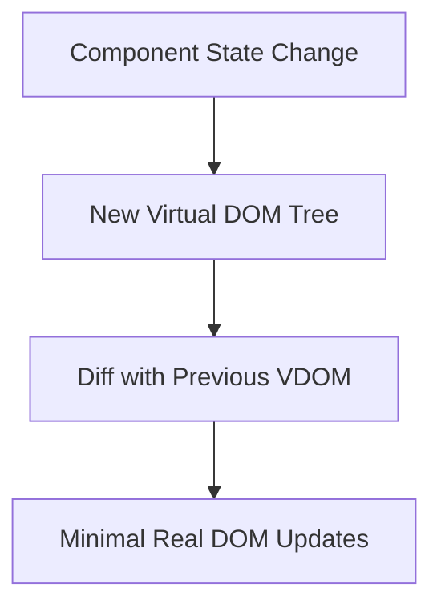
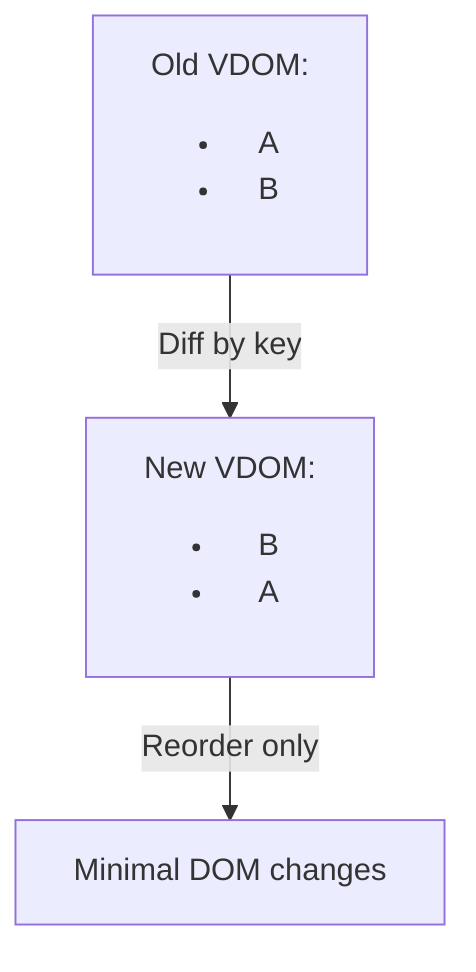
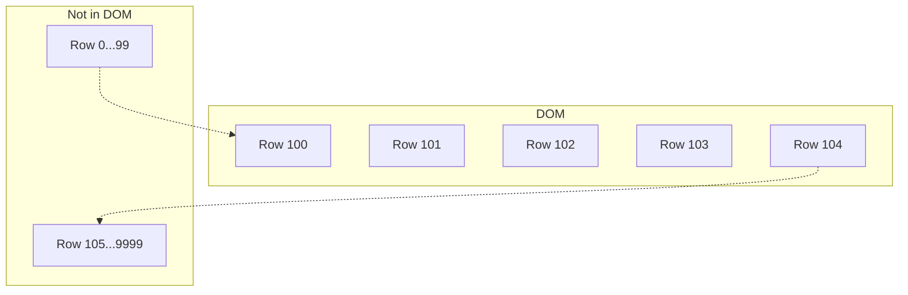
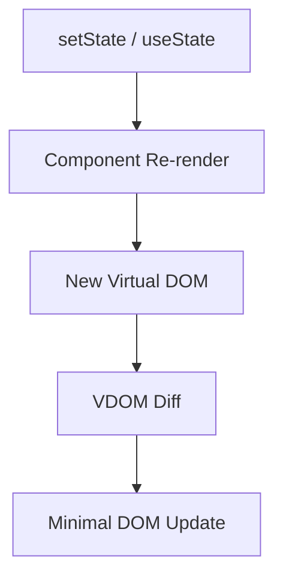
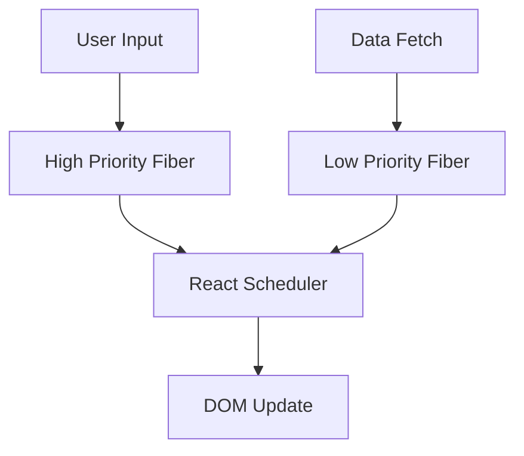

# React Interview Essentials: Virtual DOM, Reconciliation, Efficient Rendering, and State Updates

---

## 0. If Mermaid Diagrams Do Not Render

Some editors, markdown viewers, or export tools do not render Mermaid blocks.
Use the ASCII diagrams in this document as a guaranteed fallback.

### 0.1 Enable Mermaid in VS Code
1. Open Settings.
2. Search for `markdown preview mermaid`.
3. Turn on Mermaid support for Markdown preview.
4. Reopen Markdown preview.

### 0.2 Guaranteed Fallback Rule
- Every Mermaid chart below is accompanied by a plain ASCII diagram.
- If Mermaid is not visible, use the ASCII flow immediately below the Mermaid block.

### 0.3 Draw.io Reference File
- Open `INTERVIEW_NOVEL/35_REACT_VISUAL_FLOWS_REFERENCE.drawio` for editable interview-ready diagrams.
- It contains four pages: State Update Flow, Reconciliation and Keys, Virtualized Rendering, and Fiber Scheduling Priorities.

---

## 1. Virtual DOM: What & Why


### 1.1 What is the Virtual DOM?
The Virtual DOM (VDOM) is a core concept in React and other modern UI libraries. It is:
- An in-memory, lightweight JavaScript object that represents the structure of the real DOM.
- A tree of React elements (not actual DOM nodes) that describes what the UI should look like for a given state.
- Used to optimize UI updates by minimizing direct DOM manipulations, which are slow and expensive.

#### How it works:
1. On initial render, React builds a VDOM tree from your components.
2. When state or props change, React creates a new VDOM tree.
3. React compares (diffs) the new VDOM with the previous one.
4. Only the minimal set of real DOM changes are applied (patching).

#### Why is this powerful?
- Direct DOM operations (e.g., `document.createElement`, `innerHTML`) are slow because the browser must recalculate layout, paint, and composite.
- The VDOM allows React to batch, schedule, and optimize updates, leading to smoother UIs and better performance.

#### Visual Diagram (Mermaid):



ASCII fallback:
```text
[Component State Change]
      |
      v
[New Virtual DOM Tree]
      |
      v
[Diff with Previous VDOM]
      |
      v
[Minimal Real DOM Updates]
```


### 1.2 Why use the Virtual DOM?
- **Performance:** Reduces the number of direct DOM updates, which are costly.
- **Declarative UI:** You describe what the UI should look like for a given state, and React handles the rest.
- **Predictability:** The UI is always a function of state/props, making bugs easier to track.
- **Cross-platform:** The VDOM concept can be used to target web, native, or even terminal UIs.

#### Real-World Analogy:
Think of the VDOM as a blueprint. Instead of rebuilding your house every time you want to move a chair, you update the blueprint and only move the chair in the real house if the blueprint changed.

---

## 2. React Reconciliation: The Diffing Algorithm


### 2.1 What is Reconciliation?
Reconciliation is the process React uses to update the DOM efficiently when your app's state changes. It answers: "How do I update the UI to match the new state with the least work?"

#### Key Points:
- React uses a fast, heuristic O(n) diffing algorithm (not a full tree diff, which would be O(n^3)).
- It compares the old and new VDOM trees node by node.
- If the type of a node changes, React destroys the old subtree and creates a new one.
- If the type is the same, React recursively diffs children.
- **Keys** are critical for list items: they help React identify which items have changed, been added, or removed.

#### Visual Diagram (Mermaid):


ASCII fallback:
```text
Old VDOM: <ul><li key=1>A</li><li key=2>B</li></ul>
New VDOM: <ul><li key=2>B</li><li key=1>A</li></ul>

Compare by key:
- key=1 maps to A
- key=2 maps to B

Result:
[Reorder existing DOM nodes]
instead of
[Delete + recreate all nodes]
```

#### Example: Why keys matter
If you render a list without keys, React may re-render all items. With keys, React can move, add, or remove only the necessary DOM nodes.

---

## 3. Efficient Rendering: Only What is in View


### 3.1 The Challenge: Large Lists and Performance
Rendering very large lists (e.g., 10,000+ items) can:
- Cause slow initial page loads
- Lead to janky scrolling
- Consume excessive memory

### 3.2 Solution: Windowing/Virtualization
**Windowing** (a.k.a. virtualization) means rendering only the items currently visible in the viewport, plus a small buffer above and below.

#### How it works:
1. Only a subset of items (the "window") are mounted in the DOM.
2. As the user scrolls, new items are rendered and old ones are unmounted.
3. The scroll bar still reflects the total size of the list.

#### Libraries:
- [`react-window`](https://react-window.vercel.app/): Lightweight, fast, supports fixed and variable size lists/grids.
- [`react-virtualized`](https://bvaughn.github.io/react-virtualized/): More features, supports tables, grids, etc.

#### Example (react-window):
```jsx
import { FixedSizeList as List } from 'react-window';

const Row = ({ index, style }) => (
      <div style={style}>Row {index}</div>
);

<List
      height={400}
      itemCount={10000}
      itemSize={35}
      width={300}
>
      {Row}
</List>
```

#### Visual Diagram (Mermaid):


ASCII fallback:
```text
Viewport (visible window)
+-------------------------+
| Row 100                |
| Row 101                |
| Row 102                |
| Row 103                |
| Row 104                |
+-------------------------+

Not rendered in DOM right now:
- Row 0 ... 99
- Row 105 ... 9999

On scroll:
- Unmount rows leaving viewport
- Mount new rows entering viewport
```
Only the visible rows (e.g., 100-104) are in the DOM; the rest are not rendered.

---

## 4. State Updates in React: The React Way


### 4.1 How State Updates Work
- State is local to each component (via `useState`, `useReducer`, or class `this.state`).
- When you call a state setter (e.g., `setCount`), React schedules a re-render for that component and its children.
- Multiple state updates in the same event are batched for performance.
- State updates are asynchronous: React may delay them to optimize rendering and avoid unnecessary work.

#### The State Update Lifecycle:
1. You call `setState` or `setX`.
2. React marks the component as "dirty" and schedules a re-render.
3. On the next render pass, React builds a new VDOM for the component.
4. React diffs the new VDOM with the previous one.
5. Only the minimal set of real DOM changes are applied.

#### Visual Diagram (Mermaid):


ASCII fallback:
```text
[setState/useState]
      |
      v
[Schedule render]
      |
      v
[Create new VDOM]
      |
      v
[Diff old vs new]
      |
      v
[Patch real DOM minimally]
```

### 4.2 What Makes React Different?
- **Declarative State:** UI is always a function of state/props, not manual DOM manipulation.
- **Unidirectional Data Flow:** State flows down from parent to child; updates flow up via callbacks.
- **Predictable Updates:** No matter how many times you update state, the UI always matches the latest state.
- **Batching:** Multiple state updates are combined for efficiency.
- **Time Travel:** Because UI is a pure function of state, you can implement undo/redo and time-travel debugging.

#### Example: Batching
```jsx
function Example() {
  const [count, setCount] = React.useState(0);
  const handleClick = () => {
    setCount(c => c + 1);
    setCount(c => c + 1);
  };
  // Only one re-render, count increases by 2
  return <button onClick={handleClick}>{count}</button>;
}
```


### 4.3 Interview Talking Points & Deep Dives
- React's state model enables time-travel debugging, undo/redo, and predictable UI.
- State updates are batched and asynchronous for efficiency.
- Parent/child state flows are unidirectional ("one-way data flow").
- React Fiber (the engine behind React 16+) enables interruptible rendering, prioritization, and concurrent mode for even more efficient updates.
- React's diffing and batching make it stand out from frameworks that mutate the DOM directly or lack a VDOM abstraction.

---

## 5. References & Further Reading
- [React Docs: Reconciliation](https://react.dev/learn/reconciliation)
- [React Docs: State Updates](https://react.dev/learn/state-a-components-memory)
- [react-window](https://react-window.vercel.app/)
- [react-virtualized](https://bvaughn.github.io/react-virtualized/)
- [React Fiber Architecture](https://github.com/acdlite/react-fiber-architecture)

---


---

## 6. Advanced: React Fiber & Concurrent Rendering

### 6.1 What is React Fiber?
- Fiber is the reimplementation of React's core algorithm (since v16).
- Enables splitting rendering work into units, pausing, resuming, and aborting work as needed.
- Allows React to prioritize urgent updates (e.g., input) over less urgent ones (e.g., data fetch).

### 6.2 Why does this matter?
- Improves responsiveness for complex apps.
- Enables features like Suspense, Concurrent Mode, and better error boundaries.

#### Visual Diagram (Mermaid):


ASCII fallback:
```text
High priority path:          Low priority path:
[User Input]                 [Data Fetch]
      |                           |
      v                           v
[High Priority Fiber]       [Low Priority Fiber]
             \               /
              v             v
             [React Scheduler]
                    |
                    v
               [DOM Update]
```

---

## 7. Summary Table: React vs. Other Frameworks

| Feature                | React                | jQuery/Vanilla JS      | Angular/Vue         |
|------------------------|----------------------|------------------------|---------------------|
| Virtual DOM            | Yes                  | No                     | Yes                 |
| Declarative UI         | Yes                  | No                     | Yes                 |
| Unidirectional Data    | Yes                  | No                     | Angular: No, Vue: Yes |
| Batching Updates       | Yes                  | No                     | Yes                 |
| Time Travel Debugging  | Yes                  | No                     | Yes (Vuex/Redux)    |
| Fiber/Concurrent Mode  | Yes                  | No                     | No                  |

---

## 8. Further Reading & Official Resources
- [React Docs: Reconciliation](https://react.dev/learn/reconciliation)
- [React Docs: State Updates](https://react.dev/learn/state-a-components-memory)
- [react-window](https://react-window.vercel.app/)
- [react-virtualized](https://bvaughn.github.io/react-virtualized/)
- [React Fiber Architecture](https://github.com/acdlite/react-fiber-architecture)
- [React Official Blog](https://react.dev/blog)
- [React DevTools](https://react.dev/learn/react-developer-tools)

---

This is a comprehensive, interview-ready reference for React's Virtual DOM, reconciliation, efficient rendering, and state updates, with diagrams and deep explanations.
