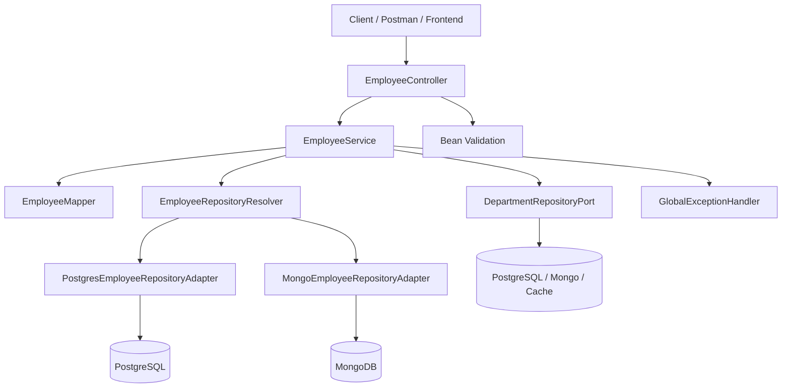
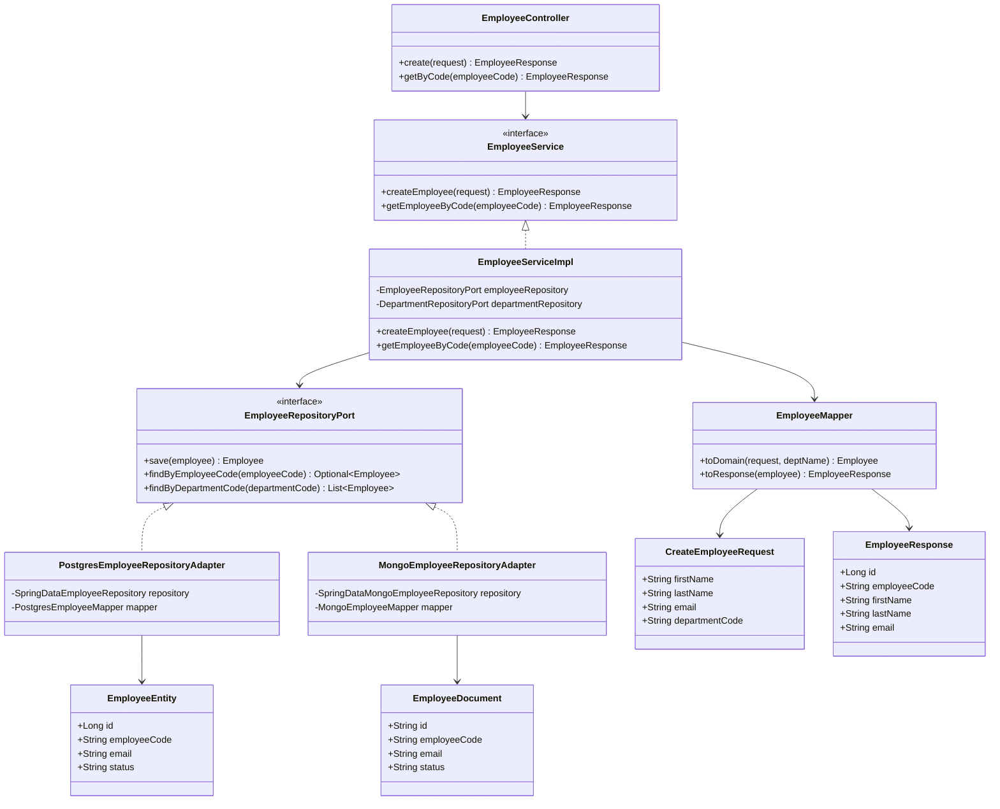

# Java Spring Boot DAO / DTO / Schema / Architecture Guide

From novice Spring Boot developer to architect-level design conversations.

This guide focuses on the exact interview gap many Java engineers hit:
- how to bootstrap a Spring Boot project correctly,
- how to separate DTO, entity, DAO, service, and mapper responsibilities,
- how to design schemas and tables,
- how to handle two different databases for the same business concept,
- how to explain HLD and LLD clearly in interviews,
- and how to talk about design principles, clean code, and patterns.

---

## 1) Core Mental Model

For interviews, keep this model in mind:

- Controller accepts HTTP requests and returns HTTP responses.
- DTO is the API contract.
- Service holds business rules and transactions.
- DAO / Repository talks to persistence.
- Entity / Document represents storage shape, not API shape.
- Mapper translates between API, domain, and persistence models.

Good answer:
- DTO answers what the API exposes.
- Entity answers how data is stored.
- Service answers what the business does.
- DAO answers how data is fetched or written.

Bad answer:
- Returning JPA entities directly from controllers.
- Putting SQL or Mongo queries in controllers.
- Making service methods do both validation and low-level persistence mapping without clear boundaries.

---

## 2) How To Create a Spring Boot Project

### Recommended project bootstrap flow

1. Use Spring Initializr.
2. Select Java 21+ if your org supports it, otherwise the project baseline.
3. Add only the starters you need:
   - Spring Web
   - Validation
   - Spring Data JPA
   - PostgreSQL Driver
   - Spring Data MongoDB if needed
   - Lombok if your team allows it
   - Actuator
   - Test
4. Generate the project and import it into your IDE.

### Minimal project layout

```text
src/main/java/com/example/employee
├── EmployeeApplication.java
├── api/
│   ├── controller/
│   ├── dto/
│   └── exception/
├── application/
│   ├── service/
│   ├── service/impl/
│   └── mapper/
├── domain/
│   ├── model/
│   └── port/
├── infrastructure/
│   ├── postgres/
│   ├── mongo/
│   └── config/
└── common/
    ├── util/
    └── constants/
```

### Main application class

```java
package com.example.employee;

import org.springframework.boot.SpringApplication;
import org.springframework.boot.autoconfigure.SpringBootApplication;

@SpringBootApplication
public class EmployeeApplication {
  public static void main(String[] args) {
    SpringApplication.run(EmployeeApplication.class, args);
  }
}
```

### application.yml example

```yaml
spring:
  application:
    name: employee-service
  datasource:
    url: jdbc:postgresql://localhost:5432/employees
    username: app_user
    password: app_password
  jpa:
    hibernate:
      ddl-auto: validate
    properties:
      hibernate:
        format_sql: true
        show_sql: false
  data:
    mongodb:
      uri: mongodb://localhost:27017/employees

server:
  port: 8080

management:
  endpoints:
    web:
      exposure:
        include: health,info,metrics,prometheus
```

### Interview note

- Use `ddl-auto: validate` or `none` in serious environments.
- Do not rely on `create` or `update` in production.
- Schema migrations should be explicit with Flyway or Liquibase.

---

## 3) Designing Tables and Schemas

### Start with the use case

Before designing a table, ask:
- What are the read patterns?
- What are the write patterns?
- What fields are mandatory?
- What needs indexing?
- What is mutable and what is immutable?
- What data must be queried together most often?

### Table design principles

- Normalize first unless you have a measured reason not to.
- Add indexes for query patterns, not just columns.
- Use foreign keys when consistency is important and the database is the source of truth.
- Keep naming consistent and predictable.
- Add created_at, updated_at, and version columns when concurrency control matters.
- Use constraints to protect invariants the application should not be able to violate.

### Example: PostgreSQL employee schema

```sql
CREATE TABLE departments (
  id BIGSERIAL PRIMARY KEY,
  code VARCHAR(50) NOT NULL UNIQUE,
  name VARCHAR(200) NOT NULL,
  created_at TIMESTAMP NOT NULL DEFAULT NOW(),
  updated_at TIMESTAMP NOT NULL DEFAULT NOW()
);

CREATE TABLE employees (
  id BIGSERIAL PRIMARY KEY,
  employee_code VARCHAR(50) NOT NULL UNIQUE,
  first_name VARCHAR(100) NOT NULL,
  last_name VARCHAR(100) NOT NULL,
  email VARCHAR(200) NOT NULL UNIQUE,
  phone VARCHAR(30),
  department_id BIGINT NOT NULL,
  status VARCHAR(30) NOT NULL,
  salary NUMERIC(12,2) NOT NULL,
  created_at TIMESTAMP NOT NULL DEFAULT NOW(),
  updated_at TIMESTAMP NOT NULL DEFAULT NOW(),
  version BIGINT NOT NULL DEFAULT 0,
  CONSTRAINT fk_employee_department
    FOREIGN KEY (department_id) REFERENCES departments(id)
);

CREATE INDEX idx_employees_department_id ON employees(department_id);
CREATE INDEX idx_employees_status ON employees(status);
```

### When to denormalize

- High read volume with stable reference data.
- Reporting tables.
- Precomputed projections.
- Search/read models in CQRS.

### MongoDB document design for the same employee concept

```json
{
  "_id": "emp_1001",
  "employeeCode": "E-1001",
  "name": {
    "first": "Asha",
    "last": "Kumar"
  },
  "email": "asha@example.com",
  "phone": "+91-9000000000",
  "department": {
    "code": "ENG",
    "name": "Engineering"
  },
  "status": "ACTIVE",
  "salary": 1200000,
  "tags": ["backend", "java"],
  "createdAt": "2026-05-22T10:00:00Z",
  "updatedAt": "2026-05-22T10:00:00Z"
}
```

### Interview framing

- PostgreSQL is better when you need strong relational consistency, joins, and reporting.
- MongoDB is better when the document shape is flexible and reads are naturally document-shaped.
- The right choice depends on query patterns, consistency needs, and operational constraints.

---

## 4) DTO, Entity, Domain Model, and Mapper

### DTO

DTO is for API contracts. Keep it simple, explicit, and immutable when possible.

```java
package com.example.employee.api.dto;

import jakarta.validation.constraints.Email;
import jakarta.validation.constraints.NotBlank;
import jakarta.validation.constraints.Positive;

public record CreateEmployeeRequest(
    @NotBlank String firstName,
    @NotBlank String lastName,
    @Email String email,
    String phone,
    @NotBlank String departmentCode,
    @Positive double salary
) {}
```

```java
package com.example.employee.api.dto;

public record EmployeeResponse(
    Long id,
    String employeeCode,
    String firstName,
    String lastName,
    String email,
    String departmentName,
    String status
) {}
```

### Entity

Entity represents a database row in JPA.

```java
package com.example.employee.infrastructure.postgres.entity;

import jakarta.persistence.*;
import java.math.BigDecimal;
import java.time.Instant;

@Entity
@Table(name = "employees")
public class EmployeeEntity {

  @Id
  @GeneratedValue(strategy = GenerationType.IDENTITY)
  private Long id;

  @Column(name = "employee_code", nullable = false, unique = true)
  private String employeeCode;

  @Column(name = "first_name", nullable = false)
  private String firstName;

  @Column(name = "last_name", nullable = false)
  private String lastName;

  @Column(nullable = false, unique = true)
  private String email;

  private String phone;

  @Column(name = "department_id", nullable = false)
  private Long departmentId;

  @Column(nullable = false)
  private String status;

  @Column(nullable = false)
  private BigDecimal salary;

  @Column(name = "created_at", nullable = false)
  private Instant createdAt;

  @Column(name = "updated_at", nullable = false)
  private Instant updatedAt;

  @Version
  private Long version;

  // getters/setters omitted for brevity
}
```

### Domain model

The domain model is the business shape.

```java
package com.example.employee.domain.model;

public record Employee(
    Long id,
    String employeeCode,
    String firstName,
    String lastName,
    String email,
    String departmentCode,
    String departmentName,
    String status,
    double salary
) {}
```

### Mapper

```java
package com.example.employee.application.mapper;

import com.example.employee.api.dto.CreateEmployeeRequest;
import com.example.employee.api.dto.EmployeeResponse;
import com.example.employee.domain.model.Employee;

public final class EmployeeMapper {

  private EmployeeMapper() {}

  public static EmployeeResponse toResponse(Employee employee) {
    return new EmployeeResponse(
        employee.id(),
        employee.employeeCode(),
        employee.firstName(),
        employee.lastName(),
        employee.email(),
        employee.departmentName(),
        employee.status()
    );
  }

  public static Employee toDomain(CreateEmployeeRequest request, String deptName) {
    return new Employee(
        null,
        null,
        request.firstName(),
        request.lastName(),
        request.email(),
        request.departmentCode(),
        deptName,
        "ACTIVE",
        request.salary()
    );
  }
}
```

### Interview best practice

- Keep DTOs separate from entities.
- Do not expose persistence shape directly in API responses.
- Use mappers to isolate mapping complexity.
- Prefer records for immutable DTOs when the project baseline allows it.

---

## 5) DAO, Repository, and the Generic Multi-DB Problem

### Important distinction

In Spring interviews, repository and DAO are often used interchangeably. A strong answer clarifies the layers:

- DAO / repository interface defines a contract.
- DAO implementation talks to a specific database technology.
- Service should depend on the contract, not on a concrete DB class.

### Generic DAO interface

Use a generic interface for common CRUD behavior.

```java
package com.example.employee.domain.port;

import java.util.List;
import java.util.Optional;

public interface GenericDao<T, ID> {
  T save(T entity);
  Optional<T> findById(ID id);
  List<T> findAll();
  void deleteById(ID id);
}
```

### But do not over-genericize

Generic DAO is useful for shared CRUD operations.
But for business queries, prefer domain-specific repository interfaces:

```java
public interface EmployeeRepositoryPort {
  Employee save(Employee employee);
  Optional<Employee> findByEmployeeCode(String employeeCode);
  List<Employee> findByDepartmentCode(String departmentCode);
}
```

Why this is better:
- more readable,
- closer to business language,
- easier to test,
- easier to change DB-specific internals later.

### Two database implementations for the same business object

Suppose employee data exists in:
- PostgreSQL for transactional master data,
- MongoDB for search-heavy or flexible metadata.

Use ports and adapters:

- `EmployeeRepositoryPort` is the contract.
- `PostgresEmployeeRepositoryAdapter` is one implementation.
- `MongoEmployeeRepositoryAdapter` is another implementation.
- A service or strategy chooses the right adapter based on use case or tenant.

### PostgreSQL adapter

```java
package com.example.employee.infrastructure.postgres;

import com.example.employee.application.mapper.EmployeeMapper;
import com.example.employee.domain.model.Employee;
import com.example.employee.domain.port.EmployeeRepositoryPort;
import org.springframework.stereotype.Repository;

@Repository
public class PostgresEmployeeRepositoryAdapter implements EmployeeRepositoryPort {

  private final SpringDataEmployeeRepository repository;
  private final PostgresEmployeeMapper mapper;

  public PostgresEmployeeRepositoryAdapter(SpringDataEmployeeRepository repository,
                                           PostgresEmployeeMapper mapper) {
    this.repository = repository;
    this.mapper = mapper;
  }

  @Override
  public Employee save(Employee employee) {
    var entity = mapper.toEntity(employee);
    return mapper.toDomain(repository.save(entity));
  }

  @Override
  public Optional<Employee> findByEmployeeCode(String employeeCode) {
    return repository.findByEmployeeCode(employeeCode).map(mapper::toDomain);
  }

  @Override
  public List<Employee> findByDepartmentCode(String departmentCode) {
    return repository.findByDepartmentCode(departmentCode).stream()
        .map(mapper::toDomain)
        .toList();
  }
}
```

### Mongo adapter

```java
package com.example.employee.infrastructure.mongo;

import com.example.employee.domain.model.Employee;
import com.example.employee.domain.port.EmployeeRepositoryPort;
import org.springframework.stereotype.Repository;

@Repository
public class MongoEmployeeRepositoryAdapter implements EmployeeRepositoryPort {

  private final SpringDataMongoEmployeeRepository repository;
  private final MongoEmployeeMapper mapper;

  public MongoEmployeeRepositoryAdapter(SpringDataMongoEmployeeRepository repository,
                                        MongoEmployeeMapper mapper) {
    this.repository = repository;
    this.mapper = mapper;
  }

  @Override
  public Employee save(Employee employee) {
    return mapper.toDomain(repository.save(mapper.toDocument(employee)));
  }

  @Override
  public Optional<Employee> findByEmployeeCode(String employeeCode) {
    return repository.findByEmployeeCode(employeeCode).map(mapper::toDomain);
  }

  @Override
  public List<Employee> findByDepartmentCode(String departmentCode) {
    return repository.findByDepartmentCode(departmentCode).stream()
        .map(mapper::toDomain)
        .toList();
  }
}
```

### Strategy / factory when both DBs exist

If the service must route to a DB based on tenant, feature flag, or read/write split, use a strategy.

```java
public interface EmployeeRepositoryResolver {
  EmployeeRepositoryPort resolve(String source);
}
```

```java
@Service
public class DefaultEmployeeRepositoryResolver implements EmployeeRepositoryResolver {
  private final EmployeeRepositoryPort postgresPort;
  private final EmployeeRepositoryPort mongoPort;

  public DefaultEmployeeRepositoryResolver(PostgresEmployeeRepositoryAdapter postgresPort,
                                           MongoEmployeeRepositoryAdapter mongoPort) {
    this.postgresPort = postgresPort;
    this.mongoPort = mongoPort;
  }

  @Override
  public EmployeeRepositoryPort resolve(String source) {
    return "mongo".equalsIgnoreCase(source) ? mongoPort : postgresPort;
  }
}
```

### Interview insight for the multi-DB question

- Do not try to create one shared entity that perfectly matches both databases.
- Keep a canonical domain model and map each persistence model to it.
- Use interface + adapter + mapper.
- If both DBs have different details, those differences belong in persistence adapters or source-specific models, not in the service contract.

---

## 6) Service and Service Implementation

### Service interface

```java
package com.example.employee.application.service;

import com.example.employee.api.dto.CreateEmployeeRequest;
import com.example.employee.api.dto.EmployeeResponse;

public interface EmployeeService {
  EmployeeResponse createEmployee(CreateEmployeeRequest request);
  EmployeeResponse getEmployeeByCode(String employeeCode);
}
```

### Service implementation

```java
package com.example.employee.application.service.impl;

import com.example.employee.api.dto.CreateEmployeeRequest;
import com.example.employee.api.dto.EmployeeResponse;
import com.example.employee.application.mapper.EmployeeMapper;
import com.example.employee.application.service.EmployeeService;
import com.example.employee.domain.model.Employee;
import com.example.employee.domain.port.EmployeeRepositoryPort;
import com.example.employee.domain.port.DepartmentRepositoryPort;
import org.springframework.stereotype.Service;
import org.springframework.transaction.annotation.Transactional;

@Service
public class EmployeeServiceImpl implements EmployeeService {

  private final EmployeeRepositoryPort employeeRepository;
  private final DepartmentRepositoryPort departmentRepository;

  public EmployeeServiceImpl(EmployeeRepositoryPort employeeRepository,
                             DepartmentRepositoryPort departmentRepository) {
    this.employeeRepository = employeeRepository;
    this.departmentRepository = departmentRepository;
  }

  @Override
  @Transactional
  public EmployeeResponse createEmployee(CreateEmployeeRequest request) {
    String departmentName = departmentRepository
        .findDepartmentNameByCode(request.departmentCode())
        .orElseThrow(() -> new IllegalArgumentException("Invalid department code"));

    Employee employee = EmployeeMapper.toDomain(request, departmentName);
    Employee saved = employeeRepository.save(employee);
    return EmployeeMapper.toResponse(saved);
  }

  @Override
  @Transactional(readOnly = true)
  public EmployeeResponse getEmployeeByCode(String employeeCode) {
    Employee employee = employeeRepository.findByEmployeeCode(employeeCode)
        .orElseThrow(() -> new IllegalArgumentException("Employee not found"));
    return EmployeeMapper.toResponse(employee);
  }
}
```

### Service best practices

- Put business rules in the service layer.
- Use transactions at the service boundary.
- Keep controller thin.
- Keep repository focused on persistence only.
- Throw domain-friendly exceptions and translate them centrally.

---

## 7) Controller, Validation, and Exception Handling

### Controller

```java
package com.example.employee.api.controller;

import com.example.employee.api.dto.CreateEmployeeRequest;
import com.example.employee.api.dto.EmployeeResponse;
import com.example.employee.application.service.EmployeeService;
import jakarta.validation.Valid;
import org.springframework.http.HttpStatus;
import org.springframework.web.bind.annotation.*;

@RestController
@RequestMapping("/api/v1/employees")
public class EmployeeController {

  private final EmployeeService employeeService;

  public EmployeeController(EmployeeService employeeService) {
    this.employeeService = employeeService;
  }

  @PostMapping
  @ResponseStatus(HttpStatus.CREATED)
  public EmployeeResponse create(@Valid @RequestBody CreateEmployeeRequest request) {
    return employeeService.createEmployee(request);
  }

  @GetMapping("/{employeeCode}")
  public EmployeeResponse getByCode(@PathVariable String employeeCode) {
    return employeeService.getEmployeeByCode(employeeCode);
  }
}
```

### Central exception handling

```java
package com.example.employee.api.exception;

import org.springframework.http.HttpStatus;
import org.springframework.http.ResponseEntity;
import org.springframework.web.bind.MethodArgumentNotValidException;
import org.springframework.web.bind.annotation.ExceptionHandler;
import org.springframework.web.bind.annotation.RestControllerAdvice;

@RestControllerAdvice
public class GlobalExceptionHandler {

  @ExceptionHandler(IllegalArgumentException.class)
  public ResponseEntity<ApiError> handleIllegalArgument(IllegalArgumentException ex) {
    return ResponseEntity.badRequest().body(new ApiError("BAD_REQUEST", ex.getMessage()));
  }

  @ExceptionHandler(MethodArgumentNotValidException.class)
  public ResponseEntity<ApiError> handleValidation(MethodArgumentNotValidException ex) {
    return ResponseEntity.status(HttpStatus.BAD_REQUEST)
        .body(new ApiError("VALIDATION_FAILED", "Invalid request payload"));
  }
}
```

### Why this matters in interviews

- Controller is transport logic.
- Service is orchestration and business logic.
- Validation belongs at the boundary.
- Exception translation should be centralized.

---

## 8) Abstract Class vs Interface

### Use interface when

- You want a contract.
- You expect multiple implementations.
- You want to decouple service from implementation.

### Use abstract class when

- You want to share state or partial behavior.
- You want a reusable template method.
- You have common logic for subclasses.

### Example abstract base for audit fields

```java
@MappedSuperclass
public abstract class AuditableEntity {
  @Column(name = "created_at")
  private Instant createdAt;

  @Column(name = "updated_at")
  private Instant updatedAt;

  // getters/setters
}
```

### Clean answer

- Interfaces define role and contract.
- Abstract classes define shared partial implementation.
- Prefer composition over inheritance when possible.

---

## 9) Design Patterns That Fit This Problem

### Factory

Used to choose Postgres or Mongo adapter based on input or configuration.

### Strategy

Used when the repository implementation varies by tenant, data source, or feature flag.

### Adapter

Used to wrap Spring Data JPA / Mongo repositories behind a stable domain port.

### Mapper

Used to convert between DTO, domain model, entity, and document.

### Template Method

Useful when many operations share a workflow but differ in persistence detail.

### Decorator / Proxy

Useful for logging, caching, metrics, retries, security, and transaction boundaries.

### Clean interview summary

- Repository adapter pattern solves technology-specific persistence.
- Strategy solves dynamic selection among multiple persistence implementations.
- Mapper solves object shape translation.
- Factory centralizes creation and selection.

---

## 10) SOLID and Clean Code Guidance

### Single Responsibility Principle

Each class should have one reason to change.

- Controller: HTTP concerns.
- Service: business workflow.
- Repository: data access.
- Mapper: conversion.

### Open/Closed Principle

Add new repository implementations without changing service logic.

### Liskov Substitution Principle

Any implementation of the repository port should behave consistently.

### Interface Segregation Principle

Do not force all repositories to implement methods they do not need.

### Dependency Inversion Principle

Service should depend on `EmployeeRepositoryPort`, not `PostgresEmployeeRepositoryAdapter`.

### Clean coding rules

- Use intention-revealing names.
- Keep methods small and focused.
- Prefer explicitness over magic.
- Avoid boolean parameter overloads when possible.
- Use immutable DTOs and value objects where feasible.
- Extract complex mapping into dedicated mappers.

---

## 11) HLD Diagram



### HLD talking points

- The controller is a thin edge adapter.
- The service owns orchestration and business rules.
- Persistence is hidden behind ports and adapters.
- A resolver or strategy chooses the right DB implementation.
- Validation and exception handling stay at the edges.

---

## 12) LLD Diagram



### LLD talking points

- Interfaces define contract.
- Implementations hide DB details.
- DTOs remain API-specific.
- Entity and document are persistence-specific.
- Mapper is the translation boundary.

---

## 13) Transaction and Consistency Best Practices

### Use `@Transactional` at the service layer

```java
@Transactional
public EmployeeResponse createEmployee(CreateEmployeeRequest request) {
  // validate, read supporting data, save, publish outbox, return response
}
```

### Best practices

- Keep transactions short.
- Avoid network calls inside long-running transactions.
- Use read-only transactions for queries.
- Understand propagation when one service method calls another.
- Do not assume self-invocation uses the proxy.

### For multi-DB writes

- Prefer one source of truth.
- Use outbox / inbox if integration is needed.
- Avoid distributed 2PC across databases unless you truly need it and understand the cost.

---

## 14) How To Explain Generic DAO in Interviews

### Good answer

I can define a generic CRUD port for shared operations, but I would not force all business behavior into one generic DAO because that hides domain intent. For a real system, I would combine a generic base contract with domain-specific repository ports.

### Example

```java
public interface CrudPort<T, ID> {
  T save(T entity);
  Optional<T> findById(ID id);
}

public interface EmployeePort {
  Optional<Employee> findByEmployeeCode(String code);
  List<Employee> findByDepartmentCode(String departmentCode);
}
```

### Why this is interview-safe

- Generic contract helps reuse.
- Domain contract keeps business language readable.
- Too much generic abstraction can reduce clarity.

---

## 15) Project Structure For Real Teams

### Recommended package grouping

- `api` for transport layer.
- `application` for orchestration and use cases.
- `domain` for business model and ports.
- `infrastructure` for JPA, Mongo, messaging, and external adapters.
- `config` for bean wiring and cross-cutting config.

### Avoid

- giant `util` package,
- mixed controller/repository code,
- persistence annotations leaking everywhere,
- DTOs that mirror the database exactly,
- service methods that just relay repository calls with no business meaning.

---

## 16) Testing Strategy

### Unit tests

- Test mapper transformations.
- Test service behavior with mocked ports.
- Test validation and exception conversion.

### Slice tests

- `@WebMvcTest` for controllers.
- `@DataJpaTest` for JPA repositories.

### Integration tests

- Test JPA + PostgreSQL with Testcontainers.
- Test Mongo adapters with Testcontainers.
- Test the full path from controller to persistence.

### Example service test focus

- valid request maps correctly,
- invalid department throws expected exception,
- repository interaction happens exactly once,
- transaction boundary is placed at service layer.

---

## 17) Interview Pitfalls And Strong Answers

### Pitfall: returning entity from controller

Strong answer:
- entity is storage-specific and may expose internal fields, lazy relationships, and security-sensitive data.

### Pitfall: making one DAO speak all databases directly

Strong answer:
- use ports and adapters; keep one contract and multiple implementations.

### Pitfall: putting all logic in the controller

Strong answer:
- controller should be thin; business logic belongs in the service.

### Pitfall: overusing inheritance

Strong answer:
- prefer composition and interfaces; abstract classes only when shared state or algorithm template is justified.

### Pitfall: designing tables without queries in mind

Strong answer:
- design around access patterns, cardinality, and write/read mix.

---

## 18) Novice To Architect Roadmap

### Novice

- Learn annotations and bootstrapping.
- Understand controller/service/repository flow.
- Map DTO to entity and back.

### Intermediate

- Learn validation, exception handling, transactions, pagination, and JPA queries.
- Learn indexes, constraints, and schema migration.

### Senior

- Design clean layering.
- Handle multiple persistence technologies.
- Reason about transaction boundaries and consistency.
- Explain trade-offs between abstraction and clarity.

### Architect

- Design extensible ports/adapters.
- Define canonical domain models.
- Choose DBs based on read/write patterns.
- Define observability, deployment, test strategy, and failure handling.

---

## 19) Practical Interview Checklist

- Can I explain DTO vs entity in one sentence?
- Can I explain why the service exists?
- Can I draw the HLD in 30 seconds?
- Can I explain a generic DAO and why not to overuse it?
- Can I explain table design from access patterns?
- Can I show how the same business concept maps to Postgres and Mongo?
- Can I explain where transactions begin and end?
- Can I describe the best practices without hand-waving?

---

## 20) Reference Pointers

Official and practical references used for this guide:

1. Spring Boot Reference: https://docs.spring.io/spring-boot/reference/
2. Spring Data JPA Reference: https://docs.spring.io/spring-data/jpa/reference/
3. Spring Framework IoC / Beans: https://docs.spring.io/spring-framework/reference/core/beans.html
4. Spring Transaction Management: https://docs.spring.io/spring-framework/reference/data-access/transaction.html
5. Spring Boot first app tutorial: https://docs.spring.io/spring-boot/tutorial/first-application/

---

## 21) Final Interview Summary

If the interviewer asks how to structure a Spring Boot system:

- Start from use cases.
- Create API DTOs.
- Keep controllers thin.
- Put business rules in services.
- Hide persistence behind interfaces.
- Map persistence models to a canonical domain model.
- Use adapter pattern for Postgres and Mongo.
- Design tables around query patterns.
- Use transactions at the service boundary.
- Add HLD and LLD diagrams to show the layers clearly.
