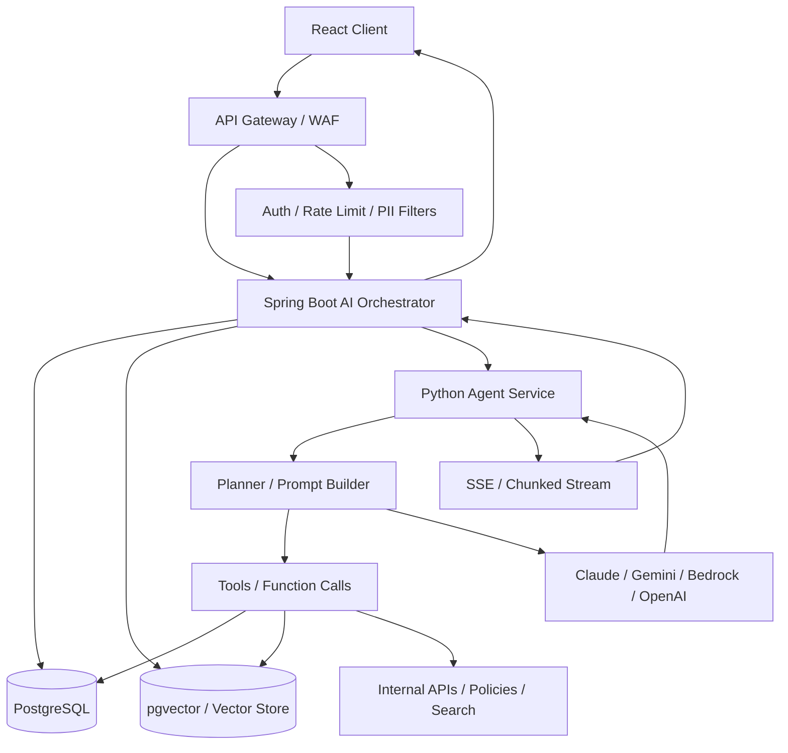
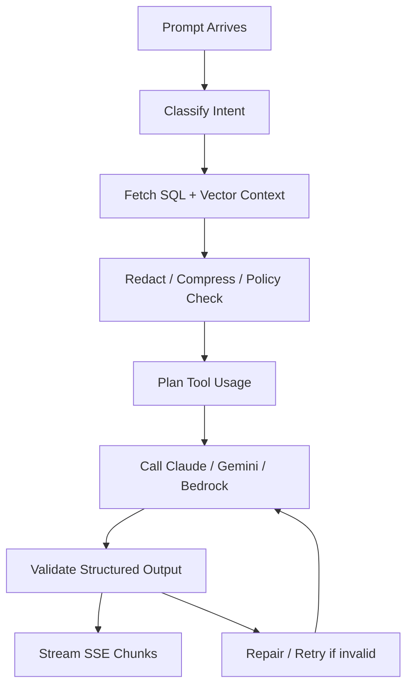
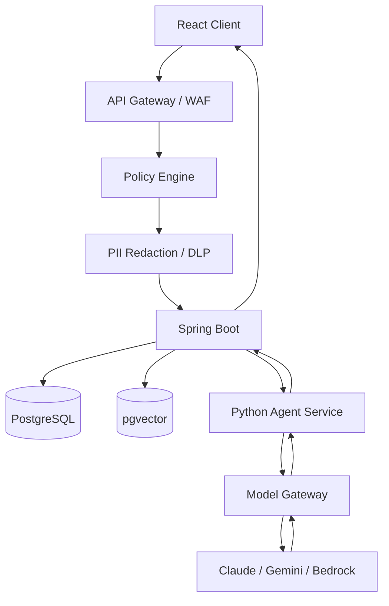

# Java Agentic AI Microservices Architecture Guide

Spring Boot, Python FastAPI, LangGraph/LangChain, PostgreSQL/pgvector, API gateways, model providers, and SSE streaming back to React.

This guide is for the interview scenario where you need to explain how a Java microservice can orchestrate an AI workflow without blocking the user request, while staying safe, observable, and enterprise-ready.

---

## 1) Problem Statement

You have a Spring Boot microservice. A user submits a prompt from a React UI. The prompt must be enriched with data from PostgreSQL and possibly vector search results from pgvector or another vector store. Then the request should be sent to an AI agent service, often implemented in Python using FastAPI with LangGraph or LangChain. The AI response may come from Claude, Gemini, Bedrock-hosted models, OpenAI, or another provider. The final answer should be streamed back to the browser, usually through SSE, because the call may take too long to keep a normal request blocked.

This is a common production pattern for:
- internal enterprise copilots,
- customer support assistants,
- knowledge-base search and synthesis,
- workflow automation assistants,
- compliance or policy review assistants,
- BI/report-generation assistants,
- and regulated-data summarization flows.

---

## 2) Executive Summary

Strong interview answer:

- Spring Boot should stay the orchestration and security edge for the product.
- Python agent service should handle agent planning, tool orchestration, prompt construction, and model-specific logic.
- PostgreSQL and pgvector should hold trusted business data and vectorized retrieval context.
- API gateway should enforce auth, throttling, payload limits, tenant isolation, and policy checks.
- SSE is a good fit for long-running assistant responses when the UI only needs one-way server updates.
- Use async request handling in Spring MVC so the server thread is not blocked.
- For very long jobs or workflow fan-out, use a job model or event-driven callbacks instead of a single blocking chain.

Short version:

Controller receives request -> auth/gateway validation -> fetch context -> call Python agent service -> model provider and tools -> stream partial/final answer -> SSE to React.

---

## 3) When To Use This Architecture

Use this architecture when:
- the AI flow needs company data grounding,
- prompt construction depends on dynamic business records,
- different models may be selected by policy or task,
- there is a need for tool calling, planning, or multi-step reasoning,
- the response is too long for a synchronous HTTP request,
- or compliance requires gateway-level controls before the model sees the prompt.

Do not use this architecture blindly if:
- the task is a simple classification that can be done in one fast model call,
- the response is tiny and synchronous,
- there is no meaningful tool use or retrieval,
- or the flow can be handled by a single Spring AI call without a separate agent service.

---

## 4) Recommended High-Level Architecture



### What this diagram says in interviews

- The React client never talks directly to the model.
- Gateway sits in front for policy, auth, and rate limiting.
- Spring Boot owns the product API, request lifecycle, and SSE delivery.
- Python owns agentic reasoning and LLM orchestration.
- Data retrieval is done before or during the agent workflow.

---

## 5) Good Reference Design Choices

### Option A: Spring Boot calls Python synchronously, Python streams token chunks back

Best for:
- moderate latency,
- real-time generation,
- simple product architecture,
- quick POCs.

Flow:
- React calls Spring Boot.
- Spring Boot starts async request handling.
- Spring Boot calls Python FastAPI.
- Python streams tokens/chunks or structured deltas back.
- Spring Boot forwards them to React as SSE.

### Option B: Spring Boot creates a job, Python consumes and emits progress events

Best for:
- long-running workflows,
- heavy tool use,
- expensive retrieval or large context,
- regulated workflows that need review gates.

Flow:
- React starts a job.
- Spring Boot stores job state and returns job id.
- Python agent processes the job asynchronously.
- Events are published to Redis, Kafka, or a queue.
- Spring Boot pushes SSE updates to React using the job id.

### Option C: Python is the public AI edge, Spring Boot remains core business API

Best for:
- teams with strong Python AI expertise,
- separate AI platform team,
- fast agent iteration in Python.

In this setup, Spring Boot may delegate to Python for AI-only operations but still owns user/account, permissions, audit, and core domain APIs.

---

## 6) Why Python For The Agent Layer

Python is often chosen for the agent service because:
- LangChain and LangGraph ecosystems are mature in Python,
- model SDKs and examples usually appear in Python first,
- tool orchestration and notebook-style experimentation is easier,
- rapid prompt iteration is convenient,
- and many AI teams already work in Python.

Spring Boot is often kept at the edge because:
- it already owns business APIs,
- it handles authentication and transactional business logic well,
- it integrates naturally with enterprise systems,
- and Java teams are often more comfortable keeping the product gateway and workflow API in Spring.

This is a healthy split: Spring for product and policy, Python for agent logic.

---

## 7) Data Grounding Pattern With PostgreSQL And pgvector

### Why pgvector is used

PostgreSQL with pgvector lets you store:
- embeddings of documents,
- embeddings of policy pages,
- embeddings of customer records or structured text projections,
- and similarity-search context for retrieval.

Spring Boot can use PostgreSQL as the system of record and also a vector-backed retrieval index.

### Typical retrieval flow

1. User prompt arrives.
2. Normalize and classify the prompt.
3. Retrieve business records from PostgreSQL.
4. Retrieve related vector chunks from pgvector.
5. Combine structured records and vector hits into a compact context package.
6. Send that package to the agent service.
7. Let the agent decide whether to answer, ask clarifying questions, or call tools.

### Important architectural rule

Do not dump the whole database into the prompt.

Instead:
- filter by tenant,
- retrieve only relevant rows,
- summarize structured records,
- compress long text,
- and pass only the minimum context needed.

---

## 8) Spring Boot Role In The Flow

Spring Boot should usually handle:
- authentication and authorization,
- request validation,
- tenant resolution,
- fetching trusted records from PostgreSQL,
- vector retrieval orchestration,
- calling the Python agent service,
- async response streaming via SSE,
- audit logs,
- correlation IDs,
- and fallback/error handling.

Spring Boot should not be the place where every LLM-specific detail lives unless the team is using Spring AI directly for a simple flow.

### Good boundary

- Spring Boot knows the business context.
- Python knows the agent mechanics.
- Model provider knows inference.

---

## 9) Python Agent Service Role

Python FastAPI service can own:
- prompt assembly,
- prompt classification,
- planning,
- tool orchestration,
- agent loops,
- language-model provider abstraction,
- model choice logic,
- streaming deltas,
- and response shaping.

### LangGraph / LangChain use cases

Use LangGraph when:
- you need explicit multi-step stateful workflows,
- you want deterministic graph-like control flow,
- you want tool execution and retries as nodes,
- or you need branching based on extracted structure.

Use LangChain when:
- the flow is simpler,
- you need reusable prompt/tool abstractions,
- or you want to compose model + retrieval + tools quickly.

Interview-safe answer:
- LangGraph is better for explicit stateful agent workflows.
- LangChain is often quicker for lightweight composition.
- For enterprise workflows, explicit state graphs are easier to reason about than invisible loops.

---

## 10) Model Provider Choices

You can use:
- Claude via Anthropic API or Bedrock,
- Gemini via Google AI / Vertex / Gemini API,
- OpenAI models,
- or Bedrock as a managed enterprise layer over multiple model families.

### Decision guidance

Use Claude when:
- long-form reasoning and tool planning matter,
- you want strong code and analysis behavior,
- or the model is exposed through Bedrock in a controlled environment.

Use Gemini when:
- you need multimodal capability,
- strong long-context use cases,
- or Google ecosystem integration.

Use Bedrock when:
- you want centralized enterprise access,
- governance and model switching matter,
- auditability and provider abstraction are important,
- and guardrails should be standardized.

Use direct provider APIs when:
- the POC is small,
- team wants rapid model experimentation,
- or the architecture does not yet require enterprise platform controls.

---

## 11) Agentic Prompt Modulation

You specifically asked about:
- adjusting temperature,
- building a better prompt using user input and records,
- generating a new payload for the agentic API,
- and over-processing records from pgvector or Postgres.

This is a good agent design pattern.

### Recommended approach

1. Classify the prompt first.
2. Decide if the prompt is:
   - factual lookup,
   - summarization,
   - reasoning over records,
   - action request,
   - or policy-sensitive.
3. Build a context bundle:
   - raw user prompt,
   - structured DB records,
   - vector retrieval hits,
   - user/tenant metadata,
   - policy and guardrail hints.
4. Build a model request.
5. Choose parameters:
   - lower temperature for factual extraction,
   - moderate temperature for synthesis,
   - lower top-p for regulated or compliance output,
   - stricter output schema for downstream automation.
6. Ask the agent for a structured response.
7. Post-process and stream chunks.

### Prompt shaping example

```text
SYSTEM:
You are an enterprise assistant. Use only the provided context. If context is insufficient, say so.

USER QUESTION:
{user_prompt}

STRUCTURED RECORDS:
{postgres_records}

VECTOR CONTEXT:
{retrieved_chunks}

POLICY HINTS:
- Do not expose sensitive fields.
- Respect tenant boundaries.
- Return JSON with fields: answer, confidence, citations, follow_up_questions.
```

### Parameter guidance

- Temperature 0.0 to 0.2 for extraction, policy, or compliance.
- Temperature 0.2 to 0.5 for grounded synthesis.
- Higher temperature only when creativity is actually needed.
- For enterprise flows, keep responses deterministic when possible.

### Interview note

Do not claim the model is “thinking harder” because temperature is high.
Explain it as a sampling parameter that trades off determinism and creativity.

---

## 12) API Gateway And Enterprise Guardrails

This is the area where regulated companies usually care most.

Before any prompt reaches the model, the gateway or an upstream policy layer may enforce:
- authentication,
- tenant isolation,
- rate limits,
- payload size limits,
- content moderation,
- PII masking,
- blocked-topic checks,
- prompt-injection checks,
- and audit logging.

### What industries typically do

Banks, healthcare, insurance, telecom, and large SaaS companies commonly put a control plane in front of AI calls. That control plane may be:
- API Gateway,
- WAF,
- internal AI gateway,
- service mesh policy,
- or a model proxy layer.

### Common control points

- **AuthN/AuthZ:** only approved users or services can invoke AI workflows.
- **Rate limiting:** avoids runaway cost and abuse.
- **PII filters:** redact sensitive data before sending to the model.
- **Prompt allowlists:** only certain tasks are allowed.
- **Prompt injection checks:** user input cannot freely override system instructions.
- **Tenant scoping:** retrieval is limited to the right tenant or customer.
- **Audit logs:** every request is traceable.
- **Model routing:** choose approved model by policy.

### If using Bedrock

Bedrock Guardrails are useful when you want:
- content filters,
- denied topics,
- word filters,
- sensitive information filters,
- grounding checks for RAG,
- and automated reasoning checks.

That means the enterprise can apply guardrails to the input and output pipeline before or during inference.

### If using Gemini or Claude directly

You usually implement the same ideas in your own API gateway or AI gateway layer:
- redact data before model invocation,
- enforce schema validation on responses,
- log model usage,
- and only permit approved prompts/tools.

### Interview-safe summary

A regulated enterprise does not blindly forward raw user prompts to Claude or Gemini. It first applies policy, data minimization, tenant filtering, and audit controls through a gateway or a dedicated AI middleware layer.

---

## 13) Recommended Request Flow

### Synchronous thinking, asynchronous transport

The work may be long-running, but the user experience should stay responsive.

### Suggested sequence

1. React sends request to Spring Boot.
2. Spring Boot validates auth and tenant.
3. Spring Boot retrieves relevant DB records and vector context.
4. Spring Boot creates a correlation/job id.
5. Spring Boot calls Python agent service.
6. Python builds prompt and selects model/provider.
7. Python calls Claude/Gemini/Bedrock/OpenAI.
8. Python streams partial updates or final response.
9. Spring Boot forwards those updates via SSE.
10. React renders chunks as they arrive.

---

## 14) Why SSE Is A Good Fit

Server-Sent Events are a strong choice when:
- the browser only needs server-to-client stream,
- the UI is a chat or progressive answer screen,
- the server should push chunks of text or events,
- and the client does not need to send messages back on the same connection.

### Why not simple blocking REST

Blocking REST is bad for long AI tasks because:
- servlet threads are held for too long,
- the user experiences higher timeout risk,
- and scaling gets worse under concurrency.

### Why not always WebSocket

WebSocket is good when:
- you need bi-directional real-time messaging,
- interactivity is continuous,
- or there are client and server side event streams.

SSE is often simpler for one-way AI response streaming.

### Spring MVC SSE support

Spring MVC supports asynchronous request processing and streaming responses such as:
- `DeferredResult`,
- `Callable`,
- `WebAsyncTask`,
- `ResponseBodyEmitter`,
- and `SseEmitter`.

For AI chat and partial answer streaming, `SseEmitter` is often the cleanest Spring MVC choice.

### Spring MVC behavior

Spring MVC asynchronous support releases the request thread while the response stays open. That is exactly what you want for a long-running AI call.

---

## 15) Spring Boot SSE Controller Example

```java
package com.example.ai.api;

import org.springframework.http.MediaType;
import org.springframework.web.bind.annotation.GetMapping;
import org.springframework.web.bind.annotation.RequestMapping;
import org.springframework.web.bind.annotation.RequestParam;
import org.springframework.web.bind.annotation.RestController;
import org.springframework.web.servlet.mvc.method.annotation.SseEmitter;

@RestController
@RequestMapping("/api/v1/ai")
public class AiController {

  private final AiOrchestrationService aiOrchestrationService;

  public AiController(AiOrchestrationService aiOrchestrationService) {
    this.aiOrchestrationService = aiOrchestrationService;
  }

  @GetMapping(value = "/stream", produces = MediaType.TEXT_EVENT_STREAM_VALUE)
  public SseEmitter stream(@RequestParam String prompt,
                           @RequestParam String tenantId,
                           @RequestParam String userId) {
    SseEmitter emitter = new SseEmitter(0L);
    aiOrchestrationService.processAsync(prompt, tenantId, userId, emitter);
    return emitter;
  }
}
```

### Service example

```java
package com.example.ai.application;

import org.springframework.stereotype.Service;
import org.springframework.web.servlet.mvc.method.annotation.SseEmitter;

@Service
public class AiOrchestrationService {

  private final PythonAgentClient pythonAgentClient;

  public AiOrchestrationService(PythonAgentClient pythonAgentClient) {
    this.pythonAgentClient = pythonAgentClient;
  }

  public void processAsync(String prompt, String tenantId, String userId, SseEmitter emitter) {
    CompletableFuture.runAsync(() -> {
      try {
        emitter.send(SseEmitter.event().name("status").data("retrieving_context"));
        AgentRequest request = pythonAgentClient.buildAgentRequest(prompt, tenantId, userId);
        pythonAgentClient.streamResponse(request, chunk -> {
          try {
            emitter.send(SseEmitter.event().name("chunk").data(chunk));
          } catch (Exception e) {
            throw new RuntimeException(e);
          }
        });
        emitter.send(SseEmitter.event().name("done").data("complete"));
        emitter.complete();
      } catch (Exception ex) {
        emitter.completeWithError(ex);
      }
    });
  }
}
```

### Interview note

`SseEmitter` is a transport-level streaming primitive. It is not the AI logic itself. It just lets Spring push events to the browser as the AI workflow progresses.

---

## 16) Python FastAPI Agent Example

```python
from fastapi import FastAPI
from pydantic import BaseModel

app = FastAPI()

class AgentRequest(BaseModel):
    prompt: str
    tenant_id: str
    user_id: str
    records: list[dict]
    vector_context: list[dict]
    model_hint: str | None = None

@app.post("/agent/stream")
async def agent_stream(req: AgentRequest):
    # In production, this would return a streaming response or async event feed.
    return {
        "status": "accepted",
        "model": req.model_hint or "claude",
        "message": "Agent will process prompt with records and stream output"
    }
```

### Better production shape

Use:
- streaming response,
- or server push events,
- or a job/event mechanism.

For longer workflows, the Python service can emit incremental events:
- `retrieval_started`,
- `retrieval_done`,
- `planning_done`,
- `model_call_started`,
- `tool_call_started`,
- `final_answer_chunk`,
- `completed`.

---

## 17) LangGraph / LangChain Agent Pattern

### Practical agent graph



### When graph-based agents help

- You need explicit steps.
- You need retries and validation.
- You need to branch based on intent.
- You need auditability and operational traceability.

### When not to overuse them

- If the task is a single model call.
- If the flow is trivial.
- If the team will have trouble maintaining it.

Interviewers like to hear that you know agents add complexity and should be justified by measurable need.

---

## 18) Structured Output Contract

This is extremely important for enterprise use.

Do not let the agent return a plain free-form paragraph if downstream systems need reliable parsing.

Use a schema like:

```json
{
  "answer": "string",
  "confidence": 0.0,
  "citations": ["string"],
  "follow_up_questions": ["string"],
  "policy_flags": ["string"]
}
```

### Why this matters

- simpler frontend rendering,
- easier audit and logging,
- easier validation,
- easier to route to human review if needed,
- and lower risk of broken integrations.

### Spring AI support

Spring AI supports structured outputs and advisors. That is useful if you choose to keep some AI orchestration in Java instead of Python.

### Gemini and Claude note

Gemini supports structured outputs and function calling in its API surface.
Claude and Bedrock workflows also support structured agentic patterns and tool use, depending on the platform and SDK.

---

## 19) Regulated Enterprise Pattern

This is the pattern you described: enterprises monitoring and regulating their data before passing it to the model.

### Typical control plane



### What happens here

- The gateway enforces who can call the service.
- Policy engine determines whether prompt is allowed.
- DLP/PII redaction removes sensitive content.
- Spring Boot retrieves only the minimum necessary data.
- Python agent orchestrates prompts and tool use.
- Model gateway optionally standardizes access to Claude/Gemini/Bedrock.
- Final answer is streamed back to the browser.

### Why companies do this

- compliance,
- data minimization,
- auditability,
- model agility,
- lower vendor lock-in,
- and safety enforcement.

---

## 20) Bedrock vs Direct Model APIs vs AI Gateway

### Bedrock

Pros:
- managed enterprise access,
- central governance,
- easier model portfolio switching,
- good fit when procurement/security want one governed surface.

Cons:
- may add platform complexity,
- not every provider feature is equally surfaced,
- and your org may need AWS-specific setup.

### Direct Claude or Gemini APIs

Pros:
- fast experimentation,
- direct access to provider features,
- simpler POCs.

Cons:
- more custom governance burden,
- separate integration patterns per provider,
- more work to enforce standard safety and audit.

### AI Gateway / Proxy Layer

Pros:
- centralized prompt logging,
- policy enforcement,
- PII masking,
- model routing,
- rate limiting,
- caching,
- and observability.

This is increasingly common in enterprises that want a vendor-neutral AI platform.

---

## 21) Spring AI As A Java Option

Sometimes the simplest solution is to keep AI orchestration directly in Spring Boot using Spring AI.

Spring AI provides:
- portable APIs for multiple model providers,
- chat, embeddings, tools/function calling,
- advisors for RAG and chat memory,
- structured outputs,
- observability support,
- and boot autoconfiguration.

### When Spring AI is enough

- smaller POC,
- Java team wants one stack,
- no complex graph workflow,
- and you do not need a separate Python AI platform team.

### When Python remains better

- the team already uses LangGraph heavily,
- more sophisticated agent control flow is needed,
- or AI experimentation is faster in Python.

Interview answer:
- Spring AI can reduce system complexity for Java-native teams.
- Python agent service can be better when your agent logic is more advanced or the AI team prefers Python.

---

## 22) Sample Multi-Stage Workflow

Here is a realistic enterprise flow:

1. User asks: "Summarize the employee risk indicators and suggest follow-up actions."
2. Spring Boot validates tenant and user permissions.
3. Spring Boot fetches employee profile, recent incidents, and policy records.
4. Spring Boot retrieves vector-context chunks from pgvector.
5. Spring Boot sends a compressed context bundle to Python.
6. Python classifies the task as a synthesis + policy review workflow.
7. Python chooses a lower temperature and a strict JSON schema.
8. Python calls the model provider.
9. Python may invoke tools for follow-up facts.
10. Python streams partial results and final structured answer.
11. Spring Boot forwards events to React via SSE.
12. React progressively shows the answer and citations.

This is the kind of end-to-end flow interviewers love because it shows orchestration, safety, and UX thinking together.

---

## 23) Error Handling And Recovery

### Failure points

- retrieval failure,
- model timeout,
- provider quota exceeded,
- tool failure,
- invalid JSON output,
- SSE disconnect,
- policy rejection,
- or downstream DB unavailability.

### Good recovery strategy

- return progress events,
- retry only safe transient failures,
- keep idempotency keys for replays,
- fall back to a smaller model if allowed,
- and show a graceful partial answer if possible.

### Spring MVC async handling

Spring MVC async request handling supports returning `DeferredResult`, `Callable`, `WebAsyncTask`, and streaming types like `SseEmitter` or `ResponseBodyEmitter`.

### FastAPI disconnection handling

FastAPI/Starlette WebSocket handling can detect disconnects through exceptions like `WebSocketDisconnect`. For streaming responses, you should still design heartbeat and cleanup behavior.

---

## 24) Observability Checklist

Track at least:
- request id,
- tenant id,
- user id,
- prompt type,
- model name,
- temperature,
- retrieval latency,
- DB query latency,
- vector search latency,
- provider latency,
- tool call latency,
- token usage,
- streaming duration,
- and error classification.

### Why this matters

Without these metrics, you cannot debug whether the issue was:
- bad retrieval,
- prompt quality,
- bad model choice,
- or a slow downstream tool.

---

## 25) Security And Governance Checklist

- Never send secrets into prompts.
- Mask PII before the model sees it when required.
- Enforce tenant filters in retrieval.
- Use approval gates for destructive tool calls.
- Store audit logs for prompt, context hash, model selection, and response metadata.
- Keep a human review path for high-risk workflows.
- Separate system instructions from user-provided content.
- Treat prompt injection as an application security problem, not just a prompt problem.

---

## 26) Best Practices Summary

### For POCs

- Start with Spring Boot orchestration plus a single Python agent service.
- Use SSE to stream responses.
- Use PostgreSQL plus pgvector for retrieval.
- Keep model choice simple at first.
- Add prompt schemas and logging early.

### For production

- Put API gateway and policy checks in front.
- Add DLP / PII redaction.
- Use structured outputs.
- Keep retrieval tenant-scoped.
- Use async request handling and streaming.
- Add circuit breakers, retries, and timeouts.
- Make provider choice configurable.
- Separate policy, retrieval, and model logic.

### For regulated enterprise systems

- Consider Bedrock or an AI gateway layer.
- Keep audit trails.
- Use grounding checks and guardrails.
- Restrict what data can be sent to external providers.
- Apply prompt and output filtering.
- Store only what is needed for memory and compliance.

---

## 27) Interview Answer Template

If asked, "How would you design a Spring Boot microservice that sends prompts to an AI agent and streams the response back?"

A strong answer is:

> I would keep Spring Boot as the secure orchestration layer, use PostgreSQL and pgvector to gather the minimum trusted context, and delegate agentic reasoning to a Python FastAPI service using LangGraph or LangChain. The Python service would build the prompt, choose model settings such as temperature and output schema, and call Claude, Gemini, or Bedrock depending on policy. Since the response may take time, I would not block the servlet thread. Instead, I would use Spring MVC async support with SseEmitter to stream partial updates to React. In regulated environments, I would put an API gateway or AI gateway in front to enforce auth, tenant filters, PII masking, and audit logging before any prompt reaches the model.

---

## 28) What To Say About Bedrock, Gemini, And Claude

- **Bedrock** is often chosen when governance and managed enterprise access matter.
- **Gemini** is strong when you need long context, multimodal capability, or Google ecosystem integration.
- **Claude** is often chosen for strong reasoning and agentic work.
- The enterprise should abstract provider selection behind a policy or gateway layer rather than hard-coding model calls everywhere.

---

## 29) Final Architecture Checklist

Before you present the architecture, make sure you can explain:
- the request lifecycle,
- where auth happens,
- where retrieval happens,
- why Python is used,
- how the model is selected,
- how prompt modulation works,
- why SSE is used,
- how you handle failures,
- how you enforce policy,
- and how you keep the system observable and auditable.

---

## 30) Reference Pointers

These are the most relevant references behind this guide:

1. Spring AI reference and ChatClient API: https://docs.spring.io/spring-ai/reference/
2. Spring AI ChatClient advisors, structured output, streaming, and memory: https://docs.spring.io/spring-ai/reference/api/chatclient.html
3. Spring MVC async requests and streaming/SSE: https://docs.spring.io/spring-framework/reference/web/webmvc/mvc-ann-async.html
4. Amazon Bedrock overview: https://docs.aws.amazon.com/bedrock/latest/userguide/what-is-bedrock.html
5. Amazon Bedrock Guardrails: https://docs.aws.amazon.com/bedrock/latest/userguide/guardrails.html
6. Gemini API docs: https://ai.google.dev/gemini-api/docs
7. FastAPI WebSockets and production streaming-related guidance: https://fastapi.tiangolo.com/advanced/websockets/

---

## 31) Closing Thought

For interviews, the most important thing is not naming every framework. It is showing that you understand the control plane around AI:
- how data is grounded,
- how prompts are shaped,
- how policies are enforced,
- how responses are streamed,
- and how the architecture stays safe and maintainable as the agent grows.

---

## 32) Enterprise Security Review Questions

If the application may handle PII, PHI, or other regulated data, an enterprise security team will usually cross-check the design before deployment. They are not only asking "is the code secure?" They are asking whether the full data lifecycle is controlled: what data enters, where it goes, who can see it, how long it lives, whether it is encrypted, and whether the AI layer can leak it accidentally.

### 32.1 Data Classification And Data Flow

Expect questions like:
- What exact data types can enter the AI workflow: PII, PHI, PCI, secrets, customer records, internal docs, source code, logs?
- Is each field classified by sensitivity, not just each table or API?
- Which requests are allowed to reach the agent, and which are blocked outright?
- Which data is used only for retrieval, and which data is sent to the model?
- Are we sending raw data, masked data, or summarized data?
- Can the prompt contain free text that may accidentally include sensitive data?
- Do we have a documented data-flow diagram from browser to gateway to Spring Boot to Python agent to model provider and back?

Security teams want to see data minimization. The strongest answer is that the AI layer only receives the smallest possible context needed for the user task.

### 32.2 Identity, Access, And Tenant Isolation

Questions typically include:
- How is the end user authenticated?
- How is the service-to-service trust established between Spring Boot and Python?
- Do we use mTLS, OAuth2 client credentials, signed JWTs, or workload identity?
- How is tenant isolation enforced in retrieval?
- Can one tenant ever retrieve another tenant’s documents through vector search?
- Are administrative overrides logged and limited?
- Is least privilege enforced on every service account, database role, and model gateway token?

For regulated systems, the reviewer will want proof that tenant filtering is enforced at the query layer, not only in application logic.

### 32.3 PII And PHI Handling

For healthcare or similar regulated environments, they will ask:
- Do we detect and redact PII/PHI before sending any text to a model?
- Are names, addresses, emails, phone numbers, SSNs, MRNs, DOBs, insurance numbers, or clinical notes masked?
- Is there a configurable DLP policy or regex/ML detector?
- Do we preserve a secure internal copy of the original data while only sending a redacted version to the model?
- Do prompts ever contain diagnostics, lab values, or clinical interpretations?
- Are outputs scanned again before being returned to the user?
- Do we support human review for sensitive answers?

If health data is involved, the security team will likely ask whether the vendor relationship and processing model are compatible with your legal obligations, internal policy, and contracts such as a BAA if applicable.

### 32.4 Prompt Injection And Data Exfiltration

The team may ask:
- What prevents a user from instructing the model to reveal hidden system prompts or confidential data?
- How do we separate system instructions from user content and retrieved context?
- Do we sanitize retrieved documents before inserting them into the prompt?
- Can a malicious document in the knowledge base manipulate the agent?
- Do we validate tool arguments before execution?
- Are tools allowlisted and scoped per use case?
- Can the agent be tricked into calling an internal API with unauthorized parameters?

They will want to know whether prompt injection is treated as an application security threat, with defense-in-depth controls rather than only prompt engineering.

### 32.5 Model Provider And Subprocessor Risk

Questions in this area often include:
- Which model providers are used in production?
- Are we using Bedrock, direct Anthropic/Claude, Gemini, or another provider?
- Is the provider contractually approved for this data class?
- Do they retain prompts or completions for training?
- Can we disable training on our data?
- Where is data processed geographically?
- Which subprocessors are involved?
- Can we switch models without changing the product data path?

Security and legal teams often focus on whether regulated content is routed to an external provider directly or through a managed enterprise platform such as Bedrock or an internal AI gateway.

### 32.6 Encryption And Key Management

Expect detailed questions about:
- TLS between every hop,
- encryption at rest for databases, queues, logs, and vector stores,
- KMS or equivalent key ownership,
- customer-managed keys versus provider-managed keys,
- key rotation,
- secret storage,
- and whether model API keys ever appear in source code or logs.

They may also ask whether embeddings are considered sensitive data in your environment and whether the vector store is encrypted and access-controlled like the primary database.

### 32.7 Logging, Monitoring, And Auditability

Security teams usually ask:
- What is logged in request/response traces?
- Do logs contain raw prompts, model outputs, embeddings, or sensitive context?
- Can we redact or hash sensitive content in logs?
- Is every model call attributable to a user, tenant, and correlation id?
- Can we reconstruct who asked what, what context was used, and what the model returned?
- Are immutable audit logs stored separately?
- Do we detect anomalous usage patterns or prompt abuse?

The safest answer is that logs contain metadata, hashes, and policy decisions by default, not raw regulated content.

### 32.8 Retention, Deletion, And Legal Hold

Questions often include:
- How long are prompts, responses, chat memory, and retrieval artifacts retained?
- Can data be deleted by user request or policy?
- What happens on account deletion?
- Do we have a legal hold mechanism?
- Are embeddings deleted when the source document is deleted?
- Can cached prompts or response fragments be purged?
- Are backups and DR copies covered by the same retention policy?

For regulated environments, the reviewer will check whether your retention story is aligned across application data, logs, caches, vector stores, and backups.

### 32.9 Environment Segregation And Deployment Controls

Common questions:
- Are dev, test, stage, and prod fully separated?
- Can production data reach non-prod environments?
- Are non-prod model endpoints isolated from prod?
- Are feature flags or runtime config used to enable/disable AI flows safely?
- Is the AI service behind the same network controls as other sensitive services?
- Are container images scanned and signed?
- Are runtime secrets injected from a secure secret manager?

Security teams want hard proof that test environments do not become shadow copies of production data.

### 32.10 Prompt, Output, And Tool Safety

They may ask:
- Do we enforce structured output schemas?
- Do we reject malformed model responses before downstream consumption?
- Are dangerous actions blocked unless explicitly approved?
- Can the model trigger a financial, medical, or operational action automatically?
- Do we have a human-in-the-loop approval path for sensitive decisions?
- Are tool calls validated against business rules?
- Do we rate-limit or disable the agent if it behaves unexpectedly?

For regulated workflows, the answer should be that the model advises, but policy and application logic decide whether an action is actually taken.

### 32.11 Vendor Risk And Legal Questions

Expect legal and vendor-risk questions such as:
- Do we have an approved vendor list for model providers?
- Has the provider been reviewed for privacy, security, and data residency?
- Are their subprocessors documented?
- Does the contract allow our data to be excluded from training?
- Can we obtain audit reports, SOC reports, or equivalent assurance?
- Are there limits on which categories of data can be sent?
- Do we need a BAA or equivalent contractual protection for the use case?

This is usually where regulated industries slow down deployment the most, especially for healthcare and financial data.

### 32.12 Incident Response And Abuse Handling

They may ask:
- What happens if a prompt leaks sensitive data?
- How do we revoke model access quickly?
- Can we rotate gateway tokens without redeploying everything?
- How do we disable the AI feature if a vulnerability is found?
- Do we have a rollback plan if a model starts producing unsafe output?
- Can we capture the exact context used for a problematic answer?
- Who gets alerted when policy violations occur?

The right answer is to have a kill switch, alerting, and an incident playbook for AI-specific failures.

### 32.13 Red-Team And Validation Questions

Security reviewers often test the app with adversarial examples and ask:
- Can prompt injection break the policy boundary?
- Can retrieved documents smuggle hidden instructions?
- Can a user force the system to reveal protected context?
- Can the model be coaxed into outputting prohibited content?
- Are there evals for hallucination, grounding, and policy compliance?
- Do we run regression tests against harmful prompts before release?

This is where simulation and red-team testing matter more than architecture slides.

### 32.14 Suggested Security Team Review Pack

Before deployment, prepare these artifacts:
- architecture and data-flow diagram,
- data classification matrix,
- DLP/redaction policy,
- model/provider approval list,
- prompt and output schema samples,
- access control matrix,
- audit logging design,
- retention/deletion policy,
- incident response runbook,
- red-team test results,
- and a risk acceptance note for any approved exceptions.

### 32.15 Short Answer You Can Give In A Review Meeting

If the security team asks for the summary, say:

> We minimize data before model invocation, enforce tenant and role boundaries at retrieval, redact PII or PHI where required, log only the metadata needed for audit, use encrypted service-to-service communication, validate model output against a schema, and keep the AI layer behind gateway and policy controls. For regulated data, the model is not trusted with raw context unless the data classification and contract allow it.

That answer shows the team you understand both the technical and compliance sides of the deployment.
