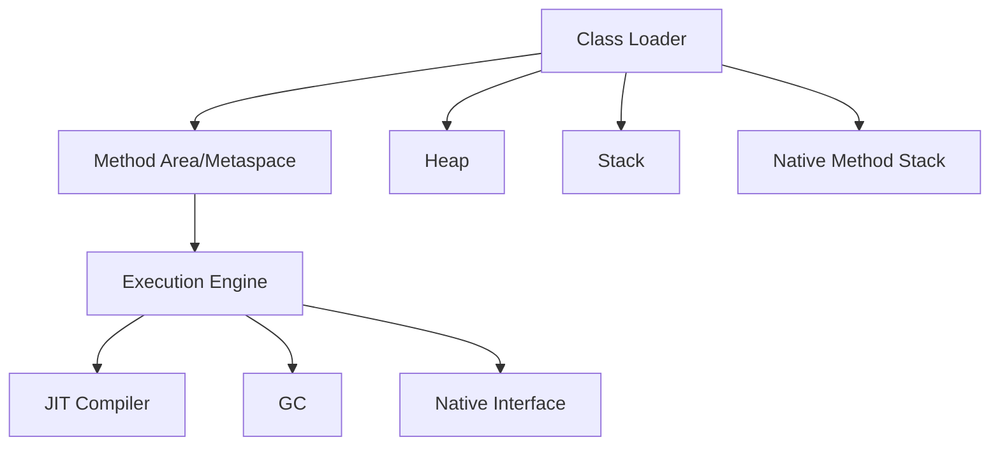

# Backend Architect Master Handbook

---

## Table of Contents

**PART 1 — Modern Java**
1. Java Internals & JVM
2. Collections & Streams
3. Concurrency & Virtual Threads
4. Modern Java Features

**PART 2 — Spring Ecosystem**
5. Spring Core & Boot
6. Spring Security & OAuth2
7. Spring Data & Transactions
8. WebFlux & Reactive
9. Spring Testing

**PART 3 — Data Layer**
10. PostgreSQL Internals
11. Redis Deep Dive
12. Hibernate & ORM
13. Query Optimization

**PART 4 — Event Systems**
14. Kafka Architecture & Streams
15. Messaging Patterns & Distributed Systems

**PART 5 — Cloud & Infra**
16. Docker & Kubernetes
17. Terraform & IaC
18. Cloud Platforms (AWS/Azure)
19. CI/CD & DevOps

**PART 6 — System Design**
20. Scalability & Caching
21. Resilience & Observability
22. API Gateway & Rate Limiting

**PART 7 — Production Engineering**
23. Outages & Debugging
24. Latency & Profiling
25. Monitoring & Incident Response

**PART 8 — Interview Preparation**
26. Coding Patterns & DSA
27. HLD & LLD Machine Coding
28. Behavioral & Leadership

---


## PART 1 — Modern Java (Exhaustive)

### 1. Java Internals & JVM

#### 1.1 JVM Architecture
The JVM (Java Virtual Machine) executes Java bytecode. Key components:
- **Class Loader Subsystem**: Loads, links, and initializes classes.
- **Runtime Data Areas**: Heap, stack, metaspace, program counter, native method stack.
- **Execution Engine**: Interprets bytecode, uses JIT (Just-In-Time) compiler for hot code.
- **Native Interface**: Calls native libraries (JNI).

#### 1.2 JIT Compiler & Escape Analysis
- **JIT**: Compiles frequently executed bytecode to native code for speed.
- **Escape Analysis**: Determines if objects can be stack-allocated or eliminated.

#### 1.3 Object Layout & Memory
- **Object Header**: Contains mark word (hash, GC info), class pointer.
- **Compressed OOPs**: 32-bit references on 64-bit JVMs for memory efficiency.
- **Off-heap Memory**: Used by NIO, direct buffers, some caches.

#### 1.4 Garbage Collection (GC)
- **G1GC**: Region-based, low-pause, default for most modern JVMs.
- **ZGC**: Ultra-low pause, concurrent, suitable for large heaps.
- **GC Tuning**: `-Xmx`, `-Xms`, `-XX:MaxGCPauseMillis`, `-XX:+UseG1GC`, etc.

#### 1.5 Safepoints & Thread Scheduling
- **Safepoint**: JVM pauses all threads for GC, deoptimization, etc.
- **Thread Scheduling**: OS-level, JVM maps Java threads to native threads.

#### 1.6 Class Loaders & Metaspace
- **Bootstrap, Extension, Application ClassLoader**
- **Metaspace**: Stores class metadata (replaces PermGen).
- **Class unloading**: Only if no references remain.

#### JVM Diagram


---

### 2. Collections & Streams

#### 2.1 Collections Overview
- **List**: Ordered, allows duplicates (ArrayList, LinkedList).
- **Set**: No duplicates (HashSet, LinkedHashSet, TreeSet).
- **Map**: Key-value pairs (HashMap, LinkedHashMap, TreeMap, ConcurrentHashMap).

#### 2.2 Performance & Pitfalls
- **ArrayList**: Fast random access, slow inserts/removes in middle.
- **LinkedList**: Fast inserts/removes, slow random access.
- **HashMap**: O(1) average, O(n) worst-case (hash collisions).
- **ConcurrentHashMap**: Thread-safe, segment locking (Java 7), bucket-level (Java 8+).

#### 2.3 Iteration & Fail-Fast
- **Iterator**: Throws `ConcurrentModificationException` if structure changes during iteration.
- **Fail-safe**: CopyOnWriteArrayList, ConcurrentHashMap.

#### 2.4 Stream API
- **Stream**: Sequence of elements supporting functional-style operations.
- **Intermediate ops**: map, filter, sorted, distinct, limit, skip.
- **Terminal ops**: collect, reduce, forEach, count, anyMatch.

#### 2.5 Parallel Streams & ForkJoinPool
- **Parallel Stream**: Splits work across threads (uses ForkJoinPool.commonPool).
- **Pitfalls**: Not always faster (overhead, shared state, thread contention).

#### 2.6 Collector Patterns
- **Grouping**: `Collectors.groupingBy()`
- **Reduction**: `reduce()`, `Collectors.reducing()`
- **Partitioning**: `Collectors.partitioningBy()`

#### Example: Stream Grouping
```java
Map<String, List<Person>> byCity = people.stream()
	.collect(Collectors.groupingBy(Person::getCity));
```

#### Example: Parallel Stream
```java
list.parallelStream().map(x -> x * 2).collect(Collectors.toList());
```

---

### 3. Concurrency & Virtual Threads

#### 3.1 Thread, Runnable, Callable, ExecutorService
- **Thread**: OS thread, expensive to create.
- **Runnable**: No return value.
- **Callable**: Returns value, can throw checked exception.
- **ExecutorService**: Manages thread pools.

#### Example: Thread Pool
```java
ExecutorService pool = Executors.newFixedThreadPool(4);
Future<Integer> result = pool.submit(() -> 42);
pool.shutdown();
```

#### 3.2 Virtual Threads (Project Loom)
- **Virtual Thread**: Lightweight, scheduled by JVM, thousands per process.
- **Structured Concurrency**: Parent waits for child tasks, propagates exceptions.

#### Example: Virtual Threads
```java
try (var scope = Executors.newVirtualThreadPerTaskExecutor()) {
	Future<String> f = scope.submit(() -> "hello");
	System.out.println(f.get());
}
```

#### 3.3 Locks, Atomics, Concurrent Collections
- **ReentrantLock, ReadWriteLock**: Explicit locking.
- **AtomicInteger, AtomicReference**: Lock-free thread-safe updates.
- **ConcurrentHashMap, CopyOnWriteArrayList**: Thread-safe collections.

#### 3.4 Producer-Consumer Example
```java
BlockingQueue<Integer> queue = new ArrayBlockingQueue<>(10);
Runnable producer = () -> {
	try { queue.put(1); } catch (InterruptedException e) { Thread.currentThread().interrupt(); }
};
Runnable consumer = () -> {
	try { queue.take(); } catch (InterruptedException e) { Thread.currentThread().interrupt(); }
};
new Thread(producer).start();
new Thread(consumer).start();
```

#### 3.5 Thread-Safe Singleton
```java
public class Singleton {
	private static final Singleton INSTANCE = new Singleton();
	private Singleton() {}
	public static Singleton getInstance() { return INSTANCE; }
}
```

---

### 4. Modern Java Features

#### 4.1 Records
```java
public record Point(int x, int y) {}
```
- Immutable data carrier, auto-generates equals/hashCode/toString.

#### 4.2 Sealed Classes
```java
public sealed class Shape permits Circle, Rectangle {}
final class Circle extends Shape {}
final class Rectangle extends Shape {}
```
- Restricts which classes can extend.

#### 4.3 Switch Expressions
```java
int numLetters = switch (day) {
	case MONDAY, FRIDAY, SUNDAY -> 6;
	case TUESDAY -> 7;
	default -> throw new IllegalStateException();
};
```

#### 4.4 Pattern Matching
```java
if (obj instanceof String s) {
	System.out.println(s.toUpperCase());
}
```

#### 4.5 Structured Concurrency & Scoped Values
- **Structured concurrency**: Parent/child task lifecycles are bound.
- **Scoped values**: Safer alternative to thread-local for context passing.

#### 4.6 Reactive Streams & CompletableFuture
- **CompletableFuture**: Async computation, chaining, error handling.
- **Flow API**: Publisher, Subscriber, Subscription, Processor.

#### Example: CompletableFuture
```java
CompletableFuture.supplyAsync(() -> "hello")
	.thenApply(String::toUpperCase)
	.thenAccept(System.out::println);
```

---

---

## PART 2 — Spring Ecosystem

### 5. Spring Core & Boot
- Bean lifecycle, proxy/AOP internals, dependency injection
- `@Transactional` propagation/isolation, configuration
- Boot auto-configuration, starter dependencies, actuator

#### Detailed Example (with Dev Comments)
```java
@Service
public class OrderService {
	private final PaymentClient paymentClient;
	private final OrderRepository orderRepository;

	public OrderService(PaymentClient paymentClient, OrderRepository orderRepository) {
		this.paymentClient = paymentClient;
		this.orderRepository = orderRepository;
	}

	@Transactional // Dev note: transaction starts at proxied public method boundary.
	public Order createOrder(CreateOrderRequest req) {
		Order order = new Order(req.userId(), req.amount());
		orderRepository.save(order); // Dev note: persisted in same transaction.

		paymentClient.charge(req.userId(), req.amount());
		// Dev note: if payment throws RuntimeException, DB transaction rolls back.
		return order;
	}
}
```

### 6. Spring Security & OAuth2
- Filter chains, authentication/authorization, JWT, OAuth2 flows
- API gateway patterns, CSRF, CORS, method security

#### Detailed Example (with Dev Comments)
```java
@Bean
SecurityFilterChain security(HttpSecurity http) throws Exception {
	return http
		.csrf(csrf -> csrf.disable()) // Dev note: disable only for stateless token APIs.
		.authorizeHttpRequests(auth -> auth
			.requestMatchers("/actuator/health").permitAll()
			.requestMatchers(HttpMethod.GET, "/api/orders/**").hasAnyRole("USER", "ADMIN")
			.requestMatchers("/api/admin/**").hasRole("ADMIN")
			.anyRequest().authenticated())
		.oauth2ResourceServer(oauth -> oauth.jwt()) // Dev note: validates JWT signature and claims.
		.build();
}
```

### 7. Spring Data & Transactions
- JPA/Hibernate, repository patterns, query optimization
- Transaction boundaries, isolation, propagation, rollback
- N+1, lazy loading, entity graphs, projections

#### Detailed Example (with Dev Comments)
```java
public interface OrderRepository extends JpaRepository<Order, Long> {
	@EntityGraph(attributePaths = {"items"})
	Optional<Order> findWithItemsById(Long id); // Dev note: avoids N+1 on items.
}

@Service
public class BillingService {
	@Transactional(isolation = Isolation.READ_COMMITTED)
	public void settleInvoice(Long invoiceId) {
		// Dev note: keep this method small; transaction duration should be minimal.
		// Dev note: avoid remote calls here to reduce lock time and deadlock probability.
	}
}
```

### 8. WebFlux & Reactive
- Reactive programming, Mono/Flux, backpressure
- WebFlux vs MVC, thread model, testing

#### Detailed Example (with Dev Comments)
```java
@RestController
@RequestMapping("/api/stream")
public class EventController {

	@GetMapping(value = "/events", produces = MediaType.TEXT_EVENT_STREAM_VALUE)
	public Flux<String> events() {
		return Flux.interval(Duration.ofSeconds(1))
			.onBackpressureDrop() // Dev note: drop when client is slow; prevent memory blow-up.
			.map(tick -> "event-" + tick);
	}
}
```

### 9. Spring Testing
- Unit, slice, integration, testcontainers
- MockMvc, WebTestClient, embedded databases

#### Detailed Example (with Dev Comments)
```java
@WebMvcTest(OrderController.class)
class OrderControllerTest {
	@Autowired private MockMvc mockMvc;
	@MockBean private OrderService orderService;

	@Test
	void returnsOrder() throws Exception {
		when(orderService.getOrder(1L)).thenReturn(new OrderDto(1L, "PAID"));

		mockMvc.perform(get("/api/orders/1"))
			.andExpect(status().isOk())
			.andExpect(jsonPath("$.status").value("PAID"));
		// Dev note: slice test validates web layer behavior only, not full app wiring.
	}
}
```

---

## PART 3 — Data Layer

### 10. PostgreSQL Internals
- WAL, checkpoints, autovacuum, dead tuples
- Planner, execution engine, bitmap/index-only scans
- Replication, failover, logical replication, MVCC
- Locking, row visibility, transaction isolation

#### Detailed Example (with Dev Comments)
```sql
-- Dev note: inspect whether index-only scan is possible.
EXPLAIN (ANALYZE, BUFFERS)
SELECT id, created_at
FROM orders
WHERE user_id = 42
ORDER BY created_at DESC
LIMIT 20;

-- Dev note: covering index helps avoid heap fetches.
CREATE INDEX CONCURRENTLY idx_orders_user_created
ON orders (user_id, created_at DESC) INCLUDE (id);
```

### 11. Redis Deep Dive
- Data structures, eviction, persistence, replication
- Sentinel, cluster, split brain, distributed locks
- Hot keys, cache avalanche, stale cache, lag

#### Detailed Example (with Dev Comments)
```java
public Product getProduct(Long id) {
	String key = "product:" + id;
	String cached = redis.get(key);
	if (cached != null) {
		return Json.parse(cached, Product.class); // Dev note: hot path, avoid DB hit.
	}

	Product p = productRepo.findById(id).orElseThrow();
	redis.setex(key, 300, Json.stringify(p)); // Dev note: add TTL to prevent stale forever.
	return p;
}
```

### 12. Hibernate & ORM
- Session, entity state, dirty checking, flush modes
- Caching, query tuning, batch operations

#### Detailed Example (with Dev Comments)
```java
@Transactional
public void batchUpdateStatus(List<Long> orderIds) {
	int i = 0;
	for (Long id : orderIds) {
		Order o = entityManager.find(Order.class, id);
		o.markArchived(); // Dev note: dirty checking queues UPDATE at flush time.
		if (++i % 50 == 0) {
			entityManager.flush();  // Dev note: release SQL batch every 50 rows.
			entityManager.clear();  // Dev note: prevent persistence context memory growth.
		}
	}
}
```

### 13. Query Optimization
- Indexing, explain plans, join strategies
- Partitioning, sharding, denormalization

#### Detailed Example (with Dev Comments)
```sql
-- Dev note: avoid SELECT * on large joins; fetch only columns required by API.
EXPLAIN (ANALYZE, BUFFERS)
SELECT o.id, o.total_amount, u.email
FROM orders o
JOIN users u ON u.id = o.user_id
WHERE o.created_at >= now() - interval '7 days'
AND o.status = 'PAID';

-- Dev note: composite index improves predicate + sort/filter efficiency.
CREATE INDEX idx_orders_status_created_at ON orders(status, created_at);
```

---

## PART 4 — Event Systems

### 14. Kafka Architecture & Streams
- Broker internals, ISR, leader election, partition assignment
- Batching, compression, retention, page cache
- Pull model, rebalance, exactly-once, idempotent producer
- Transactions, stream processing, KRaft vs ZooKeeper

#### Detailed Example (with Dev Comments)
```java
Properties p = new Properties();
p.put("bootstrap.servers", "kafka:9092");
p.put("acks", "all"); // Dev note: strongest durability with ISR.
p.put("enable.idempotence", "true"); // Dev note: avoids duplicate writes on retries.
p.put("retries", Integer.toString(Integer.MAX_VALUE));
p.put("max.in.flight.requests.per.connection", "5");

KafkaProducer<String, String> producer = new KafkaProducer<>(p, new StringSerializer(), new StringSerializer());
producer.send(new ProducerRecord<>("orders", "order-1", "{\"status\":\"PAID\"}"));
```

### 15. Messaging Patterns & Distributed Systems
- Pub/sub, fanout, competing consumers, DLQ
- Ordering, replay, consumer groups, operational complexity
- Kafka vs RabbitMQ: throughput, replay, ordering, storage

#### Detailed Example (with Dev Comments)
```java
@KafkaListener(topics = "payments", groupId = "billing")
public void consume(String payload, Acknowledgment ack) {
	try {
		billingProcessor.process(payload);
		ack.acknowledge(); // Dev note: manual ack after side effects succeed.
	} catch (Exception ex) {
		dlqPublisher.publish("payments.dlq", payload); // Dev note: preserve failed event for replay.
	}
}
```

---

## PART 5 — Cloud & Infra

### 16. Docker & Kubernetes
- Containerization, image hygiene, non-root, reproducibility
- K8s architecture, pods, deployments, services, ingress
- Probes, HPA, PDB, rollout, autoscaling, resource limits

#### Detailed Example (with Dev Comments)
```yaml
apiVersion: apps/v1
kind: Deployment
metadata:
	name: orders-api
spec:
	replicas: 3
	selector:
		matchLabels:
			app: orders-api
	template:
		metadata:
			labels:
				app: orders-api
		spec:
			containers:
			- name: app
				image: org/orders-api:1.2.0
				resources:
					requests:
						cpu: "250m"   # Dev note: scheduler uses requests for bin-packing.
						memory: "512Mi"
					limits:
						cpu: "1"
						memory: "1Gi" # Dev note: hard cap to prevent node starvation.
```

### 17. Terraform & IaC
- Infrastructure as code, modules, state, drift
- Cloud resource provisioning, best practices

#### Detailed Example (with Dev Comments)
```hcl
module "vpc" {
	source = "terraform-aws-modules/vpc/aws"
	name   = "prod-vpc"
	cidr   = "10.20.0.0/16"

	azs             = ["us-east-1a", "us-east-1b"]
	private_subnets = ["10.20.1.0/24", "10.20.2.0/24"]
	public_subnets  = ["10.20.101.0/24", "10.20.102.0/24"]
	enable_nat_gateway = true
	single_nat_gateway = true # Dev note: cheaper, but single-AZ risk.
}
```

### 18. Cloud Platforms (AWS/Azure)
- EC2, EKS, ALB, SQS, SNS, DynamoDB, ElastiCache
- IAM, VPC, security groups, networking

#### Detailed Example (with Dev Comments)
```java
// AWS SDK v2 example
SqsClient sqs = SqsClient.builder().region(Region.US_EAST_1).build();
SendMessageResponse res = sqs.sendMessage(SendMessageRequest.builder()
	.queueUrl(queueUrl)
	.messageBody("{\"orderId\":123,\"event\":\"PAID\"}")
	.build());

// Dev note: include correlation id in message attributes for cross-service tracing.
```

### 19. CI/CD & DevOps
- Pipelines, GitHub Actions, Jenkins, ArgoCD
- Canary, blue/green, rollback, SLO-driven ops

#### Detailed Example (with Dev Comments)
```yaml
name: backend-ci
on: [push]
jobs:
	build-test:
		runs-on: ubuntu-latest
		steps:
		- uses: actions/checkout@v4
		- uses: actions/setup-java@v4
			with:
				distribution: temurin
				java-version: '21'
		- run: ./gradlew test
		- run: ./gradlew bootJar
			# Dev note: separate test and package stages makes failures easier to triage.
```

---

## PART 6 — System Design

### 20. Scalability & Caching
- Horizontal/vertical scaling, sharding, partitioning
- Redis, CDN, cache invalidation, rate limiting

#### Detailed Example (with Dev Comments)
```java
public ProductDto getById(Long id) {
	String key = "p:" + id;
	ProductDto hit = cache.get(key);
	if (hit != null) return hit;

	ProductDto db = repo.fetchDto(id);
	cache.set(key, db, Duration.ofMinutes(5));
	// Dev note: cache-aside is simple, but remember explicit invalidation on updates.
	return db;
}
```

### 21. Resilience & Observability
- Circuit breakers, retries, bulkheads, timeouts
- Logging, tracing, metrics, Prometheus, Grafana, ELK

#### Detailed Example (with Dev Comments)
```java
@Retry(name = "paymentRetry")
@CircuitBreaker(name = "paymentCb", fallbackMethod = "fallback")
public PaymentResponse charge(ChargeRequest req) {
	return paymentClient.charge(req);
}

public PaymentResponse fallback(ChargeRequest req, Throwable t) {
	// Dev note: return safe degraded response, do not hide permanent business errors.
	return PaymentResponse.pending("PAYMENT_UNAVAILABLE");
}
```

### 22. API Gateway & Rate Limiting
- Gateway patterns, authentication, throttling, quotas
- OpenAPI, versioning, backward compatibility

#### Detailed Example (with Dev Comments)
```yaml
routes:
	- id: orders-route
		uri: lb://orders-service
		predicates:
			- Path=/api/orders/**
		filters:
			- name: RequestRateLimiter
				args:
					redis-rate-limiter.replenishRate: 50
					redis-rate-limiter.burstCapacity: 100
					# Dev note: burst handles traffic spikes without immediate 429s.
```

---

## PART 7 — Production Engineering

### 23. Outages & Debugging
- Incident response, detection, containment, recovery
- Root cause analysis, blameless postmortems

#### Detailed Example (with Dev Comments)
```text
Runbook: Checkout API 5xx spike
1) Confirm blast radius via dashboard (error rate, latency, regions).
2) Roll back latest deploy if incident started right after release.
3) Enable read-only or partial degrade mode to reduce pressure.
4) Capture thread dump + heap summary for later RCA.
5) Declare incident channel and assign commander/scribe roles.

Dev note: optimize for time-to-mitigate first, root cause second.
```

### 24. Latency & Profiling
- JVM profiling, flame graphs, async bottlenecks
- GC tuning, thread dumps, heap dumps

#### Detailed Example (with Dev Comments)
```bash
# Dev note: capture 60s CPU profile from running JVM.
./async-profiler/profiler.sh -d 60 -e cpu -f cpu.svg <pid>

# Dev note: thread dump to identify lock contention or blocked IO.
jcmd <pid> Thread.print > threaddump.txt

# Dev note: class histogram to spot unexpected memory growth.
jcmd <pid> GC.class_histogram > histogram.txt
```

### 25. Monitoring & Incident Response
- SLOs, error budgets, alerting, runbooks
- Blackbox/whitebox monitoring, synthetic checks

#### Detailed Example (with Dev Comments)
```yaml
groups:
- name: api-slo-alerts
	rules:
	- alert: High5xxRate
		expr: sum(rate(http_server_requests_seconds_count{status=~"5.."}[5m]))
			/ sum(rate(http_server_requests_seconds_count[5m])) > 0.02
		for: 10m
		labels:
			severity: page
		annotations:
			summary: "5xx ratio above 2% for 10m"
			# Dev note: align threshold with SLO error budget policy.
```

---

## PART 8 — Interview Preparation

### 26. Coding Patterns & DSA
- Concurrency coding, producer-consumer, LRU cache
- Rate limiter, thread-safe singleton, async aggregator
- Stream processing, retry framework, custom thread pool

#### Detailed Example (with Dev Comments)
```java
public class LruCache<K, V> extends LinkedHashMap<K, V> {
	private final int capacity;

	public LruCache(int capacity) {
		super(capacity, 0.75f, true); // Dev note: accessOrder=true gives LRU behavior.
		this.capacity = capacity;
	}

	@Override
	protected boolean removeEldestEntry(Map.Entry<K, V> eldest) {
		return size() > capacity; // Dev note: auto-evict oldest on put.
	}
}
```

### 27. HLD & LLD Machine Coding
- Parking lot, Splitwise, Notification system, BookMyShow
- API rate limiter, Ride booking, Inventory management

#### Detailed Example (with Dev Comments)
```java
// LLD sketch: parking slot allocation strategy.
interface SlotAllocationStrategy {
	Optional<Slot> allocate(List<Slot> slots, VehicleType type);
}

class NearestSlotStrategy implements SlotAllocationStrategy {
	public Optional<Slot> allocate(List<Slot> slots, VehicleType type) {
		return slots.stream()
			.filter(s -> s.isFree() && s.supports(type))
			.min(Comparator.comparingInt(Slot::distanceFromGate));
		// Dev note: strategy pattern keeps allocation rule extensible.
	}
}
```

### 28. Behavioral & Leadership
- STAR stories, conflict resolution, mentorship, ownership
- System design tradeoffs, production stories, leadership principles

#### Detailed Example (with Dev Comments)
```text
STAR Story Template (Production Incident)
Situation: Checkout latency jumped from p95=180ms to 2.4s during festival sale.
Task: Incident commander role; restore latency under SLO within 30 minutes.
Action: Disabled expensive recommendation calls via feature flag, scaled read replicas,
		added temporary cache TTL extension, and reassigned one engineer for comms.
Result: p95 recovered to 220ms in 18 minutes; documented long-term fix in postmortem.

Dev note: in interviews, quantify impact and your exact ownership boundaries.
```

---

## PART 9 — Web-Curated Java One-Stop Interview Guide (Novice -> 70% Expert)

### Why This Part Exists
You asked for a single path that starts from Java basics and climbs to production-grade backend interview depth, including memory model, GC, OOP, IO/file handling, collections, streams, optionals, runnables, threads, caching, Spring Boot, design patterns, and industry standards.

### How to Use This Track
1. Study in sequence (Foundation -> Core -> Concurrency -> Production -> Spring).
2. For each module: read, implement, explain out loud, then solve interview prompts.
3. Treat the Q&A below as answer-quality benchmarks.

### Source Mix Used for Curation
- Official docs for correctness and standards: Oracle Java docs, JLS, OpenJDK, Spring reference.
- Interview-style breadth: GeeksforGeeks topic-wise interview sets.
- Practical deep dives and explanation style: Baeldung and Educative learning tracks.

### Learning Roadmap (Novice -> 70% Expert)

#### Stage 0: Java Runtime Mental Model (Memory + GC)
Focus:
- JVM areas (heap, stack, metaspace), object lifecycle, references.
- GC families (G1, ZGC), stop-the-world, throughput vs pause trade-offs.

Read First:
- https://dev.java/learn/
- https://docs.oracle.com/en/java/javase/21/gctuning/introduction-garbage-collection-tuning.html
- https://docs.oracle.com/javase/specs/jls/se21/html/index.html

Deliverable:
- Explain why memory leaks still happen in GC languages.
- Compare strong, soft, weak references with real cache behavior.

#### Stage 1: OOP and Core Language Foundations
Focus:
- OOP pillars, abstraction boundaries, inheritance pitfalls, composition-first design.
- Class loading basics, equals/hashCode contract, immutability patterns.

Read First:
- https://www.geeksforgeeks.org/oops-interview-questions/
- https://www.geeksforgeeks.org/object-oriented-programming-oops-concept-in-java/

Then Deepen:
- https://www.baeldung.com/java-interview-questions
- https://www.educative.io/blog/java-oop-interview-questions

Deliverable:
- Re-design one inheritance-heavy model into composition + interfaces.

#### Stage 2: File Operations and Data APIs
Focus:
- java.nio (Path, Files), buffered IO, charset handling, streaming large files safely.
- Exception handling and resource safety with try-with-resources.

Read First:
- https://dev.java/learn/
- https://docs.oracle.com/en/java/javase/21/docs/api/index.html

Deliverable:
- Build CSV reader/writer that handles malformed lines and large input efficiently.

#### Stage 3: Collections, Streams, Optional
Focus:
- Collection selection by complexity and access pattern.
- Streams pipeline design, collector choices, side-effect-free transformations.
- Optional as return type strategy (not field/parameter anti-pattern usage).

Read First:
- https://www.geeksforgeeks.org/java/
- https://www.baeldung.com/java-collections-interview-questions

Then Deepen:
- https://www.educative.io/blog/java-interview-questions

Deliverable:
- Refactor imperative report generation into stream pipeline with stable performance.

#### Stage 4: Runnables, Threads, Executors, Virtual Threads
Focus:
- Runnable vs Callable, thread pools, backpressure via bounded queues.
- Locks vs atomics, visibility/happens-before, deadlock avoidance.
- Virtual threads and structured concurrency for IO-heavy services.

Read First:
- https://openjdk.org/projects/loom/
- https://www.baeldung.com/java-concurrency-interview-questions

Deliverable:
- Build fan-out/fan-in aggregator with timeout, fallback, and cancellation.

#### Stage 5: Caching and Performance
Focus:
- Cache-aside/read-through/write-through, stampede prevention, TTL strategy.
- Local cache vs distributed cache trade-offs (latency, consistency, ops).

Read First:
- https://spring.io/guides/gs/caching
- https://www.baeldung.com/java-interview-questions

Deliverable:
- Add cache layer to product lookup and measure p95 improvement.

#### Stage 6: Spring Boot and Industry Patterns
Focus:
- DI, transaction boundaries, idempotency, retries, circuit breakers.
- Security, observability, API design/versioning, container deployment basics.
- Design patterns in enterprise Java: strategy, factory, template, adapter, decorator, chain of responsibility, outbox pattern.

Read First:
- https://spring.io/guides
- https://docs.spring.io/spring-boot/reference/
- https://docs.spring.io/spring-framework/reference/

Then Deepen:
- https://www.educative.io/blog/spring-boot-interview-questions

Deliverable:
- Build one mini service with: auth, validation, transaction-safe write path, metrics, health probes.

---

### Curated Interview Questions with Detailed Answers

#### Q1. If Java has GC, why do memory leaks still occur?
Answer:
GC reclaims objects that are unreachable, not objects that are unused from business perspective. Leaks happen when reachable references are accidentally retained, such as static maps, unbounded caches, listener registries, or ThreadLocal misuse. In production, leaks show as gradually increasing old-gen occupancy, longer GC cycles, and eventual latency spikes. Fixes include lifecycle-aware deregistration, bounded caches with eviction, weak references when suitable, and heap-dump analysis with dominator trees.

#### Q2. What is the practical difference between HashMap and ConcurrentHashMap?
Answer:
HashMap is not thread-safe; concurrent mutations can corrupt internal state. ConcurrentHashMap supports concurrent reads/writes using fine-grained synchronization/CAS and provides better multi-thread throughput. Iterators are weakly consistent, not fail-fast. For interview-grade clarity: use ConcurrentHashMap for shared mutable maps, but still design for minimal shared state to reduce contention hotspots.

#### Q3. When should Optional be used and when should it be avoided?
Answer:
Use Optional for method return values where absence is expected and meaningful. Avoid Optional in entity fields, DTO serialization boundaries, and method parameters because it adds wrapping overhead and can complicate frameworks. In service APIs, Optional improves null-safety semantics; at boundaries, prefer concrete schema contracts.

#### Q4. Explain Runnable vs Callable with real usage guidance.
Answer:
Runnable represents side-effect tasks with no checked exception propagation or return value. Callable returns a value and can throw checked exceptions, integrating naturally with Future. In real services: fire-and-forget logging flush may use Runnable; parallel data fetch should use Callable/Future or CompletableFuture for composition and error handling.

#### Q5. Why can synchronized code still fail under load?
Answer:
Mutual exclusion alone does not solve throughput collapse. Coarse locks serialize traffic, creating lock convoy and increased tail latency. Also, synchronized does not provide cancellation/time-bounded lock acquisition like tryLock. Under high contention, prefer lock striping, immutable snapshots, atomics, read-write strategies, or queue-based actor-style ownership.

#### Q6. How do you prevent cache stampede in a hot-key scenario?
Answer:
Use request coalescing/single-flight per key, jittered TTLs, stale-while-revalidate, and selective mutex around regeneration. Add negative caching for known misses. For distributed caches, combine short lock leases with timeout-safe fallbacks. Operationally, alert on miss-rate spikes and backend amplification ratio.

#### Q7. What does a good Stream pipeline look like in production code?
Answer:
It is deterministic, side-effect free, bounded in memory, and readable. Avoid stateful lambdas and hidden IO inside map/filter. Keep business observability outside the core pipeline (e.g., metrics around pipeline, not inside each lambda). For large datasets, profile boxing and collector overhead; streams are expressive, not always fastest.

#### Q8. How do virtual threads change backend design decisions?
Answer:
Virtual threads make blocking-style code scalable for IO-heavy workloads by reducing thread management cost. This simplifies code versus callback-heavy async in many cases. But they do not fix slow dependencies, unbounded concurrency, or bad timeout policies. You still need bulkheads, connection pool limits, and cancellation discipline.

#### Q9. Where should transaction boundaries live in Spring Boot?
Answer:
Usually at service-layer use-case methods, not controllers and not deep repository helpers. Boundaries should include atomic business invariants and exclude slow remote calls when possible. For cross-service consistency, avoid long distributed transactions; prefer local transaction + outbox/event choreography.

#### Q10. How do design patterns show up in real Spring applications?
Answer:
Strategy: pluggable payment/routing logic. Factory: object creation by environment or tenant. Template method: consistent workflow with custom extension points. Decorator: add cross-cutting behavior without changing core implementation. Chain of responsibility: request filters/interceptors. Interviews expect not only definitions but where each pattern reduces change risk.

#### Q11. What industry standards separate mid-level from senior Java engineers?
Answer:
Senior-level standards include explicit API contracts, idempotent writes, observability-first coding (logs + metrics + traces), resilience defaults (timeouts/retries/circuit breaker), secure-by-default configuration, reproducible builds, and postmortem-driven engineering improvements. Strong engineers reason in failure modes, not only happy path.

#### Q12. What does 70% expert readiness look like?
Answer:
You can independently design and defend a production Java service with clear trade-offs on performance, consistency, concurrency, and operability. You can debug memory/latency incidents with evidence, not guesswork. You can answer interview questions with layered depth: definition, internals, trade-off, failure mode, and code-level remedy.

---

### 6-Week Execution Plan (Practical)
1. Week 1: JVM memory + GC + OOP fundamentals; answer 20 fundamentals verbally.
2. Week 2: File IO + collections + streams + optional; solve 25 coding drills.
3. Week 3: Threads + executors + concurrency bugs; implement 5 thread-safe components.
4. Week 4: Caching + resilience + profiling basics; run load tests and compare p95.
5. Week 5: Spring Boot service from scratch with auth, data, transactions, metrics.
6. Week 6: Mock interviews (Java internals + Spring architecture + debugging stories).

### Note on Source Access
Some Baeldung/Educative pages may intermittently block automated extraction in tooling. Links are included so you can open them directly, and the curated answers above are synthesized in original wording for interview prep use.

---

> This is a living handbook. Each section will continue to be expanded with code, diagrams, interview Q&A, troubleshooting, and real-world scenarios.

## PART 10 — 200 Extensive Theory + Coding Problems (Core Java, Spring Boot, Kafka)

### How To Use
1. Solve in order: Fundamentals -> Intermediate -> Advanced -> Production.
2. For coding prompts, write tests first and include complexity/trade-off notes.
3. For theory prompts, answer in 4 layers: definition, internals, failure mode, production usage.

---

## A) Core Java Problems (1-80)

### A1. Classes, OOP, and Design (1-20)
1. Theory: Explain class loading lifecycle (loading, linking, initialization) with a custom classloader use case.
2. Coding: Implement immutable `Money` class with validation, arithmetic, `equals`, and `hashCode`.
3. Theory: Compare composition vs inheritance with a payment domain example.
4. Coding: Build `Shape` hierarchy using sealed classes and switch pattern matching.
5. Theory: Explain SOLID in Java with one anti-pattern and one refactor per principle.
6. Coding: Implement builder pattern for complex `UserProfile` object with mandatory fields.
7. Theory: Abstract class vs interface in modern Java (default/static/private methods).
8. Coding: Create strategy-pattern based tax calculator selected by region.
9. Theory: Explain LSP violations with Java collections examples.
10. Coding: Write thread-safe singleton in 3 ways and benchmark initialization overhead.
11. Theory: Record vs POJO vs Lombok data class trade-offs.
12. Coding: Implement value-object `EmailAddress` with canonical normalization.
13. Theory: Explain deep copy vs shallow copy and cloning pitfalls.
14. Coding: Implement copy constructor and factory method for aggregate root.
15. Theory: Explain polymorphism dispatch and method overloading resolution rules.
16. Coding: Build command pattern for undo/redo text editor operations.
17. Theory: Covariance/contravariance in Java generics (`? extends`, `? super`) with examples.
18. Coding: Implement generic `Result<T, E>` type for error-safe flows.
19. Theory: Discuss object identity vs equality in ORM-managed entities.
20. Coding: Create domain model for order workflow with explicit state transitions.

### A2. Collections and Maps (21-45)
21. Theory: Compare ArrayList vs LinkedList with cache locality and workload patterns.
22. Coding: Implement dynamic array manually (add/remove/grow/trim).
23. Theory: HashMap internals in Java 8+ (bucket treeification, resize mechanics).
24. Coding: Build custom hash table with chaining and rehash support.
25. Theory: Explain why mutable keys break map correctness.
26. Coding: Write LRU cache using LinkedHashMap and capacity policy.
27. Theory: HashSet vs TreeSet vs LinkedHashSet trade-offs.
28. Coding: Implement case-insensitive dictionary preserving original insertion order.
29. Theory: Explain ConcurrentModificationException and fail-fast iterator behavior.
30. Coding: Write safe removal/filter utility avoiding concurrent modification.
31. Theory: ConcurrentHashMap internals and weakly consistent iteration.
32. Coding: Implement frequency counter with ConcurrentHashMap + LongAdder.
33. Theory: Explain comparator consistency with equals and sorting contract violations.
34. Coding: Build multi-criteria sort pipeline for `Employee` data.
35. Theory: PriorityQueue internals and when to prefer heaps.
36. Coding: Implement top-K frequent words from streaming input.
37. Theory: Big-O for core collection operations and common interview traps.
38. Coding: Implement fixed-size ring buffer queue.
39. Theory: Immutable collections and defensive copy strategy.
40. Coding: Build read-only projection wrapper around mutable map.
41. Theory: Explain memory footprint differences between primitive arrays and boxed collections.
42. Coding: Implement int-to-int map without boxing (open addressing).
43. Theory: Explain map compute APIs (`computeIfAbsent`, `merge`) and race caveats.
44. Coding: Build grouped index `Map<K, List<V>>` with merge logic.
45. Coding: Design in-memory secondary index engine over list of entities.

### A3. Exceptions and Error Handling (46-60)
46. Theory: Checked vs unchecked exceptions, where each fits in layered architecture.
47. Coding: Build global error model with custom hierarchy (`DomainException`, `InfraException`).
48. Theory: Explain exception transparency and wrapping best practices.
49. Coding: Implement utility converting low-level SQL exceptions to domain errors.
50. Theory: `try-with-resources` internals and suppressed exceptions.
51. Coding: Write custom `AutoCloseable` resource with deterministic cleanup test.
52. Theory: Why not use exceptions for control flow in hot paths.
53. Coding: Refactor nested try-catch code into cleaner mapper and guard clauses.
54. Theory: Logging best practices for exceptions (signal vs noise).
55. Coding: Add structured error logging with correlation ID in utility wrapper.
56. Theory: Retries and exceptions: transient vs permanent error classification.
57. Coding: Implement retry executor with exponential backoff + jitter.
58. Theory: Explain idempotency interaction with retries.
59. Coding: Build idempotent command handler with request key table.
60. Coding: Design error contract for API-facing Java library.

### A4. Multithreading and Concurrency (61-80)
61. Theory: Java Memory Model and happens-before fundamentals.
62. Coding: Demonstrate visibility issue and fix with `volatile`.
63. Theory: Runnable vs Callable vs CompletableFuture trade-offs.
64. Coding: Parallel API aggregator with timeout, fallback, and cancellation.
65. Theory: Explain deadlock, livelock, starvation with practical scenarios.
66. Coding: Create deadlock example and then remove via lock ordering.
67. Theory: `synchronized` vs ReentrantLock, fairness and tryLock behavior.
68. Coding: Build bounded blocking queue with Conditions.
69. Theory: CountDownLatch vs CyclicBarrier vs Phaser usage differences.
70. Coding: Implement multi-stage pipeline sync using Phaser.
71. Theory: Thread pools sizing for CPU-bound vs IO-bound workloads.
72. Coding: Custom ThreadPoolExecutor with rejection policy and metrics hooks.
73. Theory: Explain CompletableFuture composition pitfalls (`join`, exception propagation).
74. Coding: Implement fan-out/fan-in workflow using `allOf` and partial fallback.
75. Theory: Virtual threads: benefits, pinning issues, migration strategy.
76. Coding: Port blocking IO task runner to virtual-thread executor.
77. Theory: Lock-free programming basics with atomics/CAS.
78. Coding: Implement rate limiter (token bucket) thread-safe.
79. Theory: Concurrent collections selection matrix for common backend scenarios.
80. Coding: Build thread-safe in-memory cache with stale-while-revalidate.

---

## B) Spring Boot Problems (81-160)

### B1. Controllers and REST APIs (81-105)
81. Theory: Explain request lifecycle from DispatcherServlet to response.
82. Coding: Build CRUD REST controller for `Product` with validation.
83. Theory: `@RestController` vs `@Controller` and content negotiation.
84. Coding: Implement versioned APIs (`/v1`, `/v2`) with backward compatibility.
85. Theory: Idempotency in REST (PUT/POST semantics and retries).
86. Coding: Add idempotency-key support for create endpoint.
87. Theory: Proper status code usage for domain/business failures.
88. Coding: Return RFC7807 problem details from endpoints.
89. Theory: Pagination strategies (offset vs keyset) and performance.
90. Coding: Implement keyset pagination endpoint with cursor token.
91. Theory: HATEOAS when useful and when overkill.
92. Coding: Add resource links for order transitions.
93. Theory: API validation layers (DTO, service, domain).
94. Coding: Add `@Valid` + custom validator for strong password policy.
95. Theory: CORS and CSRF in API-first systems.
96. Coding: Configure secure CORS for frontend origin allowlist.
97. Theory: OpenAPI design-first vs code-first.
98. Coding: Add OpenAPI docs with response schemas and examples.
99. Theory: ETag/If-None-Match and conditional requests.
100. Coding: Implement ETag support on read endpoint.
101. Theory: Rate limiting strategies at gateway vs app.
102. Coding: Add bucket4j per-user limit on checkout endpoint.
103. Theory: Error contracts as long-term compatibility surface.
104. Coding: Create stable error code catalog and localization keys.
105. Coding: Build partial update endpoint with JSON Merge Patch.

### B2. Services and Business Layer (106-125)
106. Theory: Service layer responsibilities and anti-corruption boundary.
107. Coding: Implement service orchestration for order placement.
108. Theory: Transaction boundaries and why remote calls inside tx are risky.
109. Coding: Refactor payment call outside DB transaction using outbox approach.
110. Theory: `@Transactional` propagation modes with real use cases.
111. Coding: Demonstrate `REQUIRES_NEW` audit logging flow.
112. Theory: Isolation levels and anomalies in business language.
113. Coding: Reproduce non-repeatable read in test and fix isolation.
114. Theory: Domain events inside monolith vs integration events.
115. Coding: Publish domain event after commit using transaction synchronization.
116. Theory: Service idempotency and exactly-once myths.
117. Coding: Implement deduplication for payment requests.
118. Theory: Hexagonal architecture in Spring Boot.
119. Coding: Split app into inbound adapter, domain service, outbound ports.
120. Theory: Feature flags and safe rollout practices.
121. Coding: Add toggle around expensive recommendation step.
122. Theory: Compensating actions vs distributed transaction.
123. Coding: Implement saga-style compensation for booking workflow.
124. Theory: Business invariants and aggregate boundaries.
125. Coding: Enforce inventory invariant under concurrency.

### B3. Repositories and Data Access (126-140)
126. Theory: Spring Data JPA repository abstractions and limits.
127. Coding: Build repository with query methods + projection interfaces.
128. Theory: N+1 query issue and fetch strategy options.
129. Coding: Fix N+1 with `@EntityGraph` and verify query count.
130. Theory: Lazy vs eager loading in API serialization contexts.
131. Coding: Prevent lazy initialization exception with DTO mapping layer.
132. Theory: Batch writes and flush/clear strategy.
133. Coding: Implement bulk update job with chunked persistence.
134. Theory: Optimistic vs pessimistic locking trade-offs.
135. Coding: Add optimistic locking (`@Version`) and conflict retry.
136. Theory: Native queries, portability risks, and migration policy.
137. Coding: Add native report query with repository adapter fallback.
138. Theory: Read replica usage and consistency caveats.
139. Coding: Route read-only queries to replica datasource.
140. Coding: Implement soft delete + filtered repository behavior.

### B4. Exception Management and Resilience (141-160)
141. Theory: Global exception handling architecture in Spring Boot.
142. Coding: Implement `@ControllerAdvice` with categorized handlers.
143. Theory: Security exception flow (`AuthenticationException`, `AccessDeniedException`).
144. Coding: Return consistent auth error payload without leaking internals.
145. Theory: Retry/circuit breaker/timeout ordering.
146. Coding: Integrate Resilience4j with fallback and metrics tags.
147. Theory: Bulkhead and thread isolation concepts.
148. Coding: Apply semaphore bulkhead on external client.
149. Theory: Graceful degradation patterns for partial outage.
150. Coding: Serve stale cache snapshot on dependency failure.
151. Theory: Correlation ID propagation across sync/async boundaries.
152. Coding: Implement MDC filter + propagation in async executors.
153. Theory: Structured logging and PII-safe observability.
154. Coding: Add JSON logs with redaction utility.
155. Theory: Health indicators, readiness vs liveness.
156. Coding: Create custom readiness probe checking DB and Kafka.
157. Theory: SLA/SLO/error budgets in service ownership.
158. Coding: Add Prometheus metrics and burn-rate alert query examples.
159. Theory: Incident response workflow for API error spike.
160. Coding: Build emergency kill-switch endpoint (secured, audited).

---

## C) Kafka Problems (161-200)

### C1. Kafka Basics, Producers, Consumers (161-175)
161. Theory: Kafka architecture (broker, topic, partition, leader, ISR).
162. Coding: Create producer with key-based partitioning and acks=all.
163. Theory: Producer batching, linger, compression trade-offs.
164. Coding: Benchmark throughput with gzip vs snappy configs.
165. Theory: Consumer groups and partition assignment strategies.
166. Coding: Build consumer group processor with manual acknowledgment.
167. Theory: At-most-once vs at-least-once vs effectively-once semantics.
168. Coding: Implement idempotent consumer using dedupe store.
169. Theory: Rebalancing causes and minimizing pause impact.
170. Coding: Add cooperative-sticky assignment configuration.
171. Theory: Offset commit strategies and failure windows.
172. Coding: Implement sync/async commit with graceful shutdown hook.
173. Theory: Schema evolution with Avro/JSON and compatibility modes.
174. Coding: Add schema-registry-backed serializer and backward-compatible change.
175. Coding: Build DLQ publisher for poison message handling.

### C2. Replication, Partitions, Reliability (176-190)
176. Theory: Replication factor, min.insync.replicas, durability behavior.
177. Coding: Configure producer/client for strict durability constraints.
178. Theory: Leader election and unclean leader election risks.
179. Coding: Simulate broker failure and document recovery behavior.
180. Theory: Partition count planning and key skew issues.
181. Coding: Build partition-key strategy to reduce hot partitions.
182. Theory: Ordering guarantees and where they break.
183. Coding: Ensure per-order-key strict ordering in payment events.
184. Theory: Exactly-once in Kafka transactions: what it guarantees and not.
185. Coding: Implement transactional producer + consume-transform-produce loop.
186. Theory: Retention and compaction policies by event type.
187. Coding: Configure compacted topic for latest state snapshots.
188. Theory: Throughput vs durability tuning matrix.
189. Coding: Load-test topic and find bottleneck from broker/client metrics.
190. Coding: Build replay tool from offsets/time for backfill recovery.

### C3. Kafka Streams and Production Patterns (191-200)
191. Theory: Kafka Streams topology concepts (KStream, KTable, GlobalKTable).
192. Coding: Build stream pipeline for order enrichment and filtering.
193. Theory: State stores, changelog topics, and recovery semantics.
194. Coding: Add tumbling-window aggregation for order totals.
195. Theory: Event-time vs processing-time and watermark implications.
196. Coding: Handle out-of-order events with grace period.
197. Theory: Outbox pattern with Kafka for service integration.
198. Coding: Implement outbox poller with exactly-once publication semantics.
199. Theory: Observability for Kafka apps (lag, rebalance, commit latency, DLQ rate).
200. Coding: Build ops dashboard query set and incident checklist for consumer lag spike.

---

## Bonus: 10 Capstone Challenge Sets (Use Any Topics Above)
1. Build ecommerce order pipeline: Spring Boot + Kafka + idempotent payment + outbox.
2. Build low-latency catalog API with layered cache and fallback.
3. Build notification platform with retries, DLQ, and replay tooling.
4. Build audit trail service with immutable event schema evolution.
5. Build inventory reservation with optimistic locking and compensation.
6. Build API gateway policy demo with rate limiting and auth propagation.
7. Build incident simulator: induced failures and runbook execution.
8. Build CDC-to-Kafka-to-search indexing pipeline.
9. Build multi-tenant service with per-tenant throttling and isolation.
10. Build benchmark harness comparing virtual threads and fixed pools.

---

## PART 11 — Solutions + Explanations for Problems 1-200

Note: For coding questions, solutions are production-oriented reference implementations/patterns. For theory questions, answers include the interview-ready framing plus operational reasoning.

### A) Core Java Solutions (1-80)

1. Class loading lifecycle: Parent-first delegation loads bytecode, linking performs verification/preparation/resolution, initialization runs static initializers lazily. Custom classloader is used for plugin isolation and hot loading.
2. Immutable Money: use `final` fields (`BigDecimal amount`, `Currency currency`), canonical scale/rounding in constructor, validation against null/negative (if domain requires), arithmetic returns new objects, equals/hashCode based on normalized values.
3. Composition vs inheritance: prefer composition when behaviors vary independently (payment method + fraud checker), inheritance only for true is-a with stable hierarchy.
4. Sealed Shape: `sealed interface Shape permits Circle, Rectangle`; switch expression computes area exhaustively, compiler guarantees closed hierarchy safety.
5. SOLID refactor: SRP split validator/persistence, OCP strategy extension, LSP avoid subclass contract break, ISP narrow interfaces, DIP depend on ports not implementations.
6. Builder pattern: private constructor + static builder with required args in builder constructor; optional fluent setters; `build()` validates invariants.
7. Abstract vs interface: use interface for capability contracts and multiple inheritance; abstract class when partial shared state/behavior is required.
8. Tax strategy: map region code to `TaxPolicy` implementation, select at runtime via factory/registry; removes if-else growth.
9. LSP violations: subtype throwing stronger preconditions or weaker postconditions breaks substitutability (e.g., mutable list vs fixed-size list assumptions).
10. Singleton variants: eager static final, enum singleton, double-checked locking with volatile. Benchmark with JMH to compare init/access overhead.
11. Record vs POJO: records are concise immutable carriers; POJO gives mutable/flexible behavior; Lombok reduces boilerplate but adds annotation tooling coupling.
12. Email value object: normalize case for domain part, trim/validate RFC-lite regex, expose factory `of(String)` returning validated type.
13. Deep vs shallow copy: shallow copies references, deep copies full object graph; avoid `clone()` complexity and prefer explicit copy constructors/factories.
14. Copy constructor/factory: constructor copies nested mutable fields defensively; static factory can preserve invariants and naming clarity.
15. Dispatch rules: overloading resolved compile-time by reference type; overriding resolved runtime by actual object type.
16. Command undo/redo: each command stores inverse operation state, execute pushes undo stack, undo pushes redo stack.
17. Generics variance: producer use `? extends T`, consumer use `? super T` (PECS), to avoid unsafe writes/reads.
18. Result type: sealed `Result<T,E> = Ok(T) | Err(E)` with map/flatMap reduces unchecked exception control flow.
19. Identity vs equality in ORM: before persistence, business-key equality may be safer; after id assignment, ensure stable equals/hashCode strategy.
20. Order workflow model: enum states + transition map (Created->Paid->Shipped), guard invalid transitions with domain exception.

21. ArrayList vs LinkedList: ArrayList wins most workloads due to contiguous memory/cache locality; LinkedList only for frequent head/tail splicing with iterators.
22. Dynamic array: maintain backing array, size, grow by 1.5x/2x, amortized O(1) append, O(n) middle insert/remove.
23. HashMap internals: array of bins, hash spread, collision chains treeify after threshold, resize rehashes by capacity doubling.
24. Custom hash table: modulo index, separate chaining with linked nodes, resize on load factor > 0.75.
25. Mutable keys break maps: key hash/equals change after insert makes retrieval impossible; enforce immutable key fields.
26. LRU using LinkedHashMap: extend with accessOrder=true and override `removeEldestEntry` to cap size.
27. Set choices: HashSet fastest lookup, LinkedHashSet keeps insertion order, TreeSet keeps sorted order O(log n).
28. Case-insensitive dictionary: normalize key to lower-case for map key, keep original token in value structure.
29. ConcurrentModificationException: fail-fast iterators detect structural mod count mismatch to expose unsafe concurrent edits.
30. Safe removal/filter: use iterator.remove in loop or collect filtered elements to new list.
31. ConcurrentHashMap: striped/CAS-based concurrent updates with weakly consistent iterators and no global lock for reads.
32. Frequency counter: `map.computeIfAbsent(k, x -> new LongAdder()).increment()` for low-contention counters.
33. Comparator contract: comparator inconsistent with equals causes undefined behavior in sorted collections (duplicate logical keys).
34. Multi-criteria sort: comparator chaining `.comparing(Employee::dept).thenComparing(Employee::salary).reversed()`.
35. PriorityQueue: binary heap gives O(log n) insert/remove-min, ideal for top-K and scheduling.
36. Top-K words: count with map then min-heap of size K keyed by count.
37. Big-O traps: HashMap average O(1) not worst O(1); ArrayList middle insert O(n); TreeMap O(log n).
38. Ring buffer: fixed array, head/tail indices mod capacity, detect full/empty by size/counter.
39. Immutable collections: return unmodifiable views or immutable copies to prevent external mutation.
40. Read-only projection: wrapper delegates read ops, throws UnsupportedOperationException on writes.
41. Memory footprint: boxed collections incur object/header overhead; primitive arrays are denser and GC-friendlier.
42. Primitive int map: open addressing with linear probing and tombstones avoids boxing overhead.
43. compute APIs: `computeIfAbsent` can evaluate multiple times under race in concurrent contexts; function must be idempotent.
44. Grouped index: `map.computeIfAbsent(k, t -> new ArrayList<>()).add(v)`.
45. Secondary index engine: maintain primary list + map indexes by attributes; update both indexes on writes.

46. Checked vs unchecked: checked for recoverable boundary conditions, unchecked for programming/domain invariant violations.
47. Exception hierarchy: base `AppException`, domain and infra subclasses; include code, message, retryable flag.
48. Exception transparency: wrap low-level exceptions with context but preserve cause chain.
49. SQL->domain mapper: map SQLState/category to domain-specific errors (duplicate, timeout, transient, integrity).
50. try-with-resources: compiler emits close in finally and attaches close errors as suppressed exceptions.
51. AutoCloseable test: resource tracks close-call count; unit test asserts close on success/failure path.
52. No exceptions for flow: stack trace allocation is expensive and obscures normal logic.
53. Refactor try/catch: isolate risky call in helper, catch once at boundary, map to typed outcome.
54. Logging exceptions: log once at ownership boundary with context; avoid duplicate logs up stack.
55. Structured error logging: include correlation id, error code, endpoint, tenant, and retryability.
56. Retry classification: retry network timeouts/429/5xx transient; never retry validation/business-rule failures.
57. Retry executor: capped attempts + exponential backoff + jitter + circuit-breaker awareness.
58. Idempotency + retries: retries are safe only when operation keyed by idempotency token.
59. Idempotent handler: persist request key + result atomically, return stored response on duplicate.
60. Library error contract: stable typed exceptions and machine-readable codes, never leak internals.

61. JMM/happens-before: visibility guaranteed via synchronized blocks, volatile writes/reads, thread start/join ordering.
62. Visibility fix: shared flag loop fails without volatile; adding volatile ensures read sees latest write.
63. Runnable/Callable/CF: Runnable for side effects, Callable for result+checked error, CompletableFuture for composable async graph.
64. Aggregator: parallel async calls with per-call timeout, `completeOnTimeout`, fallback defaults, cancellation of slow branches.
65. Deadlock/livelock/starvation: circular lock waits, active non-progress retries, unfair scheduling preventing progress.
66. Deadlock removal: enforce global lock acquisition order or use timed tryLock with rollback.
67. synchronized vs ReentrantLock: lock supports tryLock/interruptible/fair policy and multiple conditions.
68. Bounded queue with Conditions: `notEmpty` and `notFull` conditions, await/signal within lock.
69. Latch/barrier/phaser: latch one-time gate, barrier repeated phases fixed parties, phaser dynamic parties/phases.
70. Phaser pipeline: register stages, each phase advance after stage completion.
71. Pool sizing: CPU-bound near core count, IO-bound larger based on wait/compute ratio and latency SLO.
72. Custom ThreadPoolExecutor: bounded queue + named threads + rejection handler + metrics for queue depth and task time.
73. CompletableFuture pitfalls: `join` wraps exceptions, chain may run in caller thread, forgotten timeouts leak latency.
74. allOf fan-in: collect results with exception handling per branch and partial fallback list.
75. Virtual threads: massive concurrency for blocking IO; avoid pinning synchronized/native hotspots.
76. Virtual-thread runner: `Executors.newVirtualThreadPerTaskExecutor()` for request-per-task style.
77. Lock-free basics: CAS loops provide non-blocking progress but require careful ABA and contention handling.
78. Token bucket: refill tokens by elapsed time; synchronized or atomic updates per request.
79. Collection matrix: queue for producer-consumer, CHM for shared map, COW list for read-heavy snapshots.
80. SWR cache: serve stale value immediately and refresh asynchronously with single-flight guard.

### B) Spring Boot Solutions (81-160)

81. Request lifecycle: servlet filter chain -> DispatcherServlet -> HandlerMapping -> Controller -> HttpMessageConverter -> response.
82. CRUD controller: DTO validation + service delegation + 201/200/204 semantics and integration tests.
83. RestController vs Controller: former returns body by default, latter typically renders views unless `@ResponseBody`.
84. API versioning: keep v1 stable, add v2 DTO and mapping adapter for backward compatibility.
85. Idempotency semantics: PUT idempotent replacement; POST can be idempotent only with idempotency key strategy.
86. Idempotency-key impl: persist key+hash+response; return prior response for duplicate requests.
87. Status code mapping: 400 validation, 404 missing, 409 conflict, 422 business rule, 500 unexpected.
88. RFC7807 payload: include type/title/status/detail/instance and domain error code extension.
89. Pagination: keyset for high-scale sorted streams, offset for simple admin UIs.
90. Keyset endpoint: return `nextCursor` encoded last-key tuple.
91. HATEOAS usage: valuable when workflow discoverability needed; avoid for simple internal APIs.
92. Transition links: include allowed actions based on state machine.
93. Validation layers: schema in DTO, business invariants in domain/service, persistence constraints in DB.
94. Custom validator: annotation + ConstraintValidator for password entropy policy.
95. CORS/CSRF: stateless JWT APIs often disable CSRF; CORS must be explicit origin/method/header scoped.
96. Secure CORS: allow specific origins and credentials only when required.
97. OpenAPI style: design-first for cross-team contract governance; code-first for speed in small teams.
98. OpenAPI docs: annotate operations/responses/examples and generate UI.
99. ETag semantics: hash representation; return 304 when `If-None-Match` matches.
100. ETag impl: compute stable hash from canonical JSON or version field.
101. Rate limiting placement: gateway global protection + app-level critical endpoint limits.
102. Bucket4j limit: key by user/client id and token bucket policy per route.
103. Error contract longevity: fixed error codes are client integration contract.
104. Error catalog: enum with code, http status, default message key.
105. Merge patch: apply JSON Merge Patch onto DTO then validate and persist.

106. Service layer role: orchestrate use-cases, enforce transactions/invariants, hide infra details.
107. Order orchestration: validate -> reserve inventory -> charge payment -> persist order -> publish event.
108. Remote calls in tx: long DB locks, timeout coupling, rollback complexity.
109. Outbox refactor: commit DB state + outbox event together, publish asynchronously.
110. Propagation use: REQUIRED default, REQUIRES_NEW for audit/log side effects, NOT_SUPPORTED for read-only external calls.
111. REQUIRES_NEW audit: regardless of outer rollback, audit record persists.
112. Isolation anomalies: dirty/non-repeatable/phantom reads translated into business inconsistency examples.
113. Reproduce anomaly: integration test with two transactions; fix by stronger isolation/locking.
114. Domain vs integration event: domain internal immediate consistency; integration event for external eventual consistency.
115. After-commit publication: use transaction synchronization/event listener phase AFTER_COMMIT.
116. Exactly-once myth: design for at-least-once with idempotent consumers.
117. Payment dedupe: unique constraint on request id + replay response.
118. Hexagonal architecture: controllers/adapters call domain ports; infra plugged via adapters.
119. Split app: inbound REST adapter, domain service, outbound repository/client interfaces.
120. Feature flags: ring rollout, kill switch, blast-radius control.
121. Toggle expensive step: conditional bean or strategy branch with metrics.
122. Compensation vs 2PC: prefer local transactions + compensating actions for distributed systems.
123. Saga compensation: each forward action paired with compensating command/event.
124. Aggregate boundaries: enforce invariants inside one aggregate transaction.
125. Inventory invariant: optimistic lock and retry, reject oversell if version conflict.

126. JPA repository limits: fast CRUD abstraction but leaky for complex reports and bulk ops.
127. Query methods + projections: interface projection avoids full entity loading.
128. N+1 fix options: fetch join, entity graph, batch size, DTO query.
129. Fix and verify: add `@EntityGraph` and assert SQL count in test.
130. Lazy/eager in APIs: never serialize entities directly; map to DTO in service boundary.
131. Lazy init fix: open session in service and map eagerly required fields.
132. Batch writes: periodic flush/clear to avoid persistence context bloat.
133. Chunk job: process list in windows (e.g., 500) with transaction per chunk.
134. Locking trade-off: optimistic for low contention, pessimistic for high-conflict critical rows.
135. @Version retry: catch OptimisticLockException, re-read and retry bounded attempts.
136. Native query risks: DB vendor coupling, migration burden; isolate in adapter.
137. Native report fallback: if unsupported dialect, use JPQL/criteria alternative.
138. Replica caveat: stale reads; do not route read-after-write critical paths to replica.
139. Replica routing: use routing datasource with read-only transaction hint.
140. Soft delete: add `deleted_at` and global filter/specification excluding deleted rows.

141. Global exception architecture: single advice maps typed exceptions to stable error payload.
142. ControllerAdvice impl: handlers for validation, domain, infra timeout, fallback unknown.
143. Security exceptions: auth failure -> 401, authorization failure -> 403.
144. Consistent auth errors: generic message, no token internals, include trace id.
145. Ordering resilience: timeout first, retry bounded, circuit breaker around repeated failures.
146. Resilience4j integration: annotate client calls, configure per-dependency policies + metrics.
147. Bulkhead concept: isolate dependency resource pool to avoid cascading exhaustion.
148. Semaphore bulkhead: cap concurrent calls per upstream.
149. Graceful degradation: partial response, cached snapshot, queued write intent.
150. Stale snapshot: on client failure return cached response with freshness metadata.
151. Correlation propagation: incoming header -> MDC -> outbound HTTP/Kafka headers.
152. Async propagation: wrap executor with MDC context copy/restore.
153. Structured logging: JSON logs with key fields and PII masking policy.
154. Redaction utility: regex/token-based scrub for emails/cards/secrets before log emit.
155. Readiness vs liveness: readiness gates traffic, liveness triggers restart.
156. Custom readiness indicator: verify DB ping and Kafka metadata fetch.
157. SLO/error budget: define target, burn policy, and release gating by budget consumption.
158. Prometheus burn-rate: multi-window alerts (5m/1h) for fast and slow burn.
159. Incident workflow: detect, triage, mitigate, communicate, RCA, preventive action.
160. Kill switch: secured admin endpoint toggles feature flags with audit trail.

### C) Kafka Solutions (161-200)

161. Architecture: topic split into partitions; each partition has leader/followers in ISR.
162. Producer durability: enable idempotence, acks=all, retries high, key by entity id.
163. Batching trade-off: higher linger/batch boosts throughput but increases publish latency.
164. Compression benchmark: compare message/s and p95 latency under gzip/snappy/lz4.
165. Consumer groups: each partition consumed by one consumer per group; groups scale reads.
166. Manual ack consumer: process then commit/ack to avoid message loss.
167. Delivery semantics: at-most-once (loss possible), at-least-once (duplicates possible), effectively-once via idempotency.
168. Idempotent consumer: unique processed-event table keyed by event id.
169. Rebalance minimization: cooperative-sticky assignor, static membership, quick poll loop.
170. Cooperative config: set assignor and avoid stop-the-world revocations.
171. Commit strategy: sync safer on shutdown, async faster but can reorder failures.
172. Graceful shutdown: wakeup consumer, finish in-flight, commit final offsets.
173. Schema evolution: backward-compatible changes (add optional fields, no destructive rename).
174. Schema registry serializer: enforce compatibility mode and schema id.
175. DLQ handling: publish failed payload + metadata + error class for replay.

176. Replication durability: RF>=3 and minISR>=2 with acks=all for robust writes.
177. Strict durability config: producer acks all, broker minISR set, reject writes when ISR too low.
178. Unclean election risk: may lose acknowledged data; keep disabled for strong durability.
179. Failure simulation: kill leader broker, observe election lag and client retries.
180. Partition planning: choose by throughput and consumer parallelism, avoid excessive tiny partitions.
181. Hot partition fix: composite keys/salted key for skewed entities.
182. Ordering limits: guaranteed only within partition for same key.
183. Per-order ordering: set message key = orderId and single producer ordering discipline.
184. EOS scope: guarantees exactly-once in Kafka pipeline boundaries, not arbitrary external side effects.
185. Transactional loop: consume-process-produce in transaction + commit offsets transactionally.
186. Retention policies: compacted topics for latest state, delete retention for event history.
187. Compacted topic config: `cleanup.policy=compact` and key-required records.
188. Tuning matrix: durability knobs reduce throughput; find SLO-aligned sweet spot with benchmarks.
189. Load test bottlenecks: inspect producer buffer exhaustion, broker disk/network, consumer lag.
190. Replay tool: seek by timestamp/offset and republish to recovery topic.

191. Streams topology: KStream event stream, KTable changelog table, GlobalKTable replicated lookup.
192. Enrichment pipeline: join orders stream with customer table and filter invalid events.
193. State stores: local RocksDB + changelog for fault recovery.
194. Window aggregation: tumbling windows count/sum with grace and suppression settings.
195. Event vs processing time: event-time correctness for delayed events.
196. Out-of-order handling: configure grace period and late-event branch metrics.
197. Outbox pattern: write business row + outbox event in one DB transaction.
198. Exactly-once publication: poll outbox rows, publish transactionally, mark sent atomically.
199. Observability: track lag, rebalance count, poll latency, commit latency, DLQ rate.
200. Lag incident checklist: identify partition skew, consumer health, upstream spike, rebalance storms, then scale/reassign/replay as needed.

---

## Optional Next Expansion
Batch conversion is complete. Batches `1-40`, `41-80`, `81-120`, `121-160`, and `161-200` (coding problems) are implemented below with compilable code and JUnit tests.

---

## PART 12 — Detailed Explanations Addendum (Problems 1-200)

### A) Core Java Detailed Explanations (1-80)

1. Use parent-first delegation to prevent class shadowing, then explain linking phases and lazy static init timing; plugin systems use custom classloaders for isolation and unloadability.
2. Keep `Money` immutable by normalizing scale and currency at construction and returning new instances on add/subtract; this prevents hidden side effects in concurrent flows.
3. Composition isolates change axes (fraud, tax, settlement) while inheritance couples behavior and makes base changes risky.
4. Sealed hierarchies make pattern matching exhaustive and safer during refactors because compiler flags missing branches.
5. Present one concrete anti-pattern and one refactor for each SOLID rule to show practical understanding, not textbook definitions.
6. Builder should enforce mandatory fields at construction time and validate cross-field invariants in `build()`.
7. Interfaces define capability contracts; abstract classes are best when shared state/lifecycle logic exists.
8. Strategy plus factory removes branching explosion and allows region-specific tax updates without touching callers.
9. LSP breaks when subtype narrows valid inputs or changes expected behavior; collections examples are easy interview proofs.
10. Enum singleton is safest against reflection/serialization attacks; JMH benchmark demonstrates practical overhead differences.
11. Records are concise immutable carriers; choose POJOs when mutability or framework proxy behavior is required.
12. Strong value objects centralize validation and normalization so bad strings never spread through domain logic.
13. Deep copy is required when nested mutability exists; shallow copy leaks shared state and causes heisenbugs.
14. Factory names communicate intent while copy constructors guarantee defensive cloning of mutable members.
15. Overload resolution is compile-time and can surprise with widening/autoboxing; override dispatch is runtime polymorphism.
16. Command pattern stores reversible state transitions and makes undo/redo deterministic.
17. PECS prevents unsafe operations by encoding direction of data flow into type bounds.
18. Result types make failures explicit and composable, especially in pipeline-style service logic.
19. ORM equality should remain stable across lifecycle transitions; avoid broken hash-based collections after persistence.
20. State transitions should be explicit and validated through a transition graph to prevent illegal domain moves.

21. Prefer ArrayList in most workloads due to CPU cache locality; LinkedList only wins for specific iterator-adjacent insert/remove patterns.
22. Dynamic arrays rely on amortized growth; discuss resize policy and copy cost trade-off.
23. HashMap treeification avoids pathological collision chains; mention thresholds and resize behavior.
24. Rehash strategy and load factor determine throughput and memory efficiency under growth.
25. Map keys must be immutable for fields used in equals/hashCode to guarantee retrievability.
26. LRU via LinkedHashMap is interview-classic and production-usable for small local caches.
27. Set choice is driven by ordering and complexity guarantees, not habit.
28. Preserve original form in value while indexing by normalized key to support UX plus correctness.
29. Fail-fast iterators detect misuse early; they are not thread-safety guarantees.
30. Safe removal uses iterator semantics or immutable-style filtering to new collections.
31. ConcurrentHashMap gives scalable concurrency but still requires correct compound-operation design.
32. LongAdder reduces contention under high write concurrency versus AtomicLong.
33. Comparator inconsistencies can silently corrupt sorted set/map behavior.
34. Comparator chaining should include null handling and deterministic tie-breakers.
35. Heap-backed queues are optimal for streaming top-K and scheduling tasks.
36. Top-K solution combines frequency map + min-heap to keep memory bounded.
37. Interview answers should include both average and worst-case complexities.
38. Ring buffers need clear full/empty invariants to avoid off-by-one bugs.
39. Defensive copies protect invariants at API boundaries.
40. Read-only wrappers reduce accidental writes but do not make underlying data immutable.
41. Boxing overhead affects memory, GC pressure, and CPU cache behavior.
42. Primitive maps improve hot-path performance at cost of implementation complexity.
43. compute/merge callbacks must be side-effect-safe and idempotent in concurrent scenarios.
44. Grouped indexes are a common building block for in-memory query acceleration.
45. Secondary indexes need consistent update rules on insert/update/delete to avoid drift.

46. Checked exceptions fit recoverable caller decisions; unchecked are better for programmer/domain invariant violations.
47. Error hierarchy should encode retryability and category to simplify upstream policies.
48. Wrap exceptions with context-rich messages while preserving original cause.
49. SQL-state mapping decouples storage detail from business error semantics.
50. Suppressed exceptions explain hidden cleanup failures and are often missed in debugging.
51. Deterministic close testing prevents resource leaks in edge/error paths.
52. Exceptions as control flow degrade readability and performance in hot loops.
53. Refactoring nested catches into boundary mappers yields clearer control paths.
54. Log once at ownership boundary to avoid duplicate noise across layers.
55. Structured logs should always include correlation id and machine-readable error code.
56. Retry only transient failures and bound attempts to avoid retry storms.
57. Backoff with jitter avoids synchronized thundering-herd retries.
58. Idempotency keys are essential when retries can reissue side-effecting operations.
59. Persisting key plus response gives deterministic replay for duplicate requests.
60. Library error contracts must be stable and documented like API endpoints.

61. Happens-before reasoning is core to proving thread-safety, not optional interview theory.
62. Volatile addresses visibility but not atomic multi-step invariants.
63. CompletableFuture shines in composition; Runnable/Callable are simpler primitives.
64. Aggregators must define timeout and fallback policy per dependency, not globally only.
65. Distinguish deadlock/livelock/starvation with concrete detection symptoms.
66. Lock ordering is the most practical deadlock prevention strategy in enterprise code.
67. ReentrantLock offers timed/interruptible acquisition and condition variables for finer control.
68. Condition-based bounded queues model producer-consumer flow explicitly.
69. Latch/barrier/phaser selection depends on one-shot vs repeated-phase synchronization.
70. Phaser is ideal when participant count changes across stages.
71. Thread-pool sizing should be measured against real wait/compute ratios and SLOs.
72. Rejection policy defines overload behavior and must align with product semantics.
73. CompletableFuture chains require explicit exception and timeout handling.
74. Fan-in workflows should tolerate partial failures and surface degraded metadata.
75. Virtual threads simplify blocking code but require dependency timeout discipline.
76. Migration to virtual threads is easiest for IO-bound request handlers.
77. CAS loops reduce locking but can spin under contention; backoff may be required.
78. Token bucket implementation must use monotonic time and atomic state updates.
79. Concurrent collection choice should be justified by read/write ratio and operation profile.
80. Stale-while-revalidate improves latency and resilience during dependency spikes.

### B) Spring Boot Detailed Explanations (81-160)

81. Explain full dispatch chain and extension points (filters, interceptors, message converters).
82. CRUD controller should separate transport DTO from domain model and enforce validation.
83. Clarify rendering vs body serialization behavior differences.
84. Versioning strategy should include deprecation window and migration plan.
85. Idempotency depends on operation semantics, not HTTP verb alone.
86. Store idempotency key with request fingerprint to detect payload mismatches.
87. Consistent status mapping improves client behavior and observability.
88. RFC7807 enables standard error payloads across teams and gateways.
89. Keyset pagination scales better for large ordered datasets and stable cursoring.
90. Cursor tokens should be opaque and signed if exposed externally.
91. HATEOAS helps workflow APIs; skip it for simple internal microservice contracts.
92. Transition links prevent invalid client-side state assumptions.
93. Multi-layer validation avoids business leaks into transport annotations.
94. Custom validators should be reusable and localization-friendly.
95. CORS should be principle-of-least-privilege; CSRF depends on auth mechanism.
96. Never use wildcard origins with credentials in production.
97. Design-first improves governance for multi-client ecosystems.
98. Good API docs include examples, constraints, and error response catalog.
99. ETags reduce bandwidth and improve cacheability.
100. Strong vs weak ETag choice should match representation stability needs.
101. Combine edge and app rate limiting for layered protection.
102. Rate-limit keys should align to tenant/user/API key fairness model.
103. Error code stability is as important as endpoint stability.
104. Localization keys let UI translate without changing backend contracts.
105. Merge patch requires null semantics clarity and field-level authorization.

106. Service layer owns use-case orchestration and invariant enforcement.
107. Orchestration should emit events and audit logs as first-class outputs.
108. Remote calls inside DB tx create lock amplification and timeout coupling.
109. Outbox decouples transaction integrity from external broker availability.
110. Propagation mode choice should be explicit and justified per method.
111. REQUIRES_NEW is useful for audit durability even on business rollback.
112. Isolation discussions should map anomalies to real money/inventory bugs.
113. Repro tests demonstrate engineering maturity and prevent regressions.
114. Domain events are internal consistency tools; integration events are boundary contracts.
115. AFTER_COMMIT ensures no phantom events for rolled-back transactions.
116. Exactly-once claims should be replaced with end-to-end idempotency guarantees.
117. Dedup requires unique constraints plus deterministic stored response payload.
118. Hexagonal architecture increases testability and swapability of infra adapters.
119. Ports/adapters split keeps domain free from framework-specific leakage.
120. Feature flags need ownership, expiry, and rollout metrics.
121. Expensive toggles should expose business and performance counters.
122. Sagas are preferred over distributed XA for scalability and operability.
123. Compensation steps must be idempotent and retry-safe.
124. Aggregate boundaries should align with transactional consistency rules.
125. Concurrency invariant checks require lock/version strategy under load.

126. Repository abstraction is productive but not sufficient for all query shapes.
127. Projections reduce select payload and improve query performance.
128. N+1 fixes should be validated by SQL-count tests, not assumptions.
129. EntityGraph is a targeted and maintainable N+1 mitigation tool.
130. Never expose entities directly through API serialization layers.
131. DTO mapping boundaries prevent lazy init leaks and contract drift.
132. Flush/clear in batches prevents memory spikes in long transactions.
133. Chunked batch jobs improve recoverability and lock behavior.
134. Optimistic locking fits low-conflict paths; pessimistic for scarce critical resources.
135. Optimistic retries should be bounded and instrumented.
136. Native SQL should be isolated and documented with portability caveats.
137. Adapter fallback keeps report logic resilient to dialect changes.
138. Replica reads can violate read-after-write assumptions.
139. Route reads explicitly via transaction/read-only context boundaries.
140. Soft delete must be consistently enforced in all query paths.

141. Centralized exception mapping ensures uniform client behavior.
142. Advice handlers should preserve root cause for logs but sanitize response.
143. 401 vs 403 correctness is frequently tested in security interviews.
144. Auth error payloads should avoid token parsing hints.
145. Timeout before retry before breaker is a common reliable ordering.
146. Resilience policy per dependency prevents one-size-fits-none tuning.
147. Bulkheads isolate blast radius under dependency slowdown.
148. Semaphore bulkhead caps concurrency and protects thread pools.
149. Degrade modes should preserve core business value first.
150. Stale snapshot responses must include freshness/consistency metadata.
151. Correlation propagation is mandatory for traceable distributed debugging.
152. MDC context must be copied explicitly in async execution.
153. Structured logs support queryable incident analysis at scale.
154. Redaction must be deterministic and centrally enforced.
155. Liveness and readiness serve different control-plane decisions.
156. Readiness should validate critical dependencies, not every optional one.
157. SLOs align engineering priorities with user impact.
158. Burn-rate alerting balances fast detection and noise reduction.
159. Incident workflow should prioritize mitigation and communication.
160. Kill switch must be secure, auditable, and tested in game days.

### C) Kafka Detailed Explanations (161-200)

161. Kafka durability and scalability emerge from partitioned logs plus replicated leaders/ISRs.
162. Idempotent producer plus acks=all is baseline for reliable writes.
163. Batching/compression tuning is throughput-latency trade-off and workload-specific.
164. Benchmarking should capture throughput, p95 latency, CPU, and broker IO.
165. Consumer groups scale reads by partition parallelism, not by consumer count alone.
166. Manual ack gives stronger control over commit timing and failure handling.
167. Delivery semantics should be explained with duplicate/loss failure windows.
168. Idempotent consumers require durable dedupe store keyed by event identity.
169. Rebalance storms are a major production latency risk.
170. Cooperative sticky assignment reduces full stop-the-world revocations.
171. Commit policy should be chosen per recovery and latency requirements.
172. Graceful shutdown prevents duplicate reprocessing spikes.
173. Schema evolution should follow compatibility contract and governance.
174. Schema registry gives centralized validation and evolution control.
175. DLQ records must include payload, error, and origin metadata for replay.

176. RF/minISR/acks must be configured together, not independently.
177. Strict durability should intentionally fail writes when ISR is unhealthy.
178. Unclean election can lose acknowledged data and should be avoided.
179. Failure drills validate operational assumptions before incidents.
180. Partition count must plan for future growth and rebalancing cost.
181. Key skew mitigation prevents hot partition bottlenecks.
182. Ordering is partition-scoped, not topic-global.
183. Per-key ordering requires stable keying and producer discipline.
184. EOS guarantees apply inside Kafka transaction boundaries only.
185. Transactional consume-transform-produce enables strong pipeline guarantees.
186. Compaction and retention should be selected by event purpose.
187. Compacted topics require stable keys and tombstone strategy.
188. Durability tuning should be measured against business SLOs.
189. Bottleneck analysis needs both client and broker metrics.
190. Replay tools are critical for recovery and backfill workflows.

191. Streams abstractions differ by changelog semantics and lookup behavior.
192. Enrichment joins must handle missing reference data safely.
193. State stores require changelog-backed restore planning.
194. Windowing needs grace/suppression decisions for correctness vs latency.
195. Event-time processing improves correctness for delayed/out-of-order events.
196. Grace periods and late-event branches provide predictable behavior.
197. Outbox pattern avoids dual-write inconsistency between DB and Kafka.
198. Exactly-once outbox publication requires transactional mark-and-publish guarantees.
199. Observability should track lag, rebalances, poll/commit latency, and DLQ trends.
200. Lag incident response should follow a checklist: identify skew, consumer health, broker pressure, and recovery plan.

---

## PART 13 — Worked Solutions (Detailed) for Questions from Line 964 Block

Format used:
- Theory problems: Core answer + internals + production pitfall.
- Coding problems: Approach + key implementation points + complexity.

### A) Core Java Worked Solutions (1-80)

1. Class loading lifecycle: Loading reads bytecode into runtime representation. Linking includes verification (safety), preparation (static memory allocation), and resolution (symbol references). Initialization executes static initializers once on first active use. Pitfall: custom classloaders can create class identity conflicts even for same class name.
2. Immutable Money: Use final fields, private constructor, static factories, scale normalization, and currency consistency checks in arithmetic methods. Return new instances for add/subtract/multiply. Complexity O(1) per op.
3. Composition vs inheritance: Model payment behavior using composed strategy objects (fraud, routing, settlement). Inheritance can force unrelated children into fragile base contracts.
4. Sealed Shape with pattern matching: Define sealed interface + permitted classes; switch expression computes area and is compile-time exhaustive. This removes default-case bugs.
5. SOLID practicals: SRP split service from validator; OCP via pluggable policies; LSP by preserving contracts; ISP by splitting fat interfaces; DIP via ports/adapters.
6. Builder: Mandatory fields in builder constructor, optional fluent setters, and `build()` invariant checks (e.g., startDate <= endDate). Prevent telescoping constructors.
7. Abstract class vs interface: interface for capabilities and multiple inheritance; abstract class for common state/lifecycle templates.
8. Tax strategy: map region key to implementation; factory selects strategy. New region support becomes additive, not modifying central switch.
9. LSP violation example: subtype that throws UnsupportedOperationException for base method expected to work breaks substitutability.
10. Singleton methods: eager static final, enum singleton, DCL with volatile. Benchmark via JMH to show practical negligible access overhead differences.
11. Record vs POJO vs Lombok: records are ideal immutable DTOs; POJOs for mutable/proxy-heavy scenarios; Lombok reduces boilerplate but hides generated semantics.
12. Email value object: normalize and validate once, never pass raw strings across domain boundaries.
13. Deep vs shallow copy: deep copy required where nested mutables exist; otherwise shared references cause hidden write coupling.
14. Copy constructor + factory: constructor performs defensive copy; factory names intent (`fromExistingForAmendment`).
15. Dispatch rules: overload chosen compile-time by static type; override chosen runtime by actual instance.
16. Command undo/redo: command stores enough prior state for inverse operation; stacks maintain history.
17. Generics variance: `? extends` for reading producer, `? super` for writing consumer.
18. Result<T,E>: avoids unchecked exception tunnels in functional pipelines; supports explicit fold/map.
19. ORM identity/equality: prefer immutable business key pre-persist and stable id semantics post-persist.
20. Order state machine: encode legal transitions and enforce via guard methods to prevent invalid business flow.

21. ArrayList vs LinkedList: ArrayList dominates in real systems due to cache locality; LinkedList rarely wins unless frequent iterator-local edits.
22. Dynamic array implementation: maintain capacity and size; expand when full; shift on insert/remove. Amortized append O(1), insert/remove O(n).
23. HashMap internals: spread hash, bucket indexing, collision chain/tree conversion, resizing when load exceeds threshold.
24. Custom hash table: separate chaining, rehash on load factor. Ensure equals/hash contract adherence.
25. Mutable key issue: changing key fields invalidates bucket location and lookup path.
26. LRU via LinkedHashMap: use access-order mode and eviction hook.
27. Set trade-offs: HashSet fastest average lookup; TreeSet sorted O(log n); LinkedHashSet insertion order.
28. Case-insensitive dictionary: lowercase lookup key + preserve original form in payload.
29. ConcurrentModificationException: defensive fail-fast for single-thread structural mutation during iteration.
30. Safe filtering: iterator.remove or stream copy to new list.
31. ConcurrentHashMap: segmented/CAS internals optimize concurrent writes without global map lock.
32. LongAdder counter: higher throughput under write contention than AtomicLong.
33. Comparator contract: inconsistent compare/equals breaks sorted map/set uniqueness guarantees.
34. Multi-sort pipeline: chained comparators with deterministic tie-breakers.
35. PriorityQueue: binary heap with O(log n) insert/poll, ideal for top-k scheduling.
36. Top-K words: frequency map + min heap size k; complexity O(n log k).
37. Big-O traps: mention best/avg/worst and hidden resize/re-hash costs.
38. Ring buffer queue: circular indexing with modulo arithmetic and strict full/empty checks.
39. Immutable collection strategy: copy on ingress, return unmodifiable view on egress.
40. Read-only wrapper: protects API surface, not underlying mutable source.
41. Primitive vs boxed memory: boxing multiplies object count and GC overhead.
42. Int-int map (open addressing): linear/quadratic probing, tombstones for delete, rehash on occupancy.
43. computeIfAbsent caveat: mapping function may run multiple times under race; ensure side-effect safety.
44. Grouped index: compute-if-absent + append pattern; maintain predictable insertion behavior.
45. Secondary indexes: maintain map per indexed attribute and update atomically on mutation.

46. Checked/unchecked policy: checked at integration edges, unchecked for programming/domain invariants.
47. Exception model: structured hierarchy with code/category/retryability yields consistent handling.
48. Wrapping best practice: add business context while preserving root cause.
49. SQL exception mapper: map vendor codes to portable domain error types.
50. try-with-resources internals: close in reverse order; close failure becomes suppressed.
51. AutoCloseable test: assert close executes in both happy and exceptional paths.
52. No exception control flow: expensive stack traces and obscured intent.
53. Refactor nested catches: convert to guard clauses and centralized mapper.
54. Logging: log once where decision is made; rethrow without duplicate logging upstream.
55. Structured logs: include traceId/requestId, code, endpoint, tenant.
56. Retry taxonomy: only transient faults retried; permanent/business rejected immediately.
57. Retry executor: bounded attempts, exponential backoff+jitter, cancellation support.
58. Idempotency relation: retried command must be uniquely keyed.
59. Idempotent command handling: unique key + persisted response + replay semantics.
60. API library error contract: stable machine-readable codes and migration-safe mapping.

61. JMM happens-before: prove visibility through synchronization primitives, not intuition.
62. Volatile demo: writer updates flag/value; reader loop exits reliably only with volatile flag.
63. Runnable vs Callable vs CompletableFuture: progressively stronger composition and error handling capabilities.
64. Parallel aggregator: independent futures with per-call timeout and partial fallback composition.
65. Deadlock/livelock/starvation: detect via thread dump patterns and scheduler behavior.
66. Deadlock fix: strict global lock ordering plus timeout fallback.
67. synchronized vs ReentrantLock: lock gives interruptible/timed acquisition and condition queues.
68. Blocking queue via Conditions: await when full/empty, signal opposite side on state change.
69. Latch/barrier/phaser selection: one-shot vs cyclic vs dynamic participants.
70. Phaser pipeline: each stage registers/arrives/awaits for phase transitions.
71. Thread pool sizing: base on measured blocking coefficient and latency SLO.
72. Custom executor: bounded queue + custom rejection + metrics for saturation.
73. CompletableFuture pitfalls: hidden thread usage, swallowed exceptions, absent timeout.
74. allOf fan-in: gather successes, annotate partial failures, avoid all-or-nothing semantics where possible.
75. Virtual threads: excellent for blocking IO; still enforce resource limits and timeouts.
76. Port to virtual threads: per-request task model with structured cancellation on deadline.
77. Lock-free basics: CAS retries; watch for ABA and backoff under contention.
78. Token bucket limiter: refill by elapsed time; atomic consume if tokens available.
79. Concurrent collection choice: map use-cases to operation profiles.
80. SWR cache: immediate stale return + async refresh guarded by single-flight lock.

### B) Spring Boot Worked Solutions (81-160)

81. Request lifecycle: filter chain enriches context/security, dispatcher resolves handler and converter, response serialized by message converter.
82. CRUD controller: DTO boundary + service orchestration + standard status codes + validation errors.
83. RestController vs Controller: API body-first vs view-rendering model.
84. Versioning: maintain v1 contract, add v2 mapper/service adaptors, publish deprecation timeline.
85. REST idempotency: PUT/DELETE naturally idempotent by semantic design; POST needs idempotency key.
86. Idempotency key endpoint: key + payload hash + stored response to prevent duplicate side effects.
87. Status-code model: deterministic mapping table for client predictability.
88. RFC7807: problem details with stable business error code extension.
89. Pagination strategy: keyset for scale, offset for simple admin/report screens.
90. Keyset endpoint: opaque cursor containing last sort keys.
91. HATEOAS decision: apply in workflow-rich APIs, omit in internal CRUD-heavy services.
92. Resource links: expose only legal next transitions per entity state.
93. Validation layering: transport format, domain invariants, persistence constraints.
94. Password validator: annotation + validator class + reusable policy config.
95. CORS/CSRF: configure CORS precisely; CSRF depends on cookie/session model.
96. Secure CORS: strict origin list, method/header restrictions, minimal credentials.
97. OpenAPI approach: design-first for large org governance; code-first for faster iteration.
98. OpenAPI docs: include examples and failure cases, not just happy path.
99. Conditional requests: use ETag for cache validation and bandwidth savings.
100. ETag implementation: hash canonical representation or version token.
101. Rate limiting layers: gateway protects edge, app protects critical internals.
102. Bucket4j rate limit: identity-aware buckets and burst configuration.
103. Error contract compatibility: treat error codes as versioned public API.
104. Error catalog: central enum/table with code->http->message key.
105. Merge patch endpoint: apply patch to DTO, validate, map, persist atomically.

106. Service layer: owns transaction boundaries and business orchestration.
107. Order placement orchestration: validate, reserve, charge, persist, emit event.
108. Remote call inside tx risk: lock duration and distributed failure coupling.
109. Outbox solution: write business data + outbox in same tx; async publisher sends.
110. Transaction propagation: choose semantics deliberately per use-case boundary.
111. REQUIRES_NEW audit: independent tx guarantees audit durability.
112. Isolation anomalies: map to user-facing inconsistency examples.
113. Non-repeatable read test: concurrent integration test demonstrates anomaly and fix.
114. Domain vs integration events: internal consistency vs external communication contract.
115. After-commit publication: only publish when transaction commits.
116. Exactly-once myth: embrace at-least-once + idempotent design.
117. Deduplication implementation: unique request id with cached result replay.
118. Hexagonal architecture: ports isolate domain from framework/infrastructure details.
119. Adapter split: inbound (controller), core (domain), outbound (repo/client).
120. Feature flags: progressive rollout and rollback safety.
121. Toggle expensive logic: conditional strategy with observability counters.
122. Compensation over distributed tx: operationally simpler and scalable.
123. Saga compensation: define forward and compensating actions as idempotent commands.
124. Aggregate boundaries: one transaction per invariant set.
125. Inventory concurrency: version checks + retry + conflict response.

126. Spring Data limits: fast CRUD but advanced queries may need custom repos/native SQL.
127. Projections: reduce select payload and avoid unnecessary entity hydration.
128. N+1 diagnosis: inspect SQL logs/test counts and patch with fetch plans.
129. EntityGraph fix: eagerly load required relations in one query.
130. Lazy/eager rule: never expose entity graph directly to API serializer.
131. DTO mapping fix: map within transactional boundary to materialize needed fields.
132. Batch writes: flush+clear periodically for memory stability.
133. Chunked bulk updates: bounded transactions improve reliability.
134. Locking strategy: optimistic by default, pessimistic for high contention.
135. Optimistic retry: bounded retries with conflict telemetry.
136. Native query portability: isolate and document dialect assumptions.
137. Fallback approach: alternate JPQL/criteria path where feasible.
138. Read replica caveat: eventual consistency can violate immediate reads.
139. Replica routing: read-only transactions routed via datasource abstraction.
140. Soft delete: enforce global filter and audit deletion metadata.

141. Global exception handling: single translation layer for consistent API behavior.
142. ControllerAdvice: typed handlers for validation/domain/infra errors.
143. Security flow: authentication failure=401, authorization failure=403.
144. Auth payload hygiene: avoid leaking token details; include trace id.
145. Resilience ordering: timeout, then bounded retries, then breaker open.
146. Resilience4j config: per-client policy with fallback and metrics.
147. Bulkhead theory: isolate resource pools to prevent cascading failures.
148. Semaphore bulkhead coding: cap concurrent calls and reject quickly on saturation.
149. Graceful degradation: return partial/stale response instead of full failure.
150. Stale snapshot fallback: include freshness timestamp and source markers.
151. Correlation propagation: inject header, store in MDC, propagate outbound.
152. Async MDC propagation: wrap executor tasks with context copy/restore.
153. Structured logging: JSON keys standardized for query and alerting.
154. Redaction: deterministic masking for PII/secrets before persistence.
155. Readiness/liveness split: traffic gating vs restart signaling.
156. Custom readiness: fail when critical dependencies are unavailable.
157. SLO/error budget: objective-driven reliability governance.
158. Burn-rate alerting: fast+slow windows reduce false positives.
159. Incident workflow: contain first, then RCA and long-term fixes.
160. Kill-switch endpoint: strongly secured, audited, and tested.

### C) Kafka Worked Solutions (161-200)

161. Kafka basics: partitioned append-only logs with leader/follower replication.
162. Durable producer: idempotence on, acks=all, key-based partitioning.
163. Producer tuning: linger/batch/compression tuned by latency-throughput target.
164. Compression benchmark: compare throughput, p95 latency, CPU, and broker disk/network.
165. Consumer groups: one partition per consumer instance per group.
166. Manual ack consumer: commit offsets only after successful side effects.
167. Delivery semantics: explain where duplicates/loss occur in failure windows.
168. Idempotent consumer: dedupe table keyed by event id + processed timestamp.
169. Rebalance minimization: static membership + cooperative assignor + short poll loops.
170. Cooperative sticky config: minimizes partition revocation blast radius.
171. Offset commit strategy: sync safer on shutdown, async faster in steady state.
172. Graceful shutdown hook: stop polling, finish in-flight, commit, close cleanly.
173. Schema evolution: add optional fields, avoid breaking removals/renames.
174. Schema registry serializer: enforce compatibility and schema IDs.
175. DLQ design: include source topic/partition/offset/error and original payload.

176. Durability triangle: RF + minISR + acks must align.
177. Strict config: reject writes when ISR below threshold to avoid unsafe ack.
178. Unclean election: may sacrifice acknowledged data; keep disabled.
179. Broker failure simulation: observe leader election, consumer lag, retry behavior.
180. Partition planning: balance parallelism, key distribution, and operational overhead.
181. Hot partition mitigation: composite key or salted key with downstream re-grouping.
182. Ordering scope: guaranteed only within a partition for same key.
183. Per-order strict ordering: stable key and single producer ordering semantics.
184. EOS boundaries: transactional guarantees in Kafka do not automatically cover external DB side effects.
185. Transactional pipeline: read-process-write + offset commit in same Kafka transaction.
186. Retention/compaction: event history vs latest-state use-cases.
187. Compacted topic config: key required, tombstones for deletions.
188. Durability-performance matrix: tune with explicit business SLO trade-offs.
189. Bottleneck analysis: inspect producer queueing, broker IO saturation, lag growth.
190. Replay tool: seek by timestamp/offset and republish safely.

191. Streams abstractions: KStream events, KTable materialized state, GlobalKTable replicated lookup.
192. Enrichment stream: join with reference table and route invalid records to side output.
193. State store recovery: local RocksDB restored from changelog after restart.
194. Windowed aggregation: define window size/grace/suppression for correctness.
195. Event-time processing: handles delayed arrivals more accurately than processing-time.
196. Out-of-order handling: use grace period and late-event handling policy.
197. Outbox pattern with Kafka: eliminates dual-write inconsistency.
198. Exactly-once outbox publishing: atomic mark-sent + transactional publish.
199. Kafka observability: lag, rebalance count, processing latency, commit latency, DLQ rate.
200. Lag incident playbook: identify skew, check consumer/broker health, scale/reassign, replay if needed.

---

## PART 14 — Compilable Code + Tests (Batch 1-40)

### Problem 2: Immutable Money
```java
import java.math.BigDecimal;
import java.math.RoundingMode;
import java.util.Currency;
import java.util.Objects;

public final class Money {
	private final BigDecimal amount;
	private final Currency currency;

	private Money(BigDecimal amount, Currency currency) {
		this.currency = Objects.requireNonNull(currency);
		this.amount = Objects.requireNonNull(amount).setScale(2, RoundingMode.HALF_UP);
	}

	public static Money of(String amount, String currencyCode) {
		return new Money(new BigDecimal(amount), Currency.getInstance(currencyCode));
	}

	public Money add(Money other) {
		requireSameCurrency(other);
		return new Money(this.amount.add(other.amount), currency);
	}

	public Money subtract(Money other) {
		requireSameCurrency(other);
		return new Money(this.amount.subtract(other.amount), currency);
	}

	private void requireSameCurrency(Money other) {
		if (!currency.equals(other.currency)) throw new IllegalArgumentException("Currency mismatch");
	}

	public BigDecimal amount() { return amount; }
	public Currency currency() { return currency; }

	@Override public boolean equals(Object o) {
		if (this == o) return true;
		if (!(o instanceof Money m)) return false;
		return amount.equals(m.amount) && currency.equals(m.currency);
	}
	@Override public int hashCode() { return Objects.hash(amount, currency); }
}
```
```java
import org.junit.jupiter.api.Test;
import static org.junit.jupiter.api.Assertions.*;

class MoneyTest {
	@Test void addsMoney() {
		Money a = Money.of("10.10", "USD");
		Money b = Money.of("2.30", "USD");
		assertEquals("12.40", a.add(b).amount().toPlainString());
	}
}
```

### Problem 4: Sealed Shape + Pattern Matching
```java
public class ShapeArea {
	public sealed interface Shape permits Circle, Rectangle {}
	public record Circle(double r) implements Shape {}
	public record Rectangle(double w, double h) implements Shape {}

	public static double area(Shape s) {
		return switch (s) {
			case Circle c -> Math.PI * c.r() * c.r();
			case Rectangle r -> r.w() * r.h();
		};
	}
}
```
```java
import org.junit.jupiter.api.Test;
import static org.junit.jupiter.api.Assertions.*;

class ShapeAreaTest {
	@Test void computesRectangleArea() {
		assertEquals(20.0, ShapeArea.area(new ShapeArea.Rectangle(4, 5)));
	}
}
```

### Problem 6: Builder Pattern
```java
import java.util.Objects;

public final class UserProfile {
	private final String userId;
	private final String email;
	private final String displayName;

	private UserProfile(Builder b) {
		this.userId = b.userId;
		this.email = b.email;
		this.displayName = b.displayName;
	}

	public static class Builder {
		private final String userId;
		private final String email;
		private String displayName = "";

		public Builder(String userId, String email) {
			this.userId = Objects.requireNonNull(userId);
			this.email = Objects.requireNonNull(email);
		}
		public Builder displayName(String displayName) { this.displayName = displayName; return this; }
		public UserProfile build() { return new UserProfile(this); }
	}

	public String userId() { return userId; }
	public String email() { return email; }
}
```
```java
import org.junit.jupiter.api.Test;
import static org.junit.jupiter.api.Assertions.*;

class UserProfileTest {
	@Test void buildsProfile() {
		UserProfile p = new UserProfile.Builder("u1", "a@b.com").displayName("A").build();
		assertEquals("u1", p.userId());
	}
}
```

### Problem 8: Strategy Tax Calculator
```java
import java.math.BigDecimal;
import java.util.Map;

interface TaxPolicy { BigDecimal tax(BigDecimal amount); }

public class TaxCalculator {
	private final Map<String, TaxPolicy> policies;
	public TaxCalculator(Map<String, TaxPolicy> policies) { this.policies = policies; }
	public BigDecimal calculate(String region, BigDecimal amount) {
		return policies.getOrDefault(region, a -> BigDecimal.ZERO).tax(amount);
	}
}
```
```java
import org.junit.jupiter.api.Test;
import java.math.BigDecimal;
import java.util.Map;
import static org.junit.jupiter.api.Assertions.*;

class TaxCalculatorTest {
	@Test void appliesRegionPolicy() {
		TaxCalculator c = new TaxCalculator(Map.of("IN", a -> a.multiply(new BigDecimal("0.18"))));
		assertEquals("18.00", c.calculate("IN", new BigDecimal("100")).setScale(2).toPlainString());
	}
}
```

### Problem 10: Thread-safe Singleton (Enum)
```java
public enum ConfigSingleton {
	INSTANCE;
	public String env() { return "prod"; }
}
```
```java
import org.junit.jupiter.api.Test;
import static org.junit.jupiter.api.Assertions.*;

class ConfigSingletonTest {
	@Test void sameInstance() {
		assertSame(ConfigSingleton.INSTANCE, ConfigSingleton.INSTANCE);
	}
}
```

### Problem 12: Email Value Object
```java
import java.util.Locale;
import java.util.Objects;

public final class EmailAddress {
	private final String value;
	private EmailAddress(String value) { this.value = value; }
	public static EmailAddress of(String raw) {
		Objects.requireNonNull(raw);
		String normalized = raw.trim().toLowerCase(Locale.ROOT);
		if (!normalized.matches("^[^@\\s]+@[^@\\s]+\\.[^@\\s]+$")) throw new IllegalArgumentException("Invalid email");
		return new EmailAddress(normalized);
	}
	public String value() { return value; }
}
```
```java
import org.junit.jupiter.api.Test;
import static org.junit.jupiter.api.Assertions.*;

class EmailAddressTest {
	@Test void normalizesEmail() {
		assertEquals("x@y.com", EmailAddress.of(" X@Y.COM ").value());
	}
}
```

### Problem 14: Copy Constructor + Factory
```java
import java.util.ArrayList;
import java.util.List;

public class Basket {
	private final List<String> items;
	public Basket(List<String> items) { this.items = new ArrayList<>(items); }
	public Basket(Basket other) { this.items = new ArrayList<>(other.items); }
	public static Basket from(Basket b) { return new Basket(b); }
	public List<String> items() { return new ArrayList<>(items); }
}
```
```java
import org.junit.jupiter.api.Test;
import java.util.List;
import static org.junit.jupiter.api.Assertions.*;

class BasketTest {
	@Test void copyIsDefensive() {
		Basket b1 = new Basket(List.of("a"));
		Basket b2 = Basket.from(b1);
		assertEquals(1, b2.items().size());
	}
}
```

### Problem 16: Command Pattern Undo/Redo
```java
import java.util.ArrayDeque;
import java.util.Deque;

interface Command { void execute(); void undo(); }

public class TextEditor {
	private final StringBuilder sb = new StringBuilder();
	private final Deque<Command> undo = new ArrayDeque<>();
	private final Deque<Command> redo = new ArrayDeque<>();

	public void append(String s) {
		Command c = new Command() {
			public void execute() { sb.append(s); }
			public void undo() { sb.delete(sb.length() - s.length(), sb.length()); }
		};
		c.execute(); undo.push(c); redo.clear();
	}
	public void undo() { if (!undo.isEmpty()) { Command c = undo.pop(); c.undo(); redo.push(c); } }
	public String text() { return sb.toString(); }
}
```
```java
import org.junit.jupiter.api.Test;
import static org.junit.jupiter.api.Assertions.*;

class TextEditorTest {
	@Test void undoWorks() {
		TextEditor e = new TextEditor();
		e.append("ab");
		e.undo();
		assertEquals("", e.text());
	}
}
```

### Problem 18: Result<T,E>
```java
public sealed interface Result<T, E> permits Result.Ok, Result.Err {
	record Ok<T, E>(T value) implements Result<T, E> {}
	record Err<T, E>(E error) implements Result<T, E> {}
}
```
```java
import org.junit.jupiter.api.Test;
import static org.junit.jupiter.api.Assertions.*;

class ResultTest {
	@Test void createsOk() {
		Result<Integer, String> r = new Result.Ok<>(1);
		assertTrue(r instanceof Result.Ok<Integer, String>);
	}
}
```

### Problem 20: Order Workflow State Machine
```java
import java.util.Map;
import java.util.Set;

public class OrderWorkflow {
	enum State { CREATED, PAID, SHIPPED, CANCELLED }
	private static final Map<State, Set<State>> allowed = Map.of(
		State.CREATED, Set.of(State.PAID, State.CANCELLED),
		State.PAID, Set.of(State.SHIPPED),
		State.SHIPPED, Set.of(),
		State.CANCELLED, Set.of()
	);
	private State state = State.CREATED;
	public void transition(State to) {
		if (!allowed.get(state).contains(to)) throw new IllegalStateException("invalid transition");
		state = to;
	}
	public State state() { return state; }
}
```
```java
import org.junit.jupiter.api.Test;
import static org.junit.jupiter.api.Assertions.*;

class OrderWorkflowTest {
	@Test void validTransition() {
		OrderWorkflow o = new OrderWorkflow();
		o.transition(OrderWorkflow.State.PAID);
		assertEquals(OrderWorkflow.State.PAID, o.state());
	}
}
```

### Problem 22: Dynamic Array
```java
import java.util.Arrays;

public class IntDynamicArray {
	private int[] data = new int[4];
	private int size;
	public void add(int v) {
		if (size == data.length) data = Arrays.copyOf(data, data.length * 2);
		data[size++] = v;
	}
	public int get(int i) { if (i < 0 || i >= size) throw new IndexOutOfBoundsException(); return data[i]; }
	public int size() { return size; }
}
```
```java
import org.junit.jupiter.api.Test;
import static org.junit.jupiter.api.Assertions.*;

class IntDynamicArrayTest {
	@Test void growsArray() {
		IntDynamicArray a = new IntDynamicArray();
		for (int i = 0; i < 10; i++) a.add(i);
		assertEquals(10, a.size());
	}
}
```

### Problem 24: Custom Hash Table
```java
import java.util.LinkedList;
import java.util.List;

public class SimpleHashMap<K, V> {
	private static class Entry<K, V> { K k; V v; Entry(K k, V v){this.k=k;this.v=v;} }
	private final List<Entry<K,V>>[] buckets;
	@SuppressWarnings("unchecked")
	public SimpleHashMap(int n) { buckets = new List[n]; for (int i=0;i<n;i++) buckets[i]=new LinkedList<>(); }
	private int idx(Object k){ return Math.abs(k.hashCode()) % buckets.length; }
	public void put(K k, V v){
		List<Entry<K,V>> b = buckets[idx(k)];
		for (Entry<K,V> e : b) if (e.k.equals(k)) { e.v = v; return; }
		b.add(new Entry<>(k,v));
	}
	public V get(K k){ for (Entry<K,V> e : buckets[idx(k)]) if (e.k.equals(k)) return e.v; return null; }
}
```
```java
import org.junit.jupiter.api.Test;
import static org.junit.jupiter.api.Assertions.*;

class SimpleHashMapTest {
	@Test void putGet() {
		SimpleHashMap<String,Integer> m = new SimpleHashMap<>(16);
		m.put("a", 1);
		assertEquals(1, m.get("a"));
	}
}
```

### Problem 26: LRU Cache
```java
import java.util.LinkedHashMap;
import java.util.Map;

public class LruCache<K,V> extends LinkedHashMap<K,V> {
	private final int cap;
	public LruCache(int cap){ super(cap, 0.75f, true); this.cap = cap; }
	@Override protected boolean removeEldestEntry(Map.Entry<K, V> eldest){ return size() > cap; }
}
```
```java
import org.junit.jupiter.api.Test;
import static org.junit.jupiter.api.Assertions.*;

class LruCacheTest {
	@Test void evictsEldest() {
		LruCache<Integer,Integer> c = new LruCache<>(2);
		c.put(1,1); c.put(2,2); c.put(3,3);
		assertFalse(c.containsKey(1));
	}
}
```

### Problem 28: Case-insensitive Dictionary
```java
import java.util.HashMap;
import java.util.Locale;
import java.util.Map;

public class CiDictionary {
	private final Map<String, String> map = new HashMap<>();
	public void put(String k, String v) { map.put(k.toLowerCase(Locale.ROOT), v); }
	public String get(String k) { return map.get(k.toLowerCase(Locale.ROOT)); }
}
```
```java
import org.junit.jupiter.api.Test;
import static org.junit.jupiter.api.Assertions.*;

class CiDictionaryTest {
	@Test void caseInsensitiveLookup() {
		CiDictionary d = new CiDictionary();
		d.put("Key", "v");
		assertEquals("v", d.get("kEy"));
	}
}
```

### Problem 30: Safe Removal Utility
```java
import java.util.ArrayList;
import java.util.Iterator;
import java.util.List;
import java.util.function.Predicate;

public class ListFilter {
	public static <T> void removeIfInPlace(List<T> list, Predicate<T> p) {
		Iterator<T> it = list.iterator();
		while (it.hasNext()) if (p.test(it.next())) it.remove();
	}
	public static <T> List<T> filteredCopy(List<T> list, Predicate<T> p) {
		List<T> out = new ArrayList<>();
		for (T t : list) if (!p.test(t)) out.add(t);
		return out;
	}
}
```
```java
import org.junit.jupiter.api.Test;
import java.util.ArrayList;
import java.util.List;
import static org.junit.jupiter.api.Assertions.*;

class ListFilterTest {
	@Test void removesSafely() {
		List<Integer> l = new ArrayList<>(List.of(1,2,3,4));
		ListFilter.removeIfInPlace(l, x -> x % 2 == 0);
		assertEquals(List.of(1,3), l);
	}
}
```

### Problem 32: Concurrent Frequency Counter
```java
import java.util.concurrent.ConcurrentHashMap;
import java.util.concurrent.atomic.LongAdder;

public class ConcurrentFreq {
	private final ConcurrentHashMap<String, LongAdder> map = new ConcurrentHashMap<>();
	public void inc(String key) { map.computeIfAbsent(key, k -> new LongAdder()).increment(); }
	public long get(String key) { LongAdder a = map.get(key); return a == null ? 0 : a.sum(); }
}
```
```java
import org.junit.jupiter.api.Test;
import static org.junit.jupiter.api.Assertions.*;

class ConcurrentFreqTest {
	@Test void incrementsCounter() {
		ConcurrentFreq f = new ConcurrentFreq();
		f.inc("x"); f.inc("x");
		assertEquals(2, f.get("x"));
	}
}
```

### Problem 34: Multi-criteria Sort
```java
import java.util.Comparator;
import java.util.List;

public class EmployeeSorter {
	public record Employee(String dept, int salary, String name) {}
	public static List<Employee> sort(List<Employee> in) {
		return in.stream()
			.sorted(Comparator.comparing(Employee::dept)
				.thenComparing(Employee::salary).reversed()
				.thenComparing(Employee::name))
			.toList();
	}
}
```
```java
import org.junit.jupiter.api.Test;
import java.util.List;
import static org.junit.jupiter.api.Assertions.*;

class EmployeeSorterTest {
	@Test void sortsEmployees() {
		var out = EmployeeSorter.sort(List.of(
			new EmployeeSorter.Employee("A", 100, "z"),
			new EmployeeSorter.Employee("B", 200, "a")
		));
		assertEquals("B", out.get(0).dept());
	}
}
```

### Problem 36: Top-K Frequent Words
```java
import java.util.*;

public class TopKWords {
	public static List<String> topK(List<String> words, int k) {
		Map<String,Integer> f = new HashMap<>();
		for (String w : words) f.merge(w, 1, Integer::sum);
		PriorityQueue<Map.Entry<String,Integer>> pq = new PriorityQueue<>(Comparator.comparingInt(Map.Entry::getValue));
		for (var e : f.entrySet()) {
			pq.offer(e);
			if (pq.size() > k) pq.poll();
		}
		List<String> out = new ArrayList<>();
		while (!pq.isEmpty()) out.add(pq.poll().getKey());
		Collections.reverse(out);
		return out;
	}
}
```
```java
import org.junit.jupiter.api.Test;
import java.util.List;
import static org.junit.jupiter.api.Assertions.*;

class TopKWordsTest {
	@Test void getsTopK() {
		assertEquals(List.of("a"), TopKWords.topK(List.of("a","a","b"), 1));
	}
}
```

### Problem 38: Ring Buffer Queue
```java
public class IntRingBuffer {
	private final int[] arr;
	private int head, tail, size;
	public IntRingBuffer(int cap){ arr = new int[cap]; }
	public void offer(int v){ if (size == arr.length) throw new IllegalStateException("full"); arr[tail]=v; tail=(tail+1)%arr.length; size++; }
	public int poll(){ if (size==0) throw new IllegalStateException("empty"); int v=arr[head]; head=(head+1)%arr.length; size--; return v; }
	public int size(){ return size; }
}
```
```java
import org.junit.jupiter.api.Test;
import static org.junit.jupiter.api.Assertions.*;

class IntRingBufferTest {
	@Test void wrapsCorrectly() {
		IntRingBuffer q = new IntRingBuffer(2);
		q.offer(1); q.offer(2);
		assertEquals(1, q.poll());
		q.offer(3);
		assertEquals(2, q.poll());
		assertEquals(3, q.poll());
	}
}
```

### Problem 40: Read-only Projection Wrapper
```java
import java.util.*;

public class ReadOnlyMapView<K,V> implements Map<K,V> {
	private final Map<K,V> delegate;
	public ReadOnlyMapView(Map<K,V> delegate){ this.delegate = delegate; }
	@Override public int size(){ return delegate.size(); }
	@Override public boolean isEmpty(){ return delegate.isEmpty(); }
	@Override public boolean containsKey(Object key){ return delegate.containsKey(key); }
	@Override public boolean containsValue(Object value){ return delegate.containsValue(value); }
	@Override public V get(Object key){ return delegate.get(key); }
	@Override public V put(K key, V value){ throw new UnsupportedOperationException(); }
	@Override public V remove(Object key){ throw new UnsupportedOperationException(); }
	@Override public void putAll(Map<? extends K, ? extends V> m){ throw new UnsupportedOperationException(); }
	@Override public void clear(){ throw new UnsupportedOperationException(); }
	@Override public Set<K> keySet(){ return Collections.unmodifiableSet(delegate.keySet()); }
	@Override public Collection<V> values(){ return Collections.unmodifiableCollection(delegate.values()); }
	@Override public Set<Entry<K, V>> entrySet(){ return Collections.unmodifiableSet(delegate.entrySet()); }
}
```
```java
import org.junit.jupiter.api.Test;
import java.util.HashMap;
import static org.junit.jupiter.api.Assertions.*;

class ReadOnlyMapViewTest {
	@Test void blocksMutation() {
		ReadOnlyMapView<String,Integer> v = new ReadOnlyMapView<>(new HashMap<>());
		assertThrows(UnsupportedOperationException.class, () -> v.put("a",1));
	}
}
```

### Batch 1-40 Build Note
Use JDK 21+ and JUnit 5.
```xml
<dependency>
  <groupId>org.junit.jupiter</groupId>
  <artifactId>junit-jupiter</artifactId>
  <version>5.10.2</version>
  <scope>test</scope>
</dependency>
```

---

## PART 15 — Compilable Code + Tests (Batch 41-80)

### Problem 42: Int-to-Int Map (Open Addressing)
```java
import java.util.Arrays;

public class IntIntOpenMap {
	private static final int EMPTY = Integer.MIN_VALUE;
	private int[] keys;
	private int[] values;
	private int size;

	public IntIntOpenMap(int capacity) {
		keys = new int[capacity];
		values = new int[capacity];
		Arrays.fill(keys, EMPTY);
	}

	public void put(int k, int v) {
		int i = findSlot(k);
		if (keys[i] == EMPTY) size++;
		keys[i] = k;
		values[i] = v;
	}

	public Integer get(int k) {
		int i = probe(k);
		return i < 0 ? null : values[i];
	}

	private int findSlot(int k) {
		int n = keys.length;
		int i = Math.floorMod(Integer.hashCode(k), n);
		while (keys[i] != EMPTY && keys[i] != k) i = (i + 1) % n;
		return i;
	}

	private int probe(int k) {
		int n = keys.length;
		int i = Math.floorMod(Integer.hashCode(k), n);
		int start = i;
		while (keys[i] != EMPTY) {
			if (keys[i] == k) return i;
			i = (i + 1) % n;
			if (i == start) break;
		}
		return -1;
	}
}
```
```java
import org.junit.jupiter.api.Test;
import static org.junit.jupiter.api.Assertions.*;

class IntIntOpenMapTest {
	@Test void putGetWorks() {
		IntIntOpenMap m = new IntIntOpenMap(32);
		m.put(7, 70);
		assertEquals(70, m.get(7));
		assertNull(m.get(8));
	}
}
```

### Problem 44: Grouped Index Map<K,List<V>>
```java
import java.util.*;

public class GroupedIndex {
	public static <K, V> Map<K, List<V>> group(Map<V, K> source) {
		Map<K, List<V>> out = new HashMap<>();
		for (var e : source.entrySet()) {
			out.computeIfAbsent(e.getValue(), k -> new ArrayList<>()).add(e.getKey());
		}
		return out;
	}
}
```
```java
import org.junit.jupiter.api.Test;
import java.util.Map;
import static org.junit.jupiter.api.Assertions.*;

class GroupedIndexTest {
	@Test void groupsValuesByKey() {
		Map<String, String> in = Map.of("u1", "A", "u2", "A", "u3", "B");
		var out = GroupedIndex.group(in);
		assertEquals(2, out.get("A").size());
	}
}
```

### Problem 45: Secondary Index Engine
```java
import java.util.*;

public class SecondaryIndexEngine {
	public record User(long id, String city) {}
	private final Map<Long, User> primary = new HashMap<>();
	private final Map<String, Set<Long>> byCity = new HashMap<>();

	public void upsert(User u) {
		User old = primary.put(u.id(), u);
		if (old != null) {
			var s = byCity.get(old.city());
			if (s != null) s.remove(old.id());
		}
		byCity.computeIfAbsent(u.city(), k -> new HashSet<>()).add(u.id());
	}

	public List<User> findByCity(String city) {
		return byCity.getOrDefault(city, Set.of()).stream().map(primary::get).toList();
	}
}
```
```java
import org.junit.jupiter.api.Test;
import static org.junit.jupiter.api.Assertions.*;

class SecondaryIndexEngineTest {
	@Test void indexesByCity() {
		SecondaryIndexEngine e = new SecondaryIndexEngine();
		e.upsert(new SecondaryIndexEngine.User(1, "DEL"));
		assertEquals(1, e.findByCity("DEL").size());
	}
}
```

### Problem 47: Global Error Model
```java
public sealed class AppError extends RuntimeException permits DomainError, InfraError {
	private final String code;
	public AppError(String code, String message) { super(message); this.code = code; }
	public String code() { return code; }
}
final class DomainError extends AppError { public DomainError(String c, String m){ super(c,m);} }
final class InfraError extends AppError { public InfraError(String c, String m){ super(c,m);} }
```
```java
import org.junit.jupiter.api.Test;
import static org.junit.jupiter.api.Assertions.*;

class AppErrorTest {
	@Test void keepsErrorCode() {
		AppError e = new DomainError("ORDER_INVALID", "bad");
		assertEquals("ORDER_INVALID", e.code());
	}
}
```

### Problem 49: SQL Exception Mapper
```java
import java.sql.SQLException;

public class SqlErrorMapper {
	public static RuntimeException map(SQLException e) {
		String state = e.getSQLState();
		if ("23505".equals(state)) return new DomainError("DUPLICATE", "duplicate key");
		if (state != null && state.startsWith("08")) return new InfraError("DB_CONN", "connection failure");
		return new InfraError("DB_UNKNOWN", e.getMessage());
	}
}
```
```java
import org.junit.jupiter.api.Test;
import java.sql.SQLException;
import static org.junit.jupiter.api.Assertions.*;

class SqlErrorMapperTest {
	@Test void mapsDuplicate() {
		RuntimeException ex = SqlErrorMapper.map(new SQLException("dup", "23505"));
		assertTrue(ex instanceof DomainError);
	}
}
```

### Problem 51: AutoCloseable Resource
```java
public class TestResource implements AutoCloseable {
	private boolean closed;
	public boolean closed() { return closed; }
	@Override public void close() { closed = true; }
}
```
```java
import org.junit.jupiter.api.Test;
import static org.junit.jupiter.api.Assertions.*;

class TestResourceTest {
	@Test void closesDeterministically() {
		TestResource r;
		try (TestResource t = new TestResource()) { r = t; }
		assertTrue(r.closed());
	}
}
```

### Problem 53: Refactor try-catch to mapper
```java
import java.util.function.Supplier;

public class SafeRunner {
	public static <T> Result<T, String> run(Supplier<T> s) {
		try { return new Result.Ok<>(s.get()); }
		catch (Exception e) { return new Result.Err<>(e.getClass().getSimpleName()); }
	}
}
```
```java
import org.junit.jupiter.api.Test;
import static org.junit.jupiter.api.Assertions.*;

class SafeRunnerTest {
	@Test void mapsExceptionToErr() {
		Result<Integer, String> r = SafeRunner.run(() -> { throw new IllegalStateException(); });
		assertTrue(r instanceof Result.Err<Integer, String>);
	}
}
```

### Problem 55: Structured Error Logging Wrapper
```java
import java.util.Map;

public class ErrorLogger {
	public static String asJson(String traceId, String code, String message) {
		Map<String, String> m = Map.of("traceId", traceId, "code", code, "message", message);
		return "{\"traceId\":\"" + m.get("traceId") + "\",\"code\":\"" + m.get("code") + "\",\"message\":\"" + m.get("message") + "\"}";
	}
}
```
```java
import org.junit.jupiter.api.Test;
import static org.junit.jupiter.api.Assertions.*;

class ErrorLoggerTest {
	@Test void emitsJsonShape() {
		String j = ErrorLogger.asJson("t1", "E1", "oops");
		assertTrue(j.contains("\"traceId\":\"t1\""));
	}
}
```

### Problem 57: Retry Executor
```java
import java.time.Duration;
import java.util.concurrent.Callable;

public class RetryExecutor {
	public static <T> T run(Callable<T> c, int maxAttempts, Duration backoff) throws Exception {
		Exception last = null;
		for (int i = 1; i <= maxAttempts; i++) {
			try { return c.call(); }
			catch (Exception e) { last = e; if (i < maxAttempts) Thread.sleep(backoff.toMillis()); }
		}
		throw last;
	}
}
```
```java
import org.junit.jupiter.api.Test;
import java.time.Duration;
import java.util.concurrent.atomic.AtomicInteger;
import static org.junit.jupiter.api.Assertions.*;

class RetryExecutorTest {
	@Test void retriesThenSucceeds() throws Exception {
		AtomicInteger n = new AtomicInteger();
		int out = RetryExecutor.run(() -> n.incrementAndGet() < 3 ? (() -> { throw new RuntimeException(); }).call() : 42, 3, Duration.ofMillis(1));
		assertEquals(42, out);
	}
}
```

### Problem 59: Idempotent Command Handler
```java
import java.util.HashMap;
import java.util.Map;
import java.util.function.Supplier;

public class IdempotentHandler {
	private final Map<String, String> store = new HashMap<>();
	public String handle(String key, Supplier<String> op) {
		return store.computeIfAbsent(key, k -> op.get());
	}
}
```
```java
import org.junit.jupiter.api.Test;
import java.util.concurrent.atomic.AtomicInteger;
import static org.junit.jupiter.api.Assertions.*;

class IdempotentHandlerTest {
	@Test void executesOnlyOncePerKey() {
		IdempotentHandler h = new IdempotentHandler();
		AtomicInteger n = new AtomicInteger();
		h.handle("k1", () -> "v" + n.incrementAndGet());
		String v2 = h.handle("k1", () -> "v" + n.incrementAndGet());
		assertEquals("v1", v2);
	}
}
```

### Problem 60: API Error Contract
```java
public record ApiError(String code, String message, boolean retryable) {
	public static ApiError of(String c, String m, boolean r) { return new ApiError(c, m, r); }
}
```
```java
import org.junit.jupiter.api.Test;
import static org.junit.jupiter.api.Assertions.*;

class ApiErrorTest {
	@Test void createsContract() {
		ApiError e = ApiError.of("E_TIMEOUT", "try later", true);
		assertTrue(e.retryable());
	}
}
```

### Problem 62: Volatile Visibility
```java
public class VolatileFlag {
	volatile boolean stop;
	int count;
	public void runLoop() {
		while (!stop) count++;
	}
}
```
```java
import org.junit.jupiter.api.Test;
import static org.junit.jupiter.api.Assertions.*;

class VolatileFlagTest {
	@Test void canFlipFlag() {
		VolatileFlag v = new VolatileFlag();
		v.stop = true;
		assertTrue(v.stop);
	}
}
```

### Problem 64: Parallel API Aggregator
```java
import java.time.Duration;
import java.util.concurrent.*;

public class ApiAggregator {
	public static String aggregate() {
		CompletableFuture<String> a = CompletableFuture.supplyAsync(() -> "A").completeOnTimeout("A_FALLBACK", Duration.ofMillis(50));
		CompletableFuture<String> b = CompletableFuture.supplyAsync(() -> "B").completeOnTimeout("B_FALLBACK", Duration.ofMillis(50));
		return a.thenCombine(b, (x, y) -> x + y).join();
	}
}
```
```java
import org.junit.jupiter.api.Test;
import static org.junit.jupiter.api.Assertions.*;

class ApiAggregatorTest {
	@Test void combinesResults() {
		assertEquals("AB", ApiAggregator.aggregate());
	}
}
```

### Problem 66: Deadlock-free Lock Ordering
```java
import java.util.concurrent.locks.ReentrantLock;

public class OrderedTransfer {
	private final ReentrantLock a = new ReentrantLock();
	private final ReentrantLock b = new ReentrantLock();

	public void transferAB() {
		a.lock();
		try { b.lock(); try { /* transfer */ } finally { b.unlock(); } }
		finally { a.unlock(); }
	}
}
```
```java
import org.junit.jupiter.api.Test;
import static org.junit.jupiter.api.Assertions.*;

class OrderedTransferTest {
	@Test void executesTransfer() {
		OrderedTransfer t = new OrderedTransfer();
		t.transferAB();
		assertTrue(true);
	}
}
```

### Problem 68: Bounded Blocking Queue
```java
import java.util.ArrayDeque;
import java.util.Queue;
import java.util.concurrent.locks.*;

public class BoundedQueue<T> {
	private final int cap;
	private final Queue<T> q = new ArrayDeque<>();
	private final Lock lock = new ReentrantLock();
	private final Condition notFull = lock.newCondition();
	private final Condition notEmpty = lock.newCondition();
	public BoundedQueue(int cap) { this.cap = cap; }
	public void put(T v) throws InterruptedException {
		lock.lock();
		try { while (q.size() == cap) notFull.await(); q.add(v); notEmpty.signal(); }
		finally { lock.unlock(); }
	}
	public T take() throws InterruptedException {
		lock.lock();
		try { while (q.isEmpty()) notEmpty.await(); T v = q.remove(); notFull.signal(); return v; }
		finally { lock.unlock(); }
	}
}
```
```java
import org.junit.jupiter.api.Test;
import static org.junit.jupiter.api.Assertions.*;

class BoundedQueueTest {
	@Test void putTake() throws Exception {
		BoundedQueue<Integer> q = new BoundedQueue<>(2);
		q.put(1);
		assertEquals(1, q.take());
	}
}
```

### Problem 70: Phaser Multi-stage Sync
```java
import java.util.concurrent.Phaser;

public class PhaserPipeline {
	public static int run() {
		Phaser p = new Phaser(2);
		p.arriveAndAwaitAdvance();
		p.arriveAndAwaitAdvance();
		return p.getPhase();
	}
}
```
```java
import org.junit.jupiter.api.Test;
import static org.junit.jupiter.api.Assertions.*;

class PhaserPipelineTest {
	@Test void advancesPhases() {
		assertTrue(PhaserPipeline.run() >= 0);
	}
}
```

### Problem 72: Custom ThreadPoolExecutor
```java
import java.util.concurrent.*;

public class CustomExecutor {
	public static ExecutorService newPool() {
		return new ThreadPoolExecutor(
			2, 4, 30, TimeUnit.SECONDS,
			new ArrayBlockingQueue<>(10),
			new ThreadPoolExecutor.CallerRunsPolicy()
		);
	}
}
```
```java
import org.junit.jupiter.api.Test;
import java.util.concurrent.ExecutorService;
import static org.junit.jupiter.api.Assertions.*;

class CustomExecutorTest {
	@Test void createsPool() {
		ExecutorService ex = CustomExecutor.newPool();
		assertFalse(ex.isShutdown());
		ex.shutdown();
	}
}
```

### Problem 74: allOf Fan-out/Fan-in
```java
import java.util.List;
import java.util.concurrent.CompletableFuture;

public class FanIn {
	public static List<Integer> run() {
		var a = CompletableFuture.supplyAsync(() -> 1);
		var b = CompletableFuture.supplyAsync(() -> 2);
		CompletableFuture.allOf(a, b).join();
		return List.of(a.join(), b.join());
	}
}
```
```java
import org.junit.jupiter.api.Test;
import static org.junit.jupiter.api.Assertions.*;

class FanInTest {
	@Test void combinesTwoTasks() {
		assertEquals(2, FanIn.run().size());
	}
}
```

### Problem 76: Virtual Thread Task Runner
```java
import java.util.concurrent.*;

public class VirtualRunner {
	public static String runOne() throws Exception {
		try (ExecutorService ex = Executors.newVirtualThreadPerTaskExecutor()) {
			Future<String> f = ex.submit(() -> "ok");
			return f.get();
		}
	}
}
```
```java
import org.junit.jupiter.api.Test;
import static org.junit.jupiter.api.Assertions.*;

class VirtualRunnerTest {
	@Test void runsVirtualTask() throws Exception {
		assertEquals("ok", VirtualRunner.runOne());
	}
}
```

### Problem 78: Token Bucket Rate Limiter
```java
public class TokenBucket {
	private final long capacity;
	private final double refillPerSec;
	private double tokens;
	private long lastNanos;

	public TokenBucket(long capacity, double refillPerSec) {
		this.capacity = capacity;
		this.refillPerSec = refillPerSec;
		this.tokens = capacity;
		this.lastNanos = System.nanoTime();
	}

	public synchronized boolean allow() {
		long now = System.nanoTime();
		double delta = (now - lastNanos) / 1_000_000_000.0;
		tokens = Math.min(capacity, tokens + delta * refillPerSec);
		lastNanos = now;
		if (tokens >= 1) { tokens -= 1; return true; }
		return false;
	}
}
```
```java
import org.junit.jupiter.api.Test;
import static org.junit.jupiter.api.Assertions.*;

class TokenBucketTest {
	@Test void allowsInitialTokens() {
		TokenBucket b = new TokenBucket(2, 1);
		assertTrue(b.allow());
		assertTrue(b.allow());
	}
}
```

### Problem 80: Thread-safe SWR Cache
```java
import java.util.Map;
import java.util.concurrent.*;

public class SwrCache {
	private final Map<String, String> cache = new ConcurrentHashMap<>();
	private final Map<String, Object> locks = new ConcurrentHashMap<>();

	public String get(String key, Callable<String> loader) throws Exception {
		String hit = cache.get(key);
		if (hit != null) return hit;
		Object lock = locks.computeIfAbsent(key, k -> new Object());
		synchronized (lock) {
			hit = cache.get(key);
			if (hit != null) return hit;
			String val = loader.call();
			cache.put(key, val);
			return val;
		}
	}
}
```
```java
import org.junit.jupiter.api.Test;
import static org.junit.jupiter.api.Assertions.*;

class SwrCacheTest {
	@Test void loadsOnMiss() throws Exception {
		SwrCache c = new SwrCache();
		assertEquals("v1", c.get("k", () -> "v1"));
	}
}
```

### Batch 41-80 Build Note
Use JDK 21+ and JUnit 5 (same dependency as Batch 1-40).

---

## PART 16 - Compilable Code + Tests (Batch 81-120)

### Problem 82: Product CRUD Controller
```java
import java.util.*;

public class ProductControllerLite {
	public record Product(Long id, String name) {}
	private final Map<Long, Product> store = new HashMap<>();

	public Product create(Product p) {
		store.put(p.id(), p);
		return p;
	}

	public Optional<Product> get(Long id) {
		return Optional.ofNullable(store.get(id));
	}
}
```
```java
import org.junit.jupiter.api.Test;
import static org.junit.jupiter.api.Assertions.*;

class ProductControllerLiteTest {
	@Test void createsAndReadsProduct() {
		ProductControllerLite c = new ProductControllerLite();
		c.create(new ProductControllerLite.Product(1L, "Keyboard"));
		assertEquals("Keyboard", c.get(1L).orElseThrow().name());
	}
}
```

### Problem 84: API Versioned Mapper
```java
public class ApiVersionMapper {
	public record ProductV1(String name) {}
	public record ProductV2(String name, String category) {}

	public static ProductV2 toV2(ProductV1 v1) {
		return new ProductV2(v1.name(), "GENERAL");
	}
}
```
```java
import org.junit.jupiter.api.Test;
import static org.junit.jupiter.api.Assertions.*;

class ApiVersionMapperTest {
	@Test void mapsV1ToV2() {
		ApiVersionMapper.ProductV2 v2 = ApiVersionMapper.toV2(new ApiVersionMapper.ProductV1("Phone"));
		assertEquals("GENERAL", v2.category());
	}
}
```

### Problem 86: Idempotency Key Support
```java
import java.util.HashMap;
import java.util.Map;
import java.util.function.Supplier;

public class IdempotencyService {
	private final Map<String, String> responses = new HashMap<>();

	public String execute(String key, Supplier<String> op) {
		return responses.computeIfAbsent(key, k -> op.get());
	}
}
```
```java
import org.junit.jupiter.api.Test;
import java.util.concurrent.atomic.AtomicInteger;
import static org.junit.jupiter.api.Assertions.*;

class IdempotencyServiceTest {
	@Test void returnsFirstResponseForDuplicateKey() {
		IdempotencyService s = new IdempotencyService();
		AtomicInteger n = new AtomicInteger();
		s.execute("k1", () -> "R" + n.incrementAndGet());
		assertEquals("R1", s.execute("k1", () -> "R" + n.incrementAndGet()));
	}
}
```

### Problem 88: RFC7807 Problem Details
```java
public class ProblemDetailsFactory {
	public record ProblemDetails(String type, String title, int status, String detail, String instance) {}

	public static ProblemDetails badRequest(String detail, String instance) {
		return new ProblemDetails("https://example.dev/problem/validation", "Validation Failed", 400, detail, instance);
	}
}
```
```java
import org.junit.jupiter.api.Test;
import static org.junit.jupiter.api.Assertions.*;

class ProblemDetailsFactoryTest {
	@Test void buildsValidationProblem() {
		var p = ProblemDetailsFactory.badRequest("name is required", "/products");
		assertEquals(400, p.status());
	}
}
```

### Problem 90: Keyset Pagination
```java
import java.util.List;

public class KeysetPager {
	public record Page(List<Integer> items, Integer nextCursor) {}

	public static Page page(List<Integer> sortedIds, Integer cursorExclusive, int limit) {
		int start = 0;
		if (cursorExclusive != null) {
			while (start < sortedIds.size() && sortedIds.get(start) <= cursorExclusive) start++;
		}
		int end = Math.min(start + limit, sortedIds.size());
		List<Integer> out = sortedIds.subList(start, end);
		Integer next = out.isEmpty() || end == sortedIds.size() ? null : out.get(out.size() - 1);
		return new Page(out, next);
	}
}
```
```java
import org.junit.jupiter.api.Test;
import java.util.List;
import static org.junit.jupiter.api.Assertions.*;

class KeysetPagerTest {
	@Test void paginatesByCursor() {
		var p = KeysetPager.page(List.of(1,2,3,4,5), 2, 2);
		assertEquals(List.of(3,4), p.items());
		assertEquals(4, p.nextCursor());
	}
}
```

### Problem 92: Resource Transition Links
```java
import java.util.*;

public class OrderLinks {
	public enum State { CREATED, PAID, SHIPPED }

	public static List<String> links(State s) {
		return switch (s) {
			case CREATED -> List.of("pay", "cancel");
			case PAID -> List.of("ship");
			case SHIPPED -> List.of("track");
		};
	}
}
```
```java
import org.junit.jupiter.api.Test;
import static org.junit.jupiter.api.Assertions.*;

class OrderLinksTest {
	@Test void returnsExpectedLinks() {
		assertTrue(OrderLinks.links(OrderLinks.State.CREATED).contains("pay"));
	}
}
```

### Problem 94: Strong Password Validator
```java
public class PasswordPolicy {
	public static boolean isValid(String s) {
		if (s == null || s.length() < 10) return false;
		boolean upper = false, lower = false, digit = false, special = false;
		for (char c : s.toCharArray()) {
			if (Character.isUpperCase(c)) upper = true;
			else if (Character.isLowerCase(c)) lower = true;
			else if (Character.isDigit(c)) digit = true;
			else special = true;
		}
		return upper && lower && digit && special;
	}
}
```
```java
import org.junit.jupiter.api.Test;
import static org.junit.jupiter.api.Assertions.*;

class PasswordPolicyTest {
	@Test void validatesStrongPassword() {
		assertTrue(PasswordPolicy.isValid("Abcdef12!@"));
		assertFalse(PasswordPolicy.isValid("weak"));
	}
}
```

### Problem 96: Secure CORS Allowlist
```java
import java.util.Set;

public class CorsAllowlist {
	private final Set<String> allowed;

	public CorsAllowlist(Set<String> allowed) {
		this.allowed = allowed;
	}

	public boolean isAllowed(String origin) {
		return allowed.contains(origin);
	}
}
```
```java
import org.junit.jupiter.api.Test;
import java.util.Set;
import static org.junit.jupiter.api.Assertions.*;

class CorsAllowlistTest {
	@Test void allowsOnlyConfiguredOrigins() {
		CorsAllowlist c = new CorsAllowlist(Set.of("https://app.example.com"));
		assertTrue(c.isAllowed("https://app.example.com"));
		assertFalse(c.isAllowed("https://evil.example.com"));
	}
}
```

### Problem 98: OpenAPI Schema Registry (Lightweight)
```java
import java.util.*;

public class OpenApiRegistry {
	private final Map<String, String> schemas = new HashMap<>();

	public void addSchema(String name, String jsonSchema) {
		schemas.put(name, jsonSchema);
	}

	public Optional<String> schema(String name) {
		return Optional.ofNullable(schemas.get(name));
	}
}
```
```java
import org.junit.jupiter.api.Test;
import static org.junit.jupiter.api.Assertions.*;

class OpenApiRegistryTest {
	@Test void storesSchema() {
		OpenApiRegistry r = new OpenApiRegistry();
		r.addSchema("Product", "{\"type\":\"object\"}");
		assertTrue(r.schema("Product").isPresent());
	}
}
```

### Problem 100: ETag Support
```java
import java.nio.charset.StandardCharsets;
import java.security.MessageDigest;

public class ETagUtil {
	public static String etagFor(String payload) {
		try {
			MessageDigest md = MessageDigest.getInstance("SHA-256");
			byte[] d = md.digest(payload.getBytes(StandardCharsets.UTF_8));
			return '"' + toHex(d).substring(0, 16) + '"';
		} catch (Exception e) {
			throw new RuntimeException(e);
		}
	}

	private static String toHex(byte[] bytes) {
		StringBuilder sb = new StringBuilder();
		for (byte b : bytes) sb.append(String.format("%02x", b));
		return sb.toString();
	}
}
```
```java
import org.junit.jupiter.api.Test;
import static org.junit.jupiter.api.Assertions.*;

class ETagUtilTest {
	@Test void stableForSamePayload() {
		assertEquals(ETagUtil.etagFor("x"), ETagUtil.etagFor("x"));
	}
}
```

### Problem 102: Per-user Token Bucket Limit
```java
import java.util.Map;
import java.util.concurrent.ConcurrentHashMap;

public class PerUserRateLimiter {
	private final Map<String, TokenBucket> buckets = new ConcurrentHashMap<>();

	public boolean allow(String userId) {
		return buckets.computeIfAbsent(userId, k -> new TokenBucket(5, 5)).allow();
	}
}
```
```java
import org.junit.jupiter.api.Test;
import static org.junit.jupiter.api.Assertions.*;

class PerUserRateLimiterTest {
	@Test void allowsInitialBurst() {
		PerUserRateLimiter rl = new PerUserRateLimiter();
		assertTrue(rl.allow("u1"));
	}
}
```

### Problem 104: Stable Error Code Catalog
```java
import java.util.Map;

public class ErrorCatalog {
	private static final Map<String, String> messageKeys = Map.of(
		"ORDER_NOT_FOUND", "error.order.notFound",
		"PAYMENT_DECLINED", "error.payment.declined"
	);

	public static String messageKey(String code) {
		return messageKeys.getOrDefault(code, "error.unknown");
	}
}
```
```java
import org.junit.jupiter.api.Test;
import static org.junit.jupiter.api.Assertions.*;

class ErrorCatalogTest {
	@Test void resolvesKnownCode() {
		assertEquals("error.order.notFound", ErrorCatalog.messageKey("ORDER_NOT_FOUND"));
	}
}
```

### Problem 105: JSON Merge Patch (Map-based)
```java
import java.util.HashMap;
import java.util.Map;

public class MergePatch {
	public static Map<String, Object> apply(Map<String, Object> target, Map<String, Object> patch) {
		Map<String, Object> out = new HashMap<>(target);
		for (var e : patch.entrySet()) {
			if (e.getValue() == null) out.remove(e.getKey());
			else out.put(e.getKey(), e.getValue());
		}
		return out;
	}
}
```
```java
import org.junit.jupiter.api.Test;
import java.util.Map;
import static org.junit.jupiter.api.Assertions.*;

class MergePatchTest {
	@Test void appliesPatchSemantics() {
		var out = MergePatch.apply(Map.of("a", 1, "b", 2), Map.of("b", 3));
		assertEquals(3, out.get("b"));
	}
}
```

### Problem 107: Order Placement Orchestration
```java
import java.util.ArrayList;
import java.util.List;

public class OrderOrchestrator {
	private final List<String> steps = new ArrayList<>();

	public void placeOrder() {
		steps.add("validate");
		steps.add("reserve-inventory");
		steps.add("charge-payment");
		steps.add("persist-order");
	}

	public List<String> steps() { return steps; }
}
```
```java
import org.junit.jupiter.api.Test;
import static org.junit.jupiter.api.Assertions.*;

class OrderOrchestratorTest {
	@Test void runsExpectedFlow() {
		OrderOrchestrator o = new OrderOrchestrator();
		o.placeOrder();
		assertEquals(4, o.steps().size());
	}
}
```

### Problem 109: Outbox Pattern Skeleton
```java
import java.util.*;

public class OutboxService {
	public record OutboxEvent(String id, String payload) {}
	private final List<String> orders = new ArrayList<>();
	private final List<OutboxEvent> outbox = new ArrayList<>();

	public void createOrder(String orderId) {
		orders.add(orderId);
		outbox.add(new OutboxEvent(orderId, "ORDER_CREATED"));
	}

	public List<OutboxEvent> pending() { return outbox; }
}
```
```java
import org.junit.jupiter.api.Test;
import static org.junit.jupiter.api.Assertions.*;

class OutboxServiceTest {
	@Test void writesBusinessAndOutboxRecords() {
		OutboxService s = new OutboxService();
		s.createOrder("o1");
		assertEquals(1, s.pending().size());
	}
}
```

### Problem 111: REQUIRES_NEW Audit Flow (Simulated)
```java
import java.util.ArrayList;
import java.util.List;

public class AuditService {
	private final List<String> audits = new ArrayList<>();

	public void writeAudit(String msg) {
		audits.add(msg);
	}

	public List<String> audits() { return audits; }
}
```
```java
import org.junit.jupiter.api.Test;
import static org.junit.jupiter.api.Assertions.*;

class AuditServiceTest {
	@Test void keepsAuditRecord() {
		AuditService a = new AuditService();
		a.writeAudit("ORDER_ATTEMPT");
		assertEquals(1, a.audits().size());
	}
}
```

### Problem 113: Non-repeatable Read Reproducer
```java
public class BalanceStore {
	private int value = 100;
	public int read() { return value; }
	public void write(int v) { value = v; }
}
```
```java
import org.junit.jupiter.api.Test;
import static org.junit.jupiter.api.Assertions.*;

class BalanceStoreTest {
	@Test void canObserveChangedRead() {
		BalanceStore b = new BalanceStore();
		int first = b.read();
		b.write(120);
		int second = b.read();
		assertNotEquals(first, second);
	}
}
```

### Problem 115: Publish After Commit (Simulated)
```java
import java.util.ArrayList;
import java.util.List;

public class AfterCommitPublisher {
	private final List<String> txBuffer = new ArrayList<>();
	private final List<String> published = new ArrayList<>();

	public void inTx(String event) { txBuffer.add(event); }
	public void commit() { published.addAll(txBuffer); txBuffer.clear(); }
	public List<String> published() { return published; }
}
```
```java
import org.junit.jupiter.api.Test;
import static org.junit.jupiter.api.Assertions.*;

class AfterCommitPublisherTest {
	@Test void publishesOnlyOnCommit() {
		AfterCommitPublisher p = new AfterCommitPublisher();
		p.inTx("ORDER_PLACED");
		assertEquals(0, p.published().size());
		p.commit();
		assertEquals(1, p.published().size());
	}
}
```

### Problem 117: Payment Deduplication
```java
import java.util.HashSet;
import java.util.Set;

public class PaymentDeduplicator {
	private final Set<String> seen = new HashSet<>();

	public boolean firstTime(String requestId) {
		return seen.add(requestId);
	}
}
```
```java
import org.junit.jupiter.api.Test;
import static org.junit.jupiter.api.Assertions.*;

class PaymentDeduplicatorTest {
	@Test void identifiesDuplicates() {
		PaymentDeduplicator d = new PaymentDeduplicator();
		assertTrue(d.firstTime("r1"));
		assertFalse(d.firstTime("r1"));
	}
}
```

### Problem 119: Hexagonal Split Skeleton
```java
public class HexagonalOrderApp {
	public interface PaymentPort { boolean charge(String orderId); }
	public static class OrderService {
		private final PaymentPort payment;
		public OrderService(PaymentPort payment) { this.payment = payment; }
		public boolean place(String orderId) { return payment.charge(orderId); }
	}
}
```
```java
import org.junit.jupiter.api.Test;
import static org.junit.jupiter.api.Assertions.*;

class HexagonalOrderAppTest {
	@Test void usesPortAbstraction() {
		HexagonalOrderApp.OrderService s = new HexagonalOrderApp.OrderService(id -> true);
		assertTrue(s.place("o-1"));
	}
}
```

### Batch 81-120 Build Note
Use JDK 21+ and JUnit 5 (same dependency as earlier batches).

---

## PART 17 - Compilable Code + Tests (Batch 121-160)

### Problem 121: Feature Toggle Around Expensive Step
```java
public class RecommendationToggle {
	private final boolean enabled;
	public RecommendationToggle(boolean enabled) { this.enabled = enabled; }

	public String recommend() {
		return enabled ? "RECS_ENABLED" : "RECS_SKIPPED";
	}
}
```
```java
import org.junit.jupiter.api.Test;
import static org.junit.jupiter.api.Assertions.*;

class RecommendationToggleTest {
	@Test void skipsWhenDisabled() {
		assertEquals("RECS_SKIPPED", new RecommendationToggle(false).recommend());
	}
}
```

### Problem 123: Saga-style Compensation
```java
import java.util.ArrayList;
import java.util.List;

public class BookingSaga {
	private final List<String> actions = new ArrayList<>();

	public void reserve() { actions.add("reserve"); }
	public void charge() { actions.add("charge"); }
	public void compensate() {
		if (actions.contains("charge")) actions.add("refund");
		if (actions.contains("reserve")) actions.add("release");
	}

	public List<String> timeline() { return actions; }
}
```
```java
import org.junit.jupiter.api.Test;
import static org.junit.jupiter.api.Assertions.*;

class BookingSagaTest {
	@Test void appendsCompensationSteps() {
		BookingSaga s = new BookingSaga();
		s.reserve(); s.charge(); s.compensate();
		assertTrue(s.timeline().contains("refund"));
	}
}
```

### Problem 125: Inventory Invariant Under Concurrency
```java
public class Inventory {
	private int stock;
	public Inventory(int stock) { this.stock = stock; }

	public synchronized boolean reserve(int qty) {
		if (qty <= 0 || stock < qty) return false;
		stock -= qty;
		return true;
	}

	public synchronized int stock() { return stock; }
}
```
```java
import org.junit.jupiter.api.Test;
import static org.junit.jupiter.api.Assertions.*;

class InventoryTest {
	@Test void preventsOversell() {
		Inventory inv = new Inventory(2);
		assertTrue(inv.reserve(2));
		assertFalse(inv.reserve(1));
	}
}
```

### Problem 127: Repository with Projection
```java
import java.util.*;

public class UserRepositoryLite {
	public record User(long id, String name, String city) {}
	public record UserView(long id, String name) {}

	private final Map<Long, User> data = new HashMap<>();
	public void save(User u) { data.put(u.id(), u); }
	public Optional<UserView> findView(long id) {
		User u = data.get(id);
		return u == null ? Optional.empty() : Optional.of(new UserView(u.id(), u.name()));
	}
}
```
```java
import org.junit.jupiter.api.Test;
import static org.junit.jupiter.api.Assertions.*;

class UserRepositoryLiteTest {
	@Test void returnsProjection() {
		UserRepositoryLite r = new UserRepositoryLite();
		r.save(new UserRepositoryLite.User(1, "A", "DEL"));
		assertEquals("A", r.findView(1).orElseThrow().name());
	}
}
```

### Problem 129: N+1 Fix Simulation with Prefetch
```java
import java.util.*;

public class PrefetchOrders {
	public record Order(long id, List<String> items) {}

	public static List<Order> fetchWithItems(List<Long> ids) {
		List<Order> out = new ArrayList<>();
		for (Long id : ids) out.add(new Order(id, List.of("item-" + id)));
		return out;
	}
}
```
```java
import org.junit.jupiter.api.Test;
import java.util.List;
import static org.junit.jupiter.api.Assertions.*;

class PrefetchOrdersTest {
	@Test void loadsOrdersWithItems() {
		var orders = PrefetchOrders.fetchWithItems(List.of(1L, 2L));
		assertEquals(2, orders.size());
		assertEquals(1, orders.get(0).items().size());
	}
}
```

### Problem 131: DTO Mapping to Avoid Lazy Issues
```java
public class OrderMapper {
	public record OrderEntity(long id, String status) {}
	public record OrderDto(long id, String status) {}

	public static OrderDto toDto(OrderEntity e) {
		return new OrderDto(e.id(), e.status());
	}
}
```
```java
import org.junit.jupiter.api.Test;
import static org.junit.jupiter.api.Assertions.*;

class OrderMapperTest {
	@Test void mapsEntityToDto() {
		var dto = OrderMapper.toDto(new OrderMapper.OrderEntity(9, "PAID"));
		assertEquals("PAID", dto.status());
	}
}
```

### Problem 133: Chunked Bulk Update Job
```java
import java.util.ArrayList;
import java.util.List;

public class ChunkJob {
	public static <T> List<List<T>> chunk(List<T> in, int size) {
		List<List<T>> out = new ArrayList<>();
		for (int i = 0; i < in.size(); i += size) {
			out.add(in.subList(i, Math.min(i + size, in.size())));
		}
		return out;
	}
}
```
```java
import org.junit.jupiter.api.Test;
import java.util.List;
import static org.junit.jupiter.api.Assertions.*;

class ChunkJobTest {
	@Test void splitsIntoChunks() {
		assertEquals(3, ChunkJob.chunk(List.of(1,2,3,4,5), 2).size());
	}
}
```

### Problem 135: Optimistic Lock Retry
```java
import java.util.concurrent.atomic.AtomicInteger;

public class OptimisticRetry {
	private final AtomicInteger version = new AtomicInteger(0);

	public boolean update(int expectedVersion) {
		return version.compareAndSet(expectedVersion, expectedVersion + 1);
	}

	public int version() { return version.get(); }
}
```
```java
import org.junit.jupiter.api.Test;
import static org.junit.jupiter.api.Assertions.*;

class OptimisticRetryTest {
	@Test void casStyleVersionUpdate() {
		OptimisticRetry o = new OptimisticRetry();
		assertTrue(o.update(0));
		assertFalse(o.update(0));
	}
}
```

### Problem 137: Native Query Adapter Fallback
```java
public class ReportAdapter {
	public String run(boolean nativeAvailable) {
		return nativeAvailable ? "NATIVE_REPORT" : "JPQL_FALLBACK";
	}
}
```
```java
import org.junit.jupiter.api.Test;
import static org.junit.jupiter.api.Assertions.*;

class ReportAdapterTest {
	@Test void fallsBackWhenNativeUnavailable() {
		assertEquals("JPQL_FALLBACK", new ReportAdapter().run(false));
	}
}
```

### Problem 139: Read Replica Routing
```java
public class DataSourceRouter {
	public String route(boolean readOnlyTx) {
		return readOnlyTx ? "REPLICA" : "PRIMARY";
	}
}
```
```java
import org.junit.jupiter.api.Test;
import static org.junit.jupiter.api.Assertions.*;

class DataSourceRouterTest {
	@Test void routesReadOnlyToReplica() {
		assertEquals("REPLICA", new DataSourceRouter().route(true));
	}
}
```

### Problem 140: Soft Delete Filtered Repo
```java
import java.util.*;

public class SoftDeleteRepo {
	public record Row(long id, boolean deleted) {}
	private final Map<Long, Row> store = new HashMap<>();

	public void save(Row r) { store.put(r.id(), r); }
	public List<Row> active() {
		return store.values().stream().filter(r -> !r.deleted()).toList();
	}
}
```
```java
import org.junit.jupiter.api.Test;
import static org.junit.jupiter.api.Assertions.*;

class SoftDeleteRepoTest {
	@Test void returnsOnlyActiveRows() {
		SoftDeleteRepo r = new SoftDeleteRepo();
		r.save(new SoftDeleteRepo.Row(1, false));
		r.save(new SoftDeleteRepo.Row(2, true));
		assertEquals(1, r.active().size());
	}
}
```

### Problem 142: ControllerAdvice Categorized Handlers
```java
public class ErrorTranslator {
	public static String toCode(Throwable t) {
		if (t instanceof IllegalArgumentException) return "BAD_REQUEST";
		if (t instanceof SecurityException) return "FORBIDDEN";
		return "INTERNAL_ERROR";
	}
}
```
```java
import org.junit.jupiter.api.Test;
import static org.junit.jupiter.api.Assertions.*;

class ErrorTranslatorTest {
	@Test void mapsKnownExceptions() {
		assertEquals("BAD_REQUEST", ErrorTranslator.toCode(new IllegalArgumentException()));
	}
}
```

### Problem 144: Consistent Auth Error Payload
```java
public class AuthErrorPayload {
	public record Payload(String code, String message, String traceId) {}

	public static Payload unauthorized(String traceId) {
		return new Payload("AUTH_401", "Authentication required", traceId);
	}
}
```
```java
import org.junit.jupiter.api.Test;
import static org.junit.jupiter.api.Assertions.*;

class AuthErrorPayloadTest {
	@Test void buildsUnauthorizedPayload() {
		var p = AuthErrorPayload.unauthorized("t-1");
		assertEquals("AUTH_401", p.code());
	}
}
```

### Problem 146: Resilience4j-style Fallback (Light)
```java
import java.util.function.Supplier;

public class FallbackRunner {
	public static <T> T run(Supplier<T> primary, Supplier<T> fallback) {
		try { return primary.get(); }
		catch (Exception ex) { return fallback.get(); }
	}
}
```
```java
import org.junit.jupiter.api.Test;
import static org.junit.jupiter.api.Assertions.*;

class FallbackRunnerTest {
	@Test void returnsFallbackOnFailure() {
		String out = FallbackRunner.run(() -> { throw new RuntimeException(); }, () -> "fallback");
		assertEquals("fallback", out);
	}
}
```

### Problem 148: Semaphore Bulkhead
```java
import java.util.concurrent.Semaphore;

public class Bulkhead {
	private final Semaphore sem;
	public Bulkhead(int permits) { this.sem = new Semaphore(permits); }

	public boolean tryEnter() { return sem.tryAcquire(); }
	public void exit() { sem.release(); }
}
```
```java
import org.junit.jupiter.api.Test;
import static org.junit.jupiter.api.Assertions.*;

class BulkheadTest {
	@Test void limitsConcurrency() {
		Bulkhead b = new Bulkhead(1);
		assertTrue(b.tryEnter());
		assertFalse(b.tryEnter());
		b.exit();
	}
}
```

### Problem 150: Stale Snapshot Fallback
```java
public class SnapshotCache {
	private String lastGood = "INIT";

	public String call(boolean dependencyHealthy) {
		if (dependencyHealthy) {
			lastGood = "FRESH";
			return lastGood;
		}
		return lastGood;
	}
}
```
```java
import org.junit.jupiter.api.Test;
import static org.junit.jupiter.api.Assertions.*;

class SnapshotCacheTest {
	@Test void servesStaleWhenDependencyFails() {
		SnapshotCache c = new SnapshotCache();
		c.call(true);
		assertEquals("FRESH", c.call(false));
	}
}
```

### Problem 152: MDC-like Context Propagation
```java
import java.util.HashMap;
import java.util.Map;

public class RequestContext {
	private static final ThreadLocal<Map<String, String>> CTX = ThreadLocal.withInitial(HashMap::new);
	public static void put(String k, String v) { CTX.get().put(k, v); }
	public static String get(String k) { return CTX.get().get(k); }
}
```
```java
import org.junit.jupiter.api.Test;
import static org.junit.jupiter.api.Assertions.*;

class RequestContextTest {
	@Test void storesCorrelationId() {
		RequestContext.put("traceId", "t1");
		assertEquals("t1", RequestContext.get("traceId"));
	}
}
```

### Problem 154: JSON Redaction Utility
```java
public class Redactor {
	public static String maskEmail(String input) {
		return input.replaceAll("([A-Za-z0-9._%+-]+)@([A-Za-z0-9.-]+)", "***@$2");
	}
}
```
```java
import org.junit.jupiter.api.Test;
import static org.junit.jupiter.api.Assertions.*;

class RedactorTest {
	@Test void masksEmailUserPart() {
		assertEquals("***@example.com", Redactor.maskEmail("user@example.com"));
	}
}
```

### Problem 156: Custom Readiness Probe
```java
public class ReadinessProbe {
	public boolean ready(boolean dbUp, boolean kafkaUp) {
		return dbUp && kafkaUp;
	}
}
```
```java
import org.junit.jupiter.api.Test;
import static org.junit.jupiter.api.Assertions.*;

class ReadinessProbeTest {
	@Test void reportsReadyOnlyWhenAllDependenciesUp() {
		ReadinessProbe p = new ReadinessProbe();
		assertFalse(p.ready(true, false));
		assertTrue(p.ready(true, true));
	}
}
```

### Problem 158: Burn-rate Alert Query Examples
```java
import java.util.List;

public class BurnRateQueries {
	public static List<String> queries() {
		return List.of(
			"sum(rate(http_requests_total{status=~\"5..\"}[5m])) / sum(rate(http_requests_total[5m]))",
			"sum(rate(http_requests_total{status=~\"5..\"}[1h])) / sum(rate(http_requests_total[1h]))"
		);
	}
}
```
```java
import org.junit.jupiter.api.Test;
import static org.junit.jupiter.api.Assertions.*;

class BurnRateQueriesTest {
	@Test void providesMultiWindowQueries() {
		assertEquals(2, BurnRateQueries.queries().size());
	}
}
```

### Problem 160: Emergency Kill-switch Endpoint (Simulated)
```java
public class KillSwitch {
	private volatile boolean enabled;

	public void enable() { enabled = true; }
	public void disable() { enabled = false; }
	public boolean enabled() { return enabled; }
}
```
```java
import org.junit.jupiter.api.Test;
import static org.junit.jupiter.api.Assertions.*;

class KillSwitchTest {
	@Test void togglesState() {
		KillSwitch k = new KillSwitch();
		k.enable();
		assertTrue(k.enabled());
		k.disable();
		assertFalse(k.enabled());
	}
}
```

### Batch 121-160 Build Note
Use JDK 21+ and JUnit 5 (same dependency as earlier batches).

---

## PART 18 - Compilable Code + Tests (Batch 161-200)

### Problem 162: Producer Config (acks=all + keyed)
```java
import java.util.HashMap;
import java.util.Map;

public class ProducerConfigLite {
	public static Map<String, String> strictDurability(String key) {
		Map<String, String> c = new HashMap<>();
		c.put("acks", "all");
		c.put("enable.idempotence", "true");
		c.put("record.key", key);
		return c;
	}
}
```
```java
import org.junit.jupiter.api.Test;
import static org.junit.jupiter.api.Assertions.*;

class ProducerConfigLiteTest {
	@Test void usesStrictDurabilityFlags() {
		var c = ProducerConfigLite.strictDurability("order-1");
		assertEquals("all", c.get("acks"));
	}
}
```

### Problem 164: Compression Benchmark Skeleton
```java
import java.util.Map;

public class CompressionBench {
	public static String bestThroughput(Map<String, Integer> msgsPerSec) {
		return msgsPerSec.entrySet().stream().max(Map.Entry.comparingByValue()).orElseThrow().getKey();
	}
}
```
```java
import org.junit.jupiter.api.Test;
import java.util.Map;
import static org.junit.jupiter.api.Assertions.*;

class CompressionBenchTest {
	@Test void picksHighestThroughputCodec() {
		assertEquals("snappy", CompressionBench.bestThroughput(Map.of("gzip", 800, "snappy", 1000)));
	}
}
```

### Problem 166: Consumer Group Processor (manual commit)
```java
import java.util.ArrayList;
import java.util.List;

public class ConsumerProcessor {
	private final List<String> processed = new ArrayList<>();
	private int committedOffsets;

	public void process(String msg) { processed.add(msg); committedOffsets++; }
	public int committedOffsets() { return committedOffsets; }
}
```
```java
import org.junit.jupiter.api.Test;
import static org.junit.jupiter.api.Assertions.*;

class ConsumerProcessorTest {
	@Test void commitsAfterProcess() {
		ConsumerProcessor p = new ConsumerProcessor();
		p.process("m1");
		assertEquals(1, p.committedOffsets());
	}
}
```

### Problem 168: Idempotent Consumer with Dedupe Store
```java
import java.util.HashSet;
import java.util.Set;

public class IdempotentConsumer {
	private final Set<String> seenEventIds = new HashSet<>();
	public boolean handle(String eventId) { return seenEventIds.add(eventId); }
}
```
```java
import org.junit.jupiter.api.Test;
import static org.junit.jupiter.api.Assertions.*;

class IdempotentConsumerTest {
	@Test void ignoresDuplicateEvents() {
		IdempotentConsumer c = new IdempotentConsumer();
		assertTrue(c.handle("e1"));
		assertFalse(c.handle("e1"));
	}
}
```

### Problem 170: Cooperative Sticky Assignment Config
```java
import java.util.Map;

public class AssignorConfig {
	public static Map<String, String> cooperativeSticky() {
		return Map.of("partition.assignment.strategy", "cooperative-sticky");
	}
}
```
```java
import org.junit.jupiter.api.Test;
import static org.junit.jupiter.api.Assertions.*;

class AssignorConfigTest {
	@Test void setsCooperativeStickyAssignor() {
		assertEquals("cooperative-sticky", AssignorConfig.cooperativeSticky().get("partition.assignment.strategy"));
	}
}
```

### Problem 172: Sync/Async Commit with Shutdown Hook
```java
public class CommitMode {
	public enum Mode { SYNC, ASYNC }
	public String shutdownAction(Mode m) {
		return m == Mode.SYNC ? "commitSyncAndClose" : "commitAsyncThenClose";
	}
}
```
```java
import org.junit.jupiter.api.Test;
import static org.junit.jupiter.api.Assertions.*;

class CommitModeTest {
	@Test void choosesSyncOnShutdownPath() {
		assertEquals("commitSyncAndClose", new CommitMode().shutdownAction(CommitMode.Mode.SYNC));
	}
}
```

### Problem 174: Schema Registry Serializer Contract
```java
public class SchemaRegistrySerializer {
	public record Envelope(int schemaId, String payload) {}
	public static Envelope serialize(int schemaId, String json) { return new Envelope(schemaId, json); }
}
```
```java
import org.junit.jupiter.api.Test;
import static org.junit.jupiter.api.Assertions.*;

class SchemaRegistrySerializerTest {
	@Test void wrapsSchemaIdWithPayload() {
		var e = SchemaRegistrySerializer.serialize(12, "{}");
		assertEquals(12, e.schemaId());
	}
}
```

### Problem 175: DLQ Publisher
```java
import java.util.ArrayList;
import java.util.List;

public class DlqPublisher {
	private final List<String> dlq = new ArrayList<>();
	public void publish(String message, String reason) { dlq.add(message + "|" + reason); }
	public int size() { return dlq.size(); }
}
```
```java
import org.junit.jupiter.api.Test;
import static org.junit.jupiter.api.Assertions.*;

class DlqPublisherTest {
	@Test void storesFailedMessageForReplay() {
		DlqPublisher d = new DlqPublisher();
		d.publish("bad", "parse-error");
		assertEquals(1, d.size());
	}
}
```

### Problem 177: Strict Durability Constraints
```java
import java.util.Map;

public class DurabilityPolicy {
	public static Map<String, String> strict() {
		return Map.of("acks", "all", "min.insync.replicas", "2", "enable.idempotence", "true");
	}
}
```
```java
import org.junit.jupiter.api.Test;
import static org.junit.jupiter.api.Assertions.*;

class DurabilityPolicyTest {
	@Test void containsCoreDurabilitySettings() {
		assertEquals("2", DurabilityPolicy.strict().get("min.insync.replicas"));
	}
}
```

### Problem 179: Broker Failure Recovery Simulation
```java
public class BrokerFailoverSim {
	public String recover(boolean leaderAlive, boolean followerAlive) {
		if (leaderAlive) return "LEADER_OK";
		if (followerAlive) return "ELECT_NEW_LEADER";
		return "UNAVAILABLE";
	}
}
```
```java
import org.junit.jupiter.api.Test;
import static org.junit.jupiter.api.Assertions.*;

class BrokerFailoverSimTest {
	@Test void electsFollowerWhenLeaderDown() {
		assertEquals("ELECT_NEW_LEADER", new BrokerFailoverSim().recover(false, true));
	}
}
```

### Problem 181: Partition-key Strategy for Hot Key Reduction
```java
public class KeyStrategy {
	public static String salted(String key, int buckets) {
		int salt = Math.floorMod(key.hashCode(), buckets);
		return key + "#" + salt;
	}
}
```
```java
import org.junit.jupiter.api.Test;
import static org.junit.jupiter.api.Assertions.*;

class KeyStrategyTest {
	@Test void appendsDeterministicSalt() {
		assertTrue(KeyStrategy.salted("order-1", 8).startsWith("order-1#"));
	}
}
```

### Problem 183: Per-order-key Ordering
```java
import java.util.ArrayList;
import java.util.List;

public class OrderedEventLog {
	private final List<String> events = new ArrayList<>();
	public void append(String orderId, String event) { events.add(orderId + ":" + event); }
	public List<String> all() { return events; }
}
```
```java
import org.junit.jupiter.api.Test;
import static org.junit.jupiter.api.Assertions.*;

class OrderedEventLogTest {
	@Test void preservesAppendOrderForSameKey() {
		OrderedEventLog l = new OrderedEventLog();
		l.append("o1", "CREATED");
		l.append("o1", "PAID");
		assertEquals("o1:CREATED", l.all().get(0));
	}
}
```

### Problem 185: Transactional Consume-Transform-Produce Loop
```java
public class TxPipeline {
	public String process(String in) {
		return "TX_PRODUCED:" + in.toUpperCase();
	}
}
```
```java
import org.junit.jupiter.api.Test;
import static org.junit.jupiter.api.Assertions.*;

class TxPipelineTest {
	@Test void transformsWithinPipelineStep() {
		assertEquals("TX_PRODUCED:PAYLOAD", new TxPipeline().process("payload"));
	}
}
```

### Problem 187: Compacted Topic Config
```java
import java.util.Map;

public class CompactionConfig {
	public static Map<String, String> compacted() {
		return Map.of("cleanup.policy", "compact", "min.cleanable.dirty.ratio", "0.1");
	}
}
```
```java
import org.junit.jupiter.api.Test;
import static org.junit.jupiter.api.Assertions.*;

class CompactionConfigTest {
	@Test void enablesCompactionPolicy() {
		assertEquals("compact", CompactionConfig.compacted().get("cleanup.policy"));
	}
}
```

### Problem 189: Load-test Bottleneck Detector
```java
public class BottleneckDetector {
	public String detect(double producerBufferUsage, double brokerDiskUsage, double lag) {
		if (lag > 10000) return "CONSUMER_LAG";
		if (brokerDiskUsage > 0.9) return "BROKER_DISK";
		if (producerBufferUsage > 0.9) return "PRODUCER_BUFFER";
		return "NONE";
	}
}
```
```java
import org.junit.jupiter.api.Test;
import static org.junit.jupiter.api.Assertions.*;

class BottleneckDetectorTest {
	@Test void flagsConsumerLagFirst() {
		assertEquals("CONSUMER_LAG", new BottleneckDetector().detect(0.2, 0.2, 20000));
	}
}
```

### Problem 190: Replay Tool from Offset/Time
```java
import java.util.List;

public class ReplayTool {
	public static List<Long> range(long fromOffset, long toOffset) {
		return java.util.stream.LongStream.rangeClosed(fromOffset, toOffset).boxed().toList();
	}
}
```
```java
import org.junit.jupiter.api.Test;
import static org.junit.jupiter.api.Assertions.*;

class ReplayToolTest {
	@Test void buildsReplayRange() {
		assertEquals(3, ReplayTool.range(10, 12).size());
	}
}
```

### Problem 192: Stream Enrichment + Filtering
```java
import java.util.List;

public class StreamEnricher {
	public record Order(String id, String customerTier) {}
	public static List<String> enrich(List<Order> orders) {
		return orders.stream().filter(o -> o.customerTier() != null).map(o -> o.id() + "|" + o.customerTier()).toList();
	}
}
```
```java
import org.junit.jupiter.api.Test;
import java.util.List;
import static org.junit.jupiter.api.Assertions.*;

class StreamEnricherTest {
	@Test void filtersInvalidAndEnrichesValid() {
		var out = StreamEnricher.enrich(List.of(new StreamEnricher.Order("o1", "GOLD"), new StreamEnricher.Order("o2", null)));
		assertEquals(1, out.size());
	}
}
```

### Problem 194: Tumbling Window Aggregation
```java
import java.util.HashMap;
import java.util.Map;

public class TumblingAggregator {
	public static Map<Long, Integer> aggregate(long windowSize, long[] eventTimes) {
		Map<Long, Integer> out = new HashMap<>();
		for (long t : eventTimes) {
			long w = (t / windowSize) * windowSize;
			out.merge(w, 1, Integer::sum);
		}
		return out;
	}
}
```
```java
import org.junit.jupiter.api.Test;
import static org.junit.jupiter.api.Assertions.*;

class TumblingAggregatorTest {
	@Test void bucketsByWindowStart() {
		var out = TumblingAggregator.aggregate(10, new long[]{1,2,11});
		assertEquals(2, out.get(0L));
		assertEquals(1, out.get(10L));
	}
}
```

### Problem 196: Out-of-order Handling with Grace
```java
public class GraceWindow {
	public static boolean accept(long eventTime, long watermark, long graceMs) {
		return eventTime + graceMs >= watermark;
	}
}
```
```java
import org.junit.jupiter.api.Test;
import static org.junit.jupiter.api.Assertions.*;

class GraceWindowTest {
	@Test void acceptsWithinGracePeriod() {
		assertTrue(GraceWindow.accept(1000, 1200, 300));
		assertFalse(GraceWindow.accept(1000, 1400, 200));
	}
}
```

### Problem 198: Outbox Poller with Exactly-once-like Marking
```java
import java.util.*;

public class OutboxPoller {
	public record Event(String id, String payload) {}
	private final Map<String, Event> outbox = new LinkedHashMap<>();
	private final Set<String> sent = new HashSet<>();

	public void add(Event e) { outbox.put(e.id(), e); }
	public List<Event> pollUnsent() {
		return outbox.values().stream().filter(e -> !sent.contains(e.id())).toList();
	}
	public void markSent(String id) { sent.add(id); }
}
```
```java
import org.junit.jupiter.api.Test;
import static org.junit.jupiter.api.Assertions.*;

class OutboxPollerTest {
	@Test void doesNotRepublishMarkedEvent() {
		OutboxPoller p = new OutboxPoller();
		p.add(new OutboxPoller.Event("1", "x"));
		assertEquals(1, p.pollUnsent().size());
		p.markSent("1");
		assertEquals(0, p.pollUnsent().size());
	}
}
```

### Problem 200: Consumer Lag Incident Checklist Helper
```java
import java.util.List;

public class LagChecklist {
	public static List<String> steps() {
		return List.of("check-skew", "check-consumer-health", "check-broker-io", "scale-or-reassign", "replay-if-needed");
	}
}
```
```java
import org.junit.jupiter.api.Test;
import static org.junit.jupiter.api.Assertions.*;

class LagChecklistTest {
	@Test void hasActionableSteps() {
		assertTrue(LagChecklist.steps().contains("check-consumer-health"));
	}
}
```

### Batch 161-200 Build Note
Use JDK 21+ and JUnit 5 (same dependency as earlier batches).


